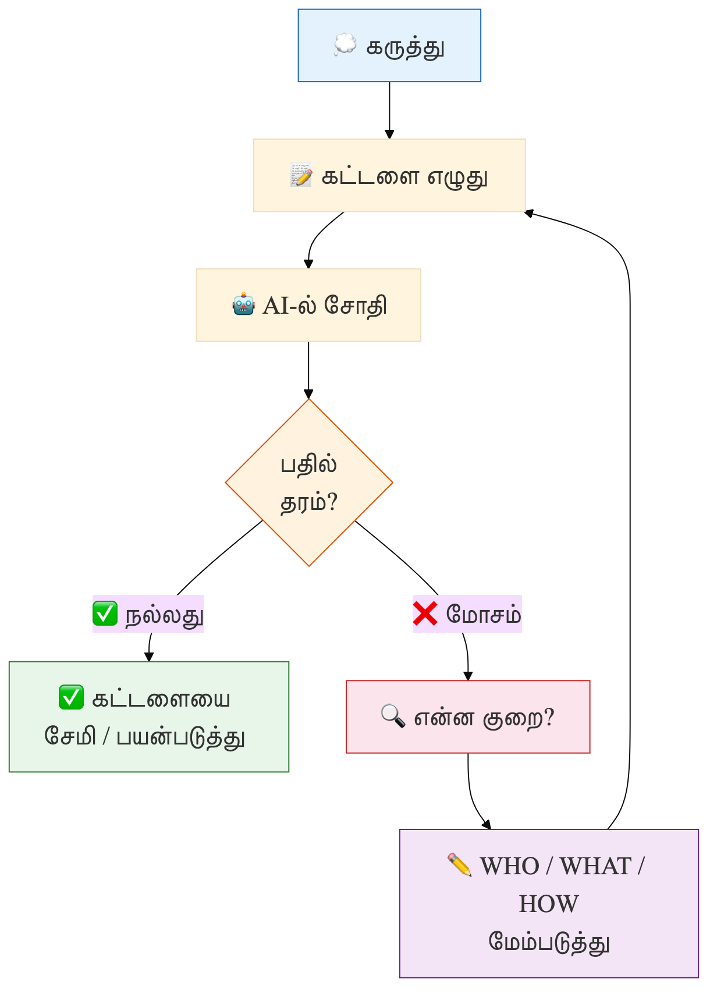

# இணைப்பு B: வகைப்பாடு கட்டமைப்பு — விரிவான தரநிலை

இந்த இணைப்பானது தமிழ் செய்யறிவுக் கட்டளைகளுக்கான (AI Prompts) விரிவான தொழில்நுட்பத் தரநிலையை (Technical Specification) வழங்குகிறது. முந்தைய அத்தியாயங்களில் நாம் பார்த்த 8-அடுக்குக் கட்டமைப்பின் (8-Layer Framework) ஆழமான விதிகள் மற்றும் ஒவ்வொரு அடுக்குக்கும் பயன்படுத்தப்படும் துல்லியமான குறியீடுகளை (Codes) இங்கு விரிவாகக் காணலாம். 

நீங்கள் ஒரு சிறந்த 'கட்டளை வடிவமைப்பாளராக' (Prompt Engineer) உருவெடுக்க இந்த வழிகாட்டி ஒரு கையேடாகச் செயல்படும்.

## 1. அடுக்கு நிலை விளக்கங்கள் (Layer Definitions)

கீழே கொடுக்கப்பட்டுள்ள 8 அடுக்குகளும் ஒரு கட்டளையின் சீரான தன்மை, தரம் மற்றும் பாதுகாப்பை உறுதி செய்கின்றன.

### L1 — பாத்திரம் (Role)

செய்யறிவு தன்னுள் வரித்துக்கொள்ள வேண்டிய ஆளுமையை இது குறிக்கிறது. இதன் மூலமாகத்தான் பதிலை எந்த அதிகாரத் தொனியில் வழங்க வேண்டும் என்பதைச் செய்யறிவு தீர்மானிக்கிறது. 
* **உதாரணங்கள்:** `Doctor` (மருத்துவர்), `Teacher` (ஆசிரியர்), `Farmer` (விவசாயி), `Developer` (மென்பொருள் பொறியாளர்), `Poet` (கவிஞர்), `Lawyer` (வழக்கறிஞர்), `Marketer` (சந்தையாளர்).

### L2 — துறை (Domain)

நீங்கள் கேட்கும் கேள்வி அல்லது கொடுக்கப்படும் பணி எந்தத் துறை சார்ந்தது என்பதை இது வரையறுக்கிறது. 

| குறியீடு (Code) | துறை (Domain) | தமிழ் அர்த்தம் |
| :--- | :--- | :--- |
| `health` | Healthcare | சுகாதாரம் |
| `edu` | Education | கல்வி |
| `agriculture` | Agriculture | விவசாயம் |
| `tech` | Technology | தொழில்நுட்பம் |
| `law` | Law | சட்டம் |
| `biz` | Business | வணிகம் |
| `lit` | Literature | இலக்கியம் |
| `daily` | Daily Life | தினசரி வாழ்க்கை |
| `employment` | Employment | வேலைவாய்ப்பு |

### L3 — திறன் நிலை (Skill Level / Target Audience)

செய்யறிவு வழங்கும் பதிலை யார் படிக்கப் போகிறார்கள்? அவர்களின் புரிதல் திறனுக்கேற்ப பதிலை அமைப்பதே இந்தத் திறன் நிலையின் நோக்கம்.

| குறியீடு (Code) | திறன் நிலை (Level) | பயனர்கள் |
| :--- | :--- | :--- |
| `beg` | Beginner | தொடக்க நிலை / பாமரர் |
| `int` | Intermediate | அடிப்படை தெரிந்தவர்கள் (இடைநிலை) |
| `adv` | Advanced | மேம்பட்ட திறன் கொண்டவர்கள் |
| `exp` | Expert | அந்தத் துறையின் நிபுணர்கள் |
| `child` | Child | குழந்தைகள் |
| `G1-G5` | Grade 1-5 | தொடக்கப் பள்ளி மாணவர்கள் |
| `G6-G12` | Grade 6-12 | உயர் மற்றும் மேல்நிலைப் பள்ளி மாணவர்கள் |

### L4 — நோக்கம்

பயனராகிய நீங்கள் செய்யறிவிடம் இருந்து எந்த வகையான முடிவை எதிர்பார்க்கிறீர்கள் என்பதை இது அறிவுறுத்துகிறது. 

| குறியீடு (Code) | நோக்கம் (Intent) | விளக்கம் |
| :--- | :--- | :--- |
| `EXPL` | Explain | கருத்துக்களைத் தெளிவாக விளக்குவது |
| `SUMM` | Summarize | நீண்ட கட்டுரைகள் அல்லது கருத்துகளைச் சுருக்குவது |
| `DRAF` | Draft | கடிதம், கணினி நிரல், அறிக்கைகளை உருவாக்குவது |
| `ANAL` | Analyze | தரவுகளைப் பகுப்பாய்வு மற்றும் தணிக்கை செய்வது |
| `TRNS` | Translate | ஆங்கிலத்தில் இருந்து தமிழுக்கு (அல்லது பிற மொழிகளுக்கு) மொழிபெயர்ப்பது |
| `CREA` | Creative | கதை, கவிதை போன்ற படைப்பாக்கங்கள் |
| `PLAN` | Plan | படிப்புத் திட்டம் அல்லது வணிகத் திட்டங்களை வகுப்பது |

### L5 — தொனி மற்றும் நடை (Tone & Register)

தமிழில் மொழி நடை மிகவும் இன்றியமையாதது. நீங்கள் பெறும் பதில் எந்த வகையான நடையில் (Style) இருக்க வேண்டும் என்பதை இது குறிக்கும்.

| தொனி (Tone) | தமிழ் பெயர் | எடுத்துக்காட்டு அல்லது பயன்பாடு |
| :--- | :--- | :--- |
| `Formal` | அலுவலக நடை / மரியாதை நடை | "நீங்கள் வாருங்கள்", "கீழே கொடுக்கப்பட்டுள்ளது" |
| `Casual` | நட்பு நடை | "நீ வா", "இதோ இருக்கு பார்" |
| `Academic` | கல்வி சார் நடை | "விளக்கவுரை", "ஆய்வாளர்கள் கூறுகின்றனர்" |
| `Poetic` | கவித்துவ நடை | செய்யுள் நடையில் வர்ணிப்பது |
| `Professional` | தொழில்முறை நடை | வணிகப் பேச்சுக்கள் மற்றும் நேர்காணல்கள் |
| `Pure Tamil` | தனித்தமிழ் | வடமொழி, ஆங்கிலக் கடன் சொற்கள் அறவே இன்றி |
| `Tanglish` | தமிங்கிலம் | "Romba thanks", "Idha try panni paar" (இலக்கணம் அவசியமில்லாத இடங்களில்) |

> [!NOTE]
> `Pure Tamil` (தனித்தமிழ்) தொனியைத் தேர்ந்தெடுக்கும்போது, முடிந்தவரை ஆங்கிலக் கலப்பிலாத தூய தமிழ்ச் சொற்களைப் பயன்படுத்தச் செய்யறிவு அறிவுறுத்தப்படும். `Tanglish` (தமிங்கிலம்) என்பது அன்றாடப் பேச்சு வழக்குக்கு மிகவும் பொருத்தமானதாக அமையும்.

### L6 — வெளியீட்டு வடிவம் (Output Format)

உங்களுக்குத் தேவையான விடை எந்த அமைப்பு முறையில் (Structure) திரையில் அச்சிடப்பட வேண்டும் என்பதற்கான அளவுகோல் இது.

* **முக்கிய வடிவங்கள்:** `Essay` (விரிவான கட்டுரை), `Table` (ஒப்பீட்டுக்கான அட்டவணை), `Bullet Points` (விரைவாகப் படிப்பதற்கான குறிப்புகள்), `Step-by-Step` (செயல்முறை விளக்கம்), `Code Block` (மென்பொருள் நிரல்), `Dialogue` (கதை அல்லது நேர்காணல் உரையாடல்).

### L7 — கட்டுப்பாடுகள் (Constraints)

செய்யறிவு எதெல்லாம் செய்யக்கூடாது என்பதற்கான முட்டுக்கட்டைகளே இந்தக் கட்டுப்பாடுகள்.

* **உதாரணங்கள்:** `No English Words` (ஆங்கிலம் அறவே கலக்கக்கூடாது), `Word Count < 100` (100 வார்த்தைகளுக்கு மிகாமல் இருக்க வேண்டும்), `Cite Sources` (மூல ஆதாரங்களைக் குறிப்பிட வேண்டும்), `Tone: Polite Only` (கோபமான வார்த்தைகளைத் தவிர்க்க வேண்டும்).

### L8 — பாதுகாப்பு கவசம் (Safety Layer)

எந்தவொரு சமூகத் திட்டத்திற்கும் பாதுகாப்பு என்பது மிகவும் அவசியமானது. ஒவ்வொரு கட்டளை மாதிரியிலும் அதற்கான பொறுப்புத்துறப்பு அறிக்கை (Disclaimer) இடம்பெற வேண்டும்.

| துறை (Domain) | கட்டாயமான பாதுகாப்பு அறிக்கை (Disclaimer) |
| :--- | :--- |
| **சுகாதாரம் (Health)** | "இவை தகவல் மற்றும் வழிகாட்டுதல் நோக்கிற்கானவை மட்டுமே. உடல்நலன் தொடர்பான முடிவுகளுக்குத் தகுதிவாய்ந்த மருத்துவரை அணுகவும்." |
| **சட்டம் (Law)** | "இது சட்ட ஆலோசனை அல்ல; சட்டங்கள் மாநிலத்திற்கு மாநிலம் மாறுபடும். சட்ட ரீதியான நடவடிக்கைகளுக்கு ஒரு வழக்கறிஞரை நாடவும்." |
| **நிதி (Finance)** | "இது நிதி சார்ந்த ஆலோசனை கிடையாது. எந்தவொரு முதலீட்டு முடிவையும் உங்கள் சொந்த ஆராய்ச்சியின் அடிப்படையிலேயே எடுக்கவும்." |

---

## 2. மாதிரி கட்டளை வடிவம் (Standard Prompt Template)

இந்தக் கட்டமைப்பைப் பயன்படுத்தி ஒரு சிறந்த கட்டளையை எப்படி எழுதுவது என்பதற்கான வரைவு (Template) கீழே கொடுக்கப்பட்டுள்ளது:

```markdown
**Role:** {பாத்திரத்தின் பெயர்}
**Domain:** {துறை}
**Skill Level:** {பயனர்களின் திறன் நிலை}
**Intent:** {நோக்கம் - எ.கா: EXPL அல்லது DRAF}
**Tone:** {எந்த நடை?}
**Format:** {எந்த வடிவம்?}

**Constraints:**
- {கட்டுப்பாடு 1}
- {கட்டுப்பாடு 2}

**Safety/Disclaimer:**
- {பாதுகாப்பு அறிக்கை}
```

> [!TIP]
> மேற்கண்ட `{அடைப்புக்குறி}` பகுதிகளை உங்கள் தேவைக்கேற்ப நிரப்பிச் செய்யறிவிடம் வழங்கிப் பாருங்கள். கிடைக்கும் முதல் பதிலை ஒரு வரைவாக (Draft) எடுத்துக்கொண்டு, அதன்பின் கேள்விகளைச் சீரமைப்பதன் (Iterative Refinement) மூலம் மிகத் துல்லியமான விடையைப் பெறலாம்.



---

## 3. கோப்பு பெயரிடல் மரபு (File Naming Convention)

எதிர்காலத்தில் ஆயிரக்கணக்கான கட்டளைகளைச் சேமித்து வைத்துத் திரும்ப எடுப்பதைப் (Prompt Library) பாதுகாப்பானதாக்க, நாங்கள் 'படிநிலை அடைவு' (Hierarchical Structure) முறையைப் பயன்படுத்துகிறோம். இதன் மூலம் துறைகள் வாரியாகக் கட்டளைகளைப் பிரித்து வைக்க முடியும்.

**பெயரிடல் வரைமுறை (Naming Standard):**
`prompts/{துறை}/collection-{பாத்திரம்}.md` அல்லது `ROLE-DOMAIN-SKILL-INTENT-TONE.md`

**உதாரணங்கள்:**
* `prompts/health/collection-doctors.md` (மருத்துவர்களுக்கான கட்டளைகளின் தொகுப்பு)
* `prompts/edu/collection-college-students.md` (கல்லூரி மாணவர்களுக்கான தொகுப்பு)
* `doctor-health-exp-draf-formal.md` (மருத்துவர் ஒருவர், சுகாதாரத் துறையில், நிபுணத்துவத்துடன், ஒரு மருத்துவ அறிக்கையைத் தொழில்முறையாக எழுதக் கேட்கும் ஒற்றைக் கட்டளைக்கானது).

> [!NOTE]
> இந்தத் தரநிலையானது சமூகக் கூட்டுமுயற்சியால் உருவாக்கப்பட்டது. இதில் நீங்களும் பங்களிக்க விரும்பினால், எங்களின் கிட்ஹப் (GitHub) பக்கத்தில் உள்ள திறந்த மூலப் (Open Source) பங்களிப்பு விதிகளைப் [CONTRIBUTING.md](https://github.com/kpassoubady/tamil-prompt-standard/blob/master/CONTRIBUTING.md) படித்துப் பாருங்கள். தற்போதைய தரநிலை பதிப்பு அளவீடு: **v0.1**.

