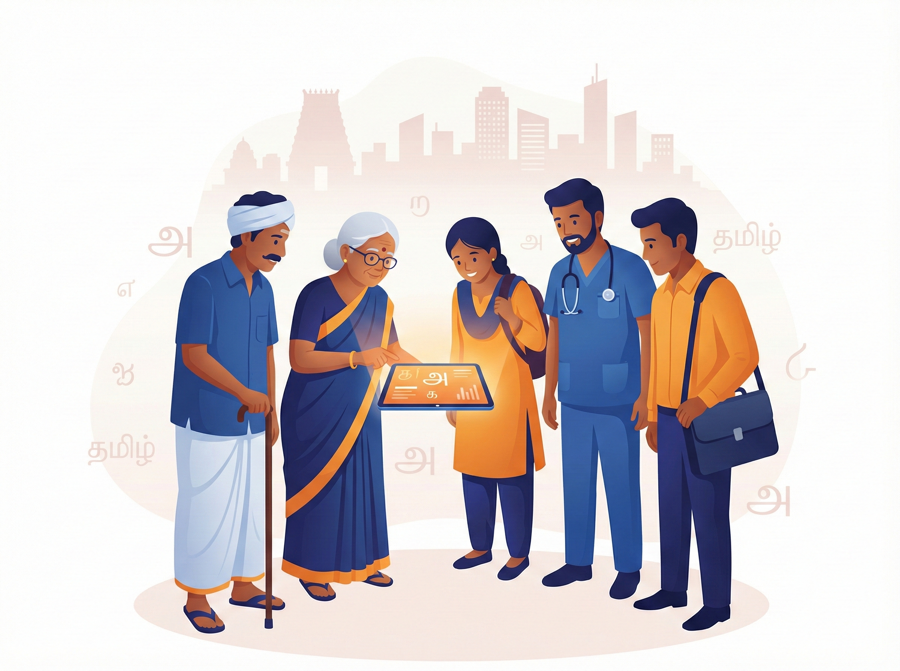
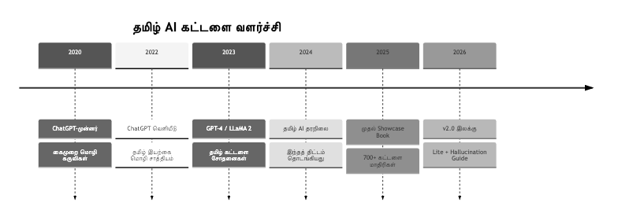

# அறிமுகம் - தமிழ் கட்டளை வடிவமைப்பு கையேடு

## Inroduction - Prompt Engineering Handbook in Tamil

**செயற்கை நுண்ணறிவு மாதிரிகளிடம் (AI / LLMs) தமிழில் துல்லியமான, தரமான பதில்களைப் பெறுவதற்கான முழுமையான வழிகாட்டி.**

---

## இந்த நூல் பற்றி

இந்தக் கையேடு **TNC21 / Tamil Research Chair on Artificial Intelligence** - IATT குழுவின் நடத்தப்படும் கூட்டத்தில்  சமர்ப்பிப்பதற்காக உருவாக்கப்பட்டது. இந்த புத்தகத்தின் எழுத்தாளர் காங்கேயன் பசுபதி 28 ஆண்டுகால தகவல் தொழில்நுட்ப அனுபவத்தின் அடிப்படையில், தமிழ் மொழியின் பொருள் நுணுக்கங்களை செய்யறிவு மாதிரிகள் எவ்வாறு உணர்கின்றன என்பதையும், அவற்றைச் செயல்திறனுடன் வழிநடத்துவது எப்படி என்பதையும் ஆராய்கிறது.

இந்த நூல் **700+ தயாரான கட்டளை மாதிரிகளை** 10 தொழில் சார்ந்த துறைகளில் வழங்குகிறது — மருத்துவர்கள் முதல் விவசாயிகள் வரை, கவிஞர்கள் முதல் நிரலாளர்கள் வரை, அனைவருக்கும் பயன்படும்.

> [!NOTE]
> இந்த நூலில் உள்ள அனைத்து கட்டளை மாதிரிகளும் தமிழ் மொழியின் இலக்கண, இலக்கிய மற்றும் கலாச்சார நுணுக்கங்களை கருத்தில்கொண்டு வடிவமைக்கப்பட்டுள்ளன. ChatGPT, Gemini, Claude, Llama போன்ற எந்த நவீன AI மாதிரியிலும் இவற்றைப் பயன்படுத்தலாம்.

---

## யாருக்கானது?

| வாசகர்                                                     | இந்த நூல் எவ்வாறு உதவும்                             |
|------------------------------------------------------------|------------------------------------------------------|
| **தொழில் வல்லுநர்கள்** (மருத்துவர், வழக்கறிஞர், ஆசிரியர்…) | உங்கள் துறைக்கான தயாரான கட்டளை மாதிரிகள்             |
| **மாணவர்கள்** (பள்ளி, கல்லூரி, போட்டித் தேர்வு)            | கற்றலை துரிதப்படுத்த AI-யை சரியாகப் பயன்படுத்த       |
| **படைப்பாளர்கள்** (கவிஞர், எழுத்தாளர், கதாசிரியர்)         | தமிழ் படைப்பாற்றலுக்கான AI கட்டளைகள்                 |
| **தொழில் முனைவோர்** (வணிகம், ஸ்டார்ட்அப், சுதந்திர தொழில்) | சந்தை, திட்டம், வாடிக்கையாளர் தொடர்புக்கான கட்டளைகள் |
| **AI ஆர்வலர்கள்**                                          | அடிப்படை முதல் மேம்பட்ட கட்டளை நுட்பங்கள் வரை        |

---

## இந்த நூலை எப்படிப் படிப்பது?

**புதியவர்களுக்கு:**
முதலில் **Appendix E** — தொடக்கநிலை கையேட்டைப் படிக்கவும். பிறகு **பகுதி I** — அடிப்படைகளுக்கு வாருங்கள். இறுதியாக உங்கள் துறைக்கான பகுதியில் (Part II–X) கட்டளைகளைப் பயன்படுத்துங்கள்.

**தொழில் வல்லுநர்களுக்கு:**
நேரடியாக உங்கள் துறைக்கான பகுதிக்குச் செல்லுங்கள். கட்டளைகளை **Appendix C** விரைவு குறிப்புத் தாளைக் கொண்டு மேம்படுத்துங்கள்.

**AI நுட்பங்களைக் கற்க:**
**பகுதி I** முழுவதையும் படிக்கவும் — அடிப்படைகள், கட்டமைப்புகள், தொழில்நுட்ப நுட்பங்கள் என்ற வரிசையில்.

> **💡 பயன்படுத்தும் முறை:** கட்டளை மாதிரிகளில் உள்ள `{அடைப்புக்குறி}` பகுதிகளை உங்கள் தேவைக்கு ஏற்ப மாற்றி AI மாதிரியிடம் வழங்கவும். முதல் பதிலை வரைவாகக் கொண்டு, மீள்சீரமைப்பு (Iterative Refinement) செய்யுங்கள்.

---

## நூலின் அமைப்பு

### பகுதி I — கட்டளை வடிவமைப்பு அடிப்படைகள்

AI-யிடம் சிறந்த பதில்களைப் பெறுவதற்கான முழுமையான கட்டளை வடிவமைப்பு இயற்கை. இப்பகுதியில்:

- **அடிப்படைகள்** — வரையறை, 5 கொள்கைகள், தமிழ் மொழிக்கான சிறப்பு குறிப்புகள்
- **கட்டமைப்புகள்** — CLEAR, CRAFT, CREATE, AUTOMAT, CATS, PROMPT மற்றும் தேர்வு வழிகாட்டி
- **தொழில்நுட்ப நுட்பங்கள்** — CoT, ToT, DSP, Zero-Shot, Zero-Shot CoT, PoT
- **TNC21 ஆய்வுக் கட்டமைப்பு** — தமிழ் AI கட்டளை வடிவமைப்பின் அடிப்படைத் தத்துவம்

---

### பகுதி II — சுகாதார கட்டளைகள்

மருத்துவர்கள், செவிலியர்கள், மனநல ஆலோசகர்கள், ஆயுஷ் மருத்துவர்கள் — நோயாளி விளக்கம், மருத்துவக் குறிப்புகள், பராமரிப்பு திட்டங்கள், மனநல ஆதரவு.

### பகுதி III — கல்வி கட்டளைகள்

தொடக்க நிலை முதல் கல்லூரி வரை, போட்டித் தேர்வு மாணவர்கள் மற்றும் ஆசிரியர்கள் — பாடம், மதிப்பீடு, ஆராய்ச்சி, தேர்வு உத்திகள்.

### பகுதி IV — விவசாய கட்டளைகள்

விவசாயிகள், விவசாயத் தொழிலாளர்கள், சுயஉதவிக் குழுக்கள், கிராமப்புற தொழில் முனைவோர் — பயிர் மேலாண்மை, அரசு திட்டங்கள், சிறுகடன், தொழில் தொடங்கல்.

### பகுதி V — வேலைவாய்ப்பு கட்டளைகள்

வேலை தேடுவோர், புதிய பட்டதாரிகள், ஸ்டார்ட்அப் நிறுவனர்கள், சுதந்திர தொழிலாளர்கள் — ரெசுமே, நேர்காணல், பிச் டெக், வாடிக்கையாளர் தேடல்.

### பகுதி VI — சட்டம் மற்றும் நிர்வாகக் கட்டளைகள்

வழக்கறிஞர்கள், சட்ட மாணவர்கள், அரசு அலுவலர்கள், கொள்கை ஆய்வாளர்கள் — ஆவண வரைவு, சட்ட ஆய்வு, கொள்கை பகுப்பாய்வு.

### பகுதி VII — தினசரி வாழ்க்கை கட்டளைகள்

பெற்றோர்கள், மூத்தோர், உள்ளடக்க உருவாக்குநர்கள் — குழந்தை வளர்ப்பு, தொழில்நுட்பம் கற்றல், YouTube, சமூக ஊடகம்.

### பகுதி VIII — தொழில்நுட்ப கட்டளைகள்

நிரலாளர்கள், வடிவமைப்பாளர்கள், தரவு ஆய்வாளர்கள் — குறியீடு, பிழைத்திருத்தம், UX/UI, SQL, தரவு காட்சிப்படுத்தல்.

### பகுதி IX — வணிக கட்டளைகள்

தொழிலதிபர்கள் மற்றும் சந்தையாளர்கள் — வணிகத் திட்டம், நிதி ஆய்வு, விளம்பரம், பிராண்டிங்.

### பகுதி X — இலக்கியம் மற்றும் மொழி கட்டளைகள்

எழுத்தாளர்கள், கவிஞர்கள், கதாசிரியர்கள், மொழியியலாளர்கள் — கட்டுரை, யாப்பு, சிறுகதை, புதுச்சொல் உருவாக்கம்.

---

## இணைப்புகள்

| இணைப்பு                                 | உள்ளடக்கம்                                                                                     |
|-----------------------------------------|------------------------------------------------------------------------------------------------|
| **Appendix A** — கட்டமைப்பு விதிகள்     | 8-அடுக்கு வகைபாடு, பாதுகாப்பு நெறிமுறைகள், கோப்பு பெயரிடல், தர மதிப்பீட்டு அளவுகோல்            |
| **Appendix B** — பணி ஓட்டங்கள்          | புதிய கட்டளை உருவாக்கல், கட்டளைத் தர மதிப்பீடு                                                 |
| **Appendix C** — விரைவு குறிப்புத் தாள் | 9 கட்டமைப்புகள் + செயல் வினைச்சொற்கள் + பாத்திரங்கள் + தொனிகள் + வடிவங்கள்                     |
| **Appendix D** — வகைபாடு கட்டமைப்பு     | 8-அடுக்கு வகைபாட்டு முழு விவரக்கோவை — அடுக்கு விளக்கங்கள், மாதிரி வடிவம், கோப்பு பெயரிடல் மரபு |
| **Appendix E** — தொடக்கநிலை கையேடு      | 5 நிமிட அறிமுகம், நடைமுறை உதாரணங்கள், மொழி நுணுக்கங்கள்                                        |

---

## விரைவுப் புள்ளிவிவரங்கள்

| அளவீடு                 | விவரம்                             |
|-----------------------|----------------------------------|
| **கட்டளை மாதிரிகள்**   | 700+                             |
| **துறைகள்**           | 10                               |
| **இலக்குப் பயனர்கள்**   | 30+                              |
| **மொழி**             | தமிழ் — ஆங்கிலக் கலைச்சொற்களுடன்   |

---

## தமிழ் AI வளர்ச்சி — ஒரு பார்வை

---

> இந்த நூல் திறந்த மூல (Open Source) சமூக முயற்சியாக உருவாக்கப்பட்டது — தமிழ் பேசும் அனைவரும் AI-யை தங்கள் மொழியில், தங்கள் வாழ்க்கைக்கு, சரியான முறையில் பயன்படுத்திக்கொள்ள வேண்டும் என்ற நோக்கில் உருவாக்கப் பட்டது.
