# சாட்ஜிபிடியில் கணக்கைத் தொடங்குவது எவ்வாறு?

இதுவரை நீங்கள் செய்யறிவு அரட்டை இயலி சாட்ஜிபிடியை (ChatGPT) பயன்படுத்தியதே இல்லை என்றால், அதனை எப்படித் தொடங்குவது என்று ஒரு சிறு தயக்கம் இருக்கலாம் அல்லவா? எந்தக் கவலையும் வேண்டாம்! இது ஒரு புதிய மின்னஞ்சல் கணக்கைத் (Email Account) தொடங்குவதைப் போன்ற மிக எளிதான செயல்தான்.


இந்த அத்தியாயத்தில், ChatGPT-இல் எங்ஙனம் ஒரு புதிய கணக்கை உருவாக்கி, உங்களுடைய முதல் கேள்வியை எப்படி கேட்பது என்பதைக் குறித்துப் படிப்படியாகப் பார்க்கப் போகிறோம்.

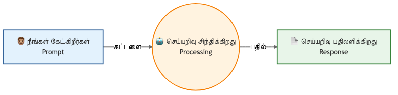

## 🌐 படி 1: ChatGPT இணையதளத்திற்குச் செல்லுங்கள்

உங்கள் அலைபேசியிலோ அல்லது கணினியிலோ உள்ள உலாவியைத் (Browser - Google Chrome, Safari போன்றவை) திறந்து கொள்ளுங்கள். 

மேலே உள்ள தேடல் பெட்டியில் **chatgpt.com** என்று தட்டச்சு செய்து உள்ளே செல்லுங்கள்.

## 🌐 படி 2: புதிய கணக்கை உருவாக்குதல் (Sign Up)

உள்ளே சென்றவுடன் திரையில் இரண்டு முக்கியப் பொத்தான்கள் (Buttons) இருக்கும்:
1. **Log in** (ஏற்கனவே கணக்கு வைத்திருப்பவர்களுக்கானது)
2. **Sign up** (புதிதாகக் கணக்கு தொடங்குபவர்களுக்கானது)

நீங்கள் முதன்முறையாக உள்ளே வருவதால், **Sign up** என்ற பொத்தானை அழுத்தவும்.

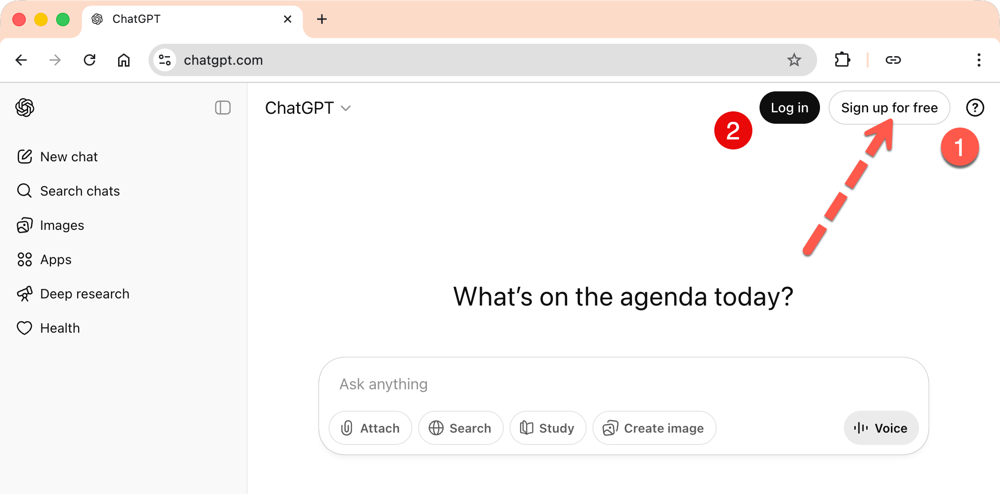

**எளிதான வழி:** உங்களிடம் ஏற்கனவே Google கணக்கு (Gmail) இருந்தால், அங்கிருக்கும் "Continue with Google" என்ற பொத்தானைத் தேர்ந்தெடுப்பதன் மூலம் உங்களுக்கான கணக்கை மிக எளிதாக உருவாக்கிவிடலாம். இதன் மூலம் மற்றுமொரு பயனர் அடையாளம் (User Id) மற்றும் கடவுச்சொல்லை (Password) நினைவில் வைத்துக்கொள்ளும் பாரம் குறையும்!

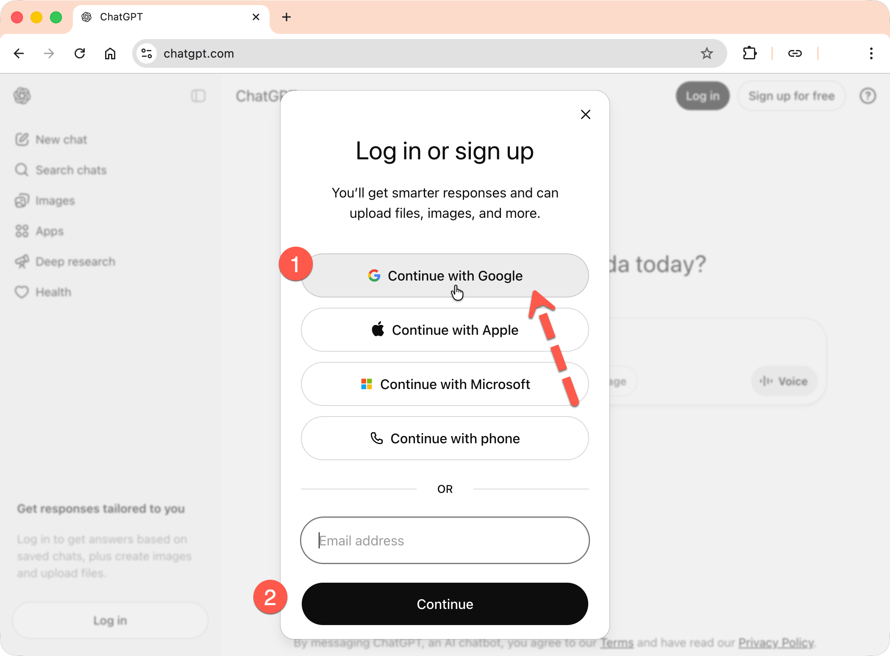

அடுத்து வரும் "Sign in with Google" திரையில், "Continue" என்பதை அழுத்தவும்.


தொடர்ந்து, உங்களின் பெயர் மற்றும் பிறந்த தேதியை உள்ளிட்டு "Continue" என்பதை அழுத்தவும்.

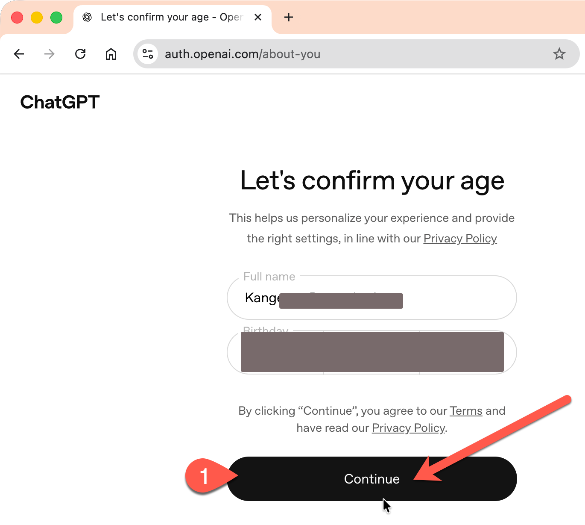

இதையடுத்து, ஓபன் ஏஐ (OpenAI) நிறுவனம் உங்களைப் பற்றிப் பல தகவல்களைக் கேட்கும். நீங்கள் அவற்றைத் தேர்ந்தெடுத்து விடையளிக்கலாம், அல்லது "Skip" என்பதை அழுத்தலாம்.

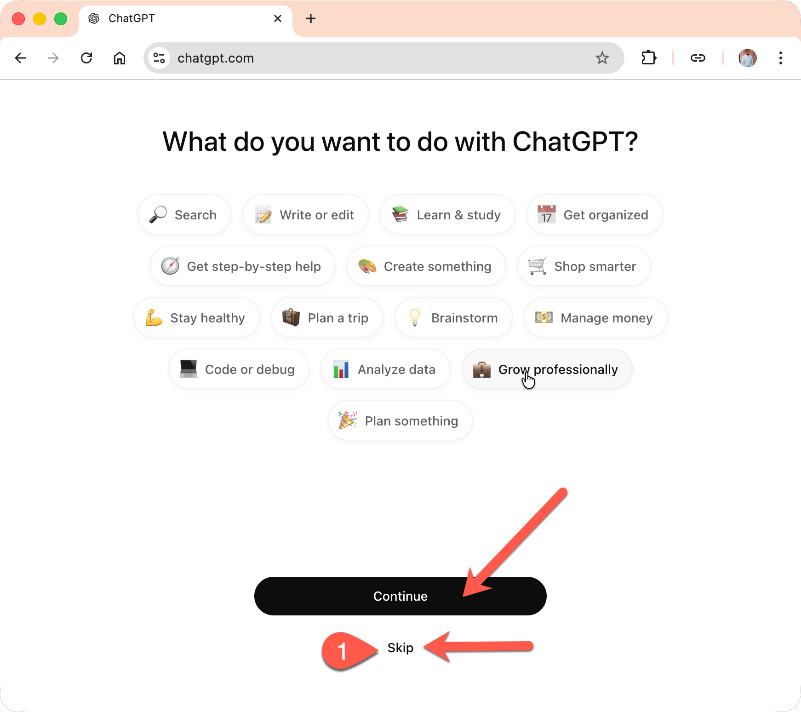

இறுதியாக, "You are all set" என்ற திரையில் "Continue" என்பதை அழுத்தவும்.

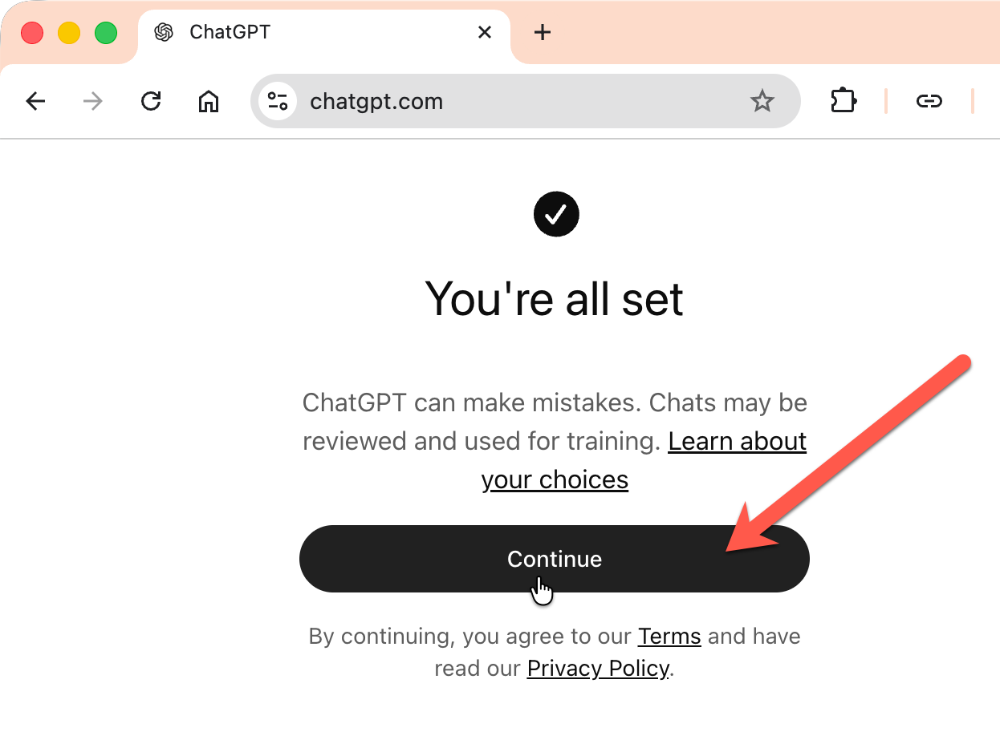

மேலே கூறியுள்ள படிகளைப் பின்பற்றி நீங்கள் ChatGPT இணையதளத்தில் வெற்றிகரமாகக் கணக்கை உருவாக்கிவிட்டீர்கள். 

உங்களுக்குச் சில குறிப்புகள் கொடுக்கப்படும். அவற்றை நீங்கள் படித்துவிட்டு "Continue" என்பதை அழுத்தவும். இந்தப் படிகள் கொஞ்சம் மாறுபடலாம். ஆனால் நீங்கள் மேலே கூறியுள்ளவற்றைப் பின்பற்றி அடுத்து வரும் திரைகளில் "Continue" என்பதை அழுத்தினால் போதும். நீங்கள் ChatGPT-யைப் பயன்படுத்தத் தயாராகிவிடுவீர்கள்.

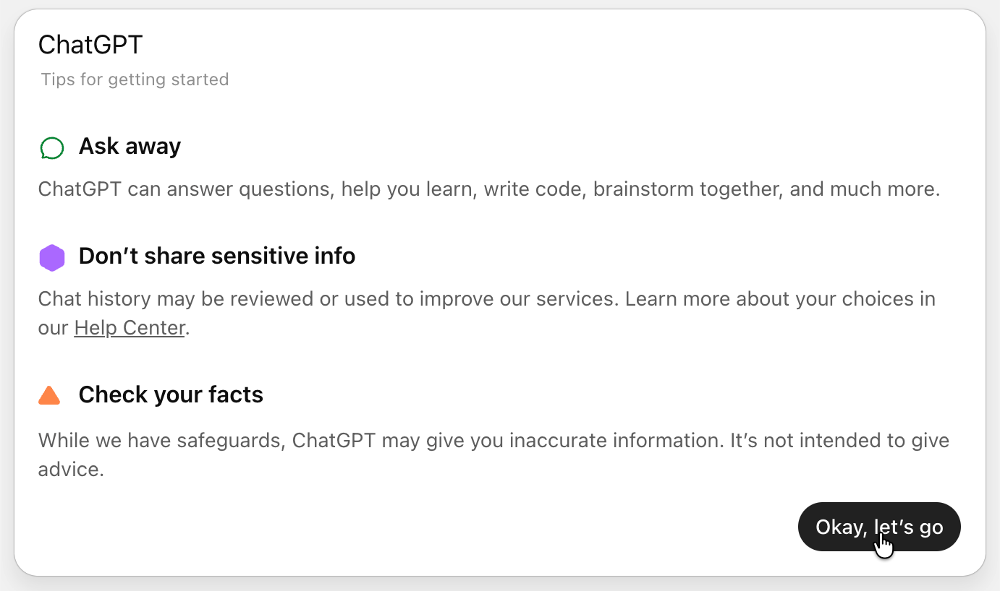


## 🖥️ படி 3: செய்யறிவுத் திரை அறிமுகம்

கணக்கு வெற்றிகரமாக உருவாக்கப்பட்டவுடன், ஒரு புதிய திரை தோன்றும். இது பார்ப்பதற்கு வாட்ஸ்அப் (WhatsApp) சாட் திரையைப் போலவே இருக்கும்.

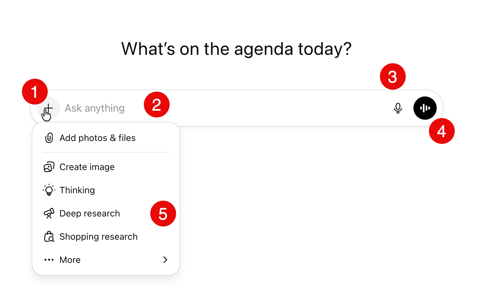

* உள்ளீட்டுப் பெட்டியின் (Input box) உள்ளே **"Ask Anything"** என்று எழுதப்பட்ட ஒரு காலி பெட்டி இருக்கும். இதுதான் நாம் வினாக்களைக் கேட்கப் போகும் இடம்!
* இதற்குக் கீழே உள்ள காலியிடத்தில்தான் செய்யறிவின் விடைகள் தோன்றும்.

## 💬 படி 4: உங்களுடைய முதல் கேள்வியைக் கேட்போம்!

இப்போது அந்த உள்ளீட்டுப் பெட்டியில் (Input box) உங்கள் முதல் கட்டளையைத் தமிழில் டைப் செய்து பார்க்கலாம். 

> [!TIP]
> **சிறு குறிப்பு:** உங்களுக்குத் தமிழில் டைப் செய்யத் தெரியவில்லை என்றால், Use Voice button (மைக் ஐகான்) பயன்படுத்தித் தமிழில் பேசினால் அதுவே டைப் செய்துவிடும். அல்லது "Thamilil eppadi type seivathu" என்று தங்கிலிஷில் (Tanglish) எழுதினாற்கூட அது புரிந்துகொள்ளும்!

இப்போது அந்தப் பெட்டியில் கீழ்க்கண்டவாறு டைப் செய்யுங்கள்:

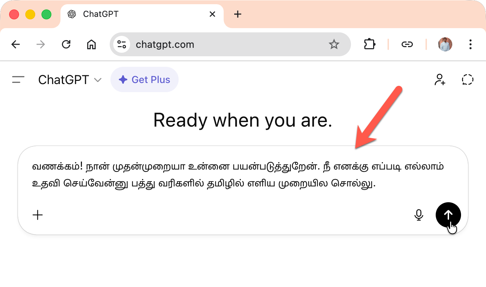

**"வணக்கம்! நான் முதன்முறையாக உன்னைப் பயன்படுத்துகிறேன். நீ எனக்கு எப்படியெல்லாம் உதவி செய்வாய் என்பதைப் பத்து வரிகளில் தமிழில் எளிய முறையில் கூறவும்."**

தட்டச்சு செய்து முடித்தவுடன், அந்தப் பெட்டியின் வலது ஓரத்தில் உள்ள **மேல்நோக்கிய அம்பு (Send)** வடிவ பொத்தானை அல்லது கணினியில் **Enter** பட்டனை தட்டுங்கள்.

சில நொடிகளிலேயே, உங்களுக்கு விடை ஆங்கிலத்திலோ தமிழிலோ கிடைக்கலாம் (நாம் தமிழில் கேட்டதால் பெரும்பாலும் தமிழிலேயே விடை வரும்). அந்த விடை மிக அழகாக உங்களை வரவேற்று, நீங்கள் கேட்கும் எந்த வினாவிற்கும் தன்னால் எங்ஙனம் தகவல்களைத் தர முடியும் என்று சொல்லும்!

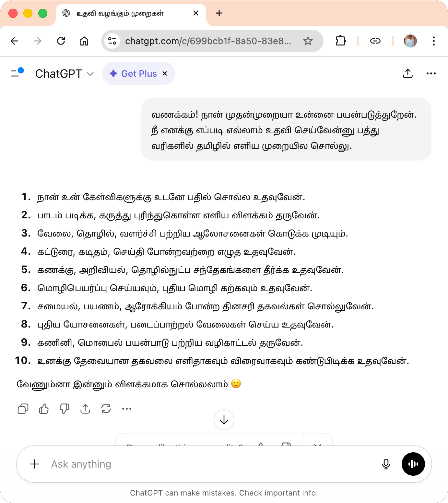

## 🔄 படி 5: எவ்வாறு தொடர்வது?

புதிதாக ஒன்றைக் கேட்க வேண்டுமென்றால், மீண்டும் அதே பெட்டியில் டைப் செய்து அனுப்பலாம். முந்தைய உரையாடல்களைத் தனியாகப் பார்க்க, திரையின் இடது பக்கத்தில் உங்களின் பழைய உரையாடல்கள் சேமிக்கப்பட்டிருக்கும். 

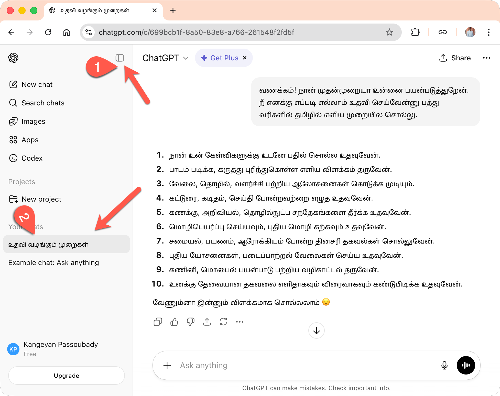

```prompt
நான் ஜப்பானைப் பற்றித் தெரிந்துகொள்ள விரும்புகிறேன். பத்து வரிகளில் ஜப்பானின் சிறப்புகளைப் பற்றி தமிழில் எளிய முறையில் சொல்லவும்.
```

கேள்வி:

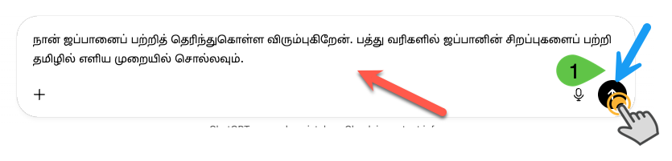

அதற்கான விடை:

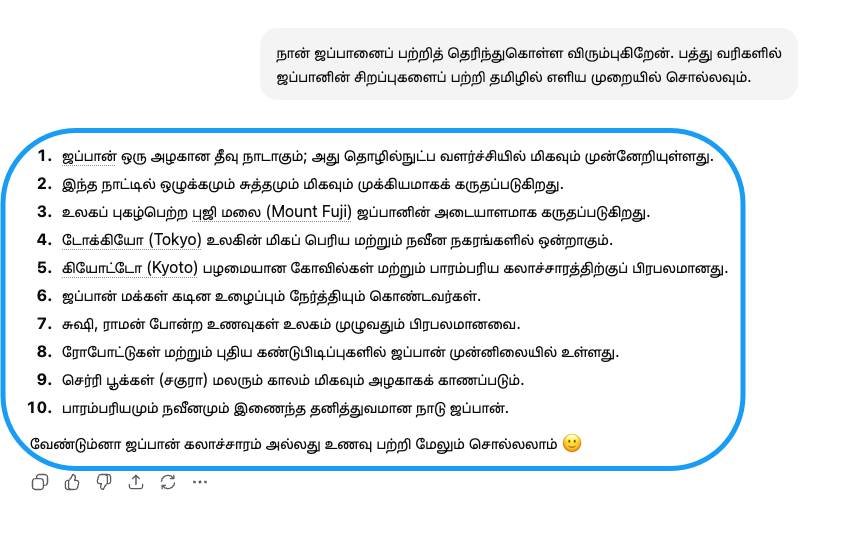   

நீங்கள் கொடுத்த விடை சரியில்லையென்றால் மற்றொரு முறை கேட்கலாம், "Try again" என்ற ஐகானை அழுத்தவும்.

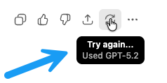   

இரண்டாவது முறையின் பதில் கீழே கொடுக்கப்பட்டுள்ளது:

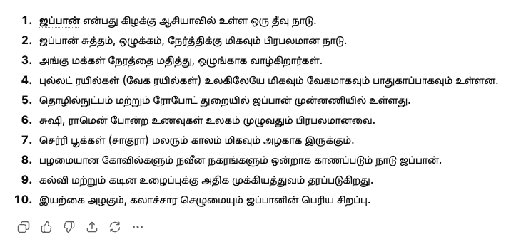      

### ❓ **தூண்டுவினா என்றால் என்ன?**

தூண்டுவினா (Prompt) என்பது செய்யறிவு மாதிரிகளுக்கு (AI Models) நாம் அளிக்கும் ஒரு தொடக்க உள்ளீடு (Input) ஆகும். இது வெறும் வினவல் (Query) மட்டுமல்ல; இது பல பரிமாணங்களைக் கொண்டது. இதனைத் தமிழில் வினவல், கட்டளை, தொடர்வினா, உள்ளீடு எனப் பல பெயர்களால் குறிப்பிட்டாலும், இப்புத்தகத்தில் நாம் **'தூண்டுவினா'** என்ற பெயரையே முதன்மையாகப் பயன்படுத்துவோம்.

ஏனெனில், 'தூண்டுவினா' என்ற சொல் செய்யறிவைத் தூண்டி (Trigger), நமக்கான விடைகளை உருவாக்கும் அதன் செயல்பாட்டைத் துல்லியமாகக் குறிக்கிறது. இது விளக்கம், மொழிபெயர்ப்பு, உதாரணம் அல்லது தொடர்ச்சியான அறிவுறுத்தல் என அனைத்தையும் உள்ளடக்கிய ஒரு பரந்துபட்ட சொல்லாகும். எனவே, இப்புத்தகம் முழுவதும் 'Prompt Engineering'-ஐ விளக்கத் 'தூண்டுவினா' என்ற சொல்லையே அச்சாணியாகக் கொள்வோம்.

அடுத்து ஓரு கேள்வி ஜப்பானைப் பற்றிய கேட்போம்.

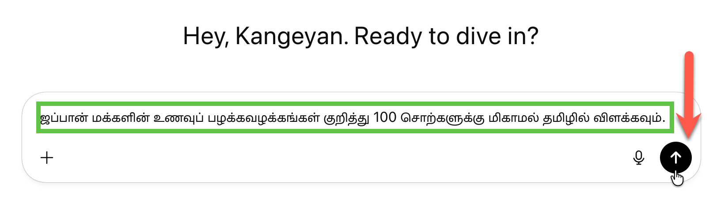    

> [!PROMPT]  
> ஜப்பான் மக்களின் உணவுப் பழக்கவழக்கங்கள் குறித்து 100 சொற்களுக்கு மிகாமல் தமிழில் விளக்கவும்.

மேலே உள்ள தூண்டுவினாவிற்குச் செய்யறிவு மாதிரி அளிக்கும் விடை:

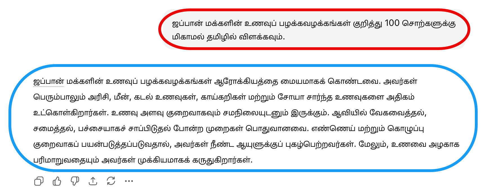    

> [!WARNING]  
> **முக்கியக் கவனம்:** 
> தயவுசெய்து உங்கள் வங்கிக் கணக்கு எண்கள், கடவுச்சொற்கள் (Passwords) போன்ற ரகசியமான தனிப்பட்டத் தகவல்களை ஒருபோதும் செய்யறிவிடம் பகிர்ந்துகொள்ளாதீர்கள்.

> [!NOTE]
> இப்போது உங்களுக்குச் செய்யறிவுக் கணக்குத் தயார்!
> 
> நாம் இங்கு ChatGPT-ஐ உதாரணமாகப் பயன்படுத்தியிருந்தாலும், இதுபோலவே இன்னும் பல சிறந்த செய்யறிவுத் தளங்கள் (Claude, Gemini, Copilot போன்றவை) உள்ளன. அவற்றையும் நீங்கள் இதே முறையில் கணக்குத் தொடங்கிப் பயன்படுத்தலாம். அந்த முன்னணித் தளங்களைப் பற்றிய முழுமையான விவரங்களைத் தெரிந்துகொள்ளப் புத்தகத்தின் இறுதியில் உள்ள **[இணைப்பு F: முன்னணி செய்யறிவுத் தளங்கள்](../appendix/appendix-top-ai-platforms.md)** என்ற பகுதியைப் படித்துப் பாருங்கள்!
> 

அடுத்த அத்தியாயங்களில் சொல்லப்பட்டுள்ள குறிப்புகளை நீங்கள் தேர்ந்தெடுக்கும் எந்தத் தளமாக இருந்தாலும் அங்கே நேரடியாகக் கேட்டுப் பாருங்கள். செய்யறிவு என்பது உங்களுக்காகக் காத்திருக்கும் ஒரு புதிய டிஜிட்டல் உதவியாளர் என்பதை நீங்களே உணர்வீர்கள்!
