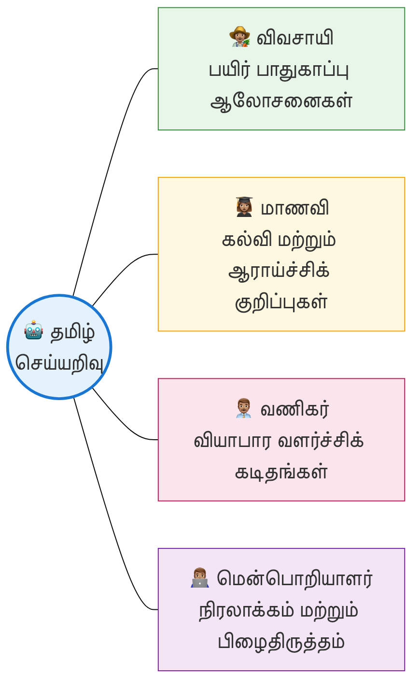

# அறிமுகம்

## ஏன் கட்டளைத் தமிழ்?

இந்தப் புத்தகத்திற்கு **"கட்டளைத் தமிழ்"** என்று பெயரிட்டிருப்பதற்கு ஆழமான காரணங்கள் உண்டு.

தமிழ் மொழியைப் பண்டைக்காலம் தொட்டு **இயல்**, **இசை**, **நாடகம்** என மூன்று பெரும் பிரிவுகளாகப் பகுத்து **முத்தமிழ்** என்று போற்றி வருகிறோம்.

* **இயல்** – சிந்தனை
* **இசை** – ஓசை
* **நாடகம்** – காட்சி
* **கட்டளை** – செயல் (Execution): AI-ஐச் செயல்பட வைப்பதால், இது 'செயல் தமிழ்' எனும் புதியதொரு பரிமாணத்தைப் பெறுகிறது.

அதைப் போலவே, இன்று AI மாதிரிகளுடன் (Models) தமிழில் உரையாடும் போது, வெறும் வினாக்கள் (Queries) மட்டுமன்றி, கட்டளைகள், அறிவுறுத்தல்கள், சான்றுகள் மற்றும் தொடர்ச்சியான வழிகாட்டுதல்கள் எனப் பல வடிவங்களில் தொடர்பு கொள்ள வேண்டியுள்ளது. இதுவே தமிழின் நவீன வடிவம் – செய்யறிவைத் தூண்டி, அதன் விடைகளைச் செதுக்கும் தமிழ்.

இத்தலைப்பிற்கு மற்றுமொரு சிறப்பும் உண்டு. தமிழ் யாப்பிலக்கணத்தில் **'கட்டளைக் கலித்துறை'** என்றொரு பாவினம் உண்டு. இதில் **'கட்டளை'** என்பது எழுத்துகளின் எண்ணிக்கையைத் துல்லியமாகக் கணக்கிட்டுப் பாடுவதைக் குறிக்கும். ஓர் எழுத்து கூடினாலும் குறைந்தாலும் அதன் இலக்கணம் சிதைந்துவிடும்.

அதைப் போலவே, செயற்கை நுண்ணறிவிடம் நாம் உரையாடும் போதும், சொற்களை மிகத் துல்லியமாகவும், அளவோடும், சரியான வரிசையிலும் அமைத்தால் மட்டுமே நாம் எதிர்பார்க்கும் துல்லியமான விடைகளைப் பெற முடியும். யாப்பிலக்கணத்தில் 'கட்டளை' என்பது எப்படி ஒரு பாடலின் அழகையும் கட்டமைப்பையும் உறுதி செய்கிறதோ, அப்படியே AI உலகில் நாம் வழங்கும் **'Prompt'** எனப்படும் கட்டளைத் தமிழ், நுட்பமான தரவுகளையும் தெளிவான விடைகளையும் பெற்றுத் தரும் அச்சாணியாகத் திகழ்கிறது.

பழமையின் இலக்கணத்தையும் (யாப்பு), புதுமையின் இலக்கணத்தையும் (AI) இணைக்கும் ஒரு பாலமாகவே இப்புத்தகத்திற்கு **'கட்டளைத் தமிழ்'** என்று பெயரிட்டுள்ளேன்.

எனவே, இயல்-இசை-நாடகம் போல, AI உலகில் ஆதிக்கம் செலுத்தும் தமிழுக்கு "கட்டளைத் தமிழ்" என்று பெயரிடுவது மிகப் பொருத்தமானது. இப்புத்தகம் **"கட்டளைத் தமிழ்: தமிழ் செயற்கை நுண்ணறிவு கட்டளை வடிவமைப்பு கையேடு"** எனும் பெயரில், 'AI Prompt Engineering'-இன் அனைத்து அம்சங்களையும் தமிழில் விரிவாக விளக்கும் ஒரு முயற்சியாகும்.

**கட்டளைத் தமிழ் - வாழ்த்துப் பாடல்**

> [!POEM]
>
> கற்றார் புகழும் கணினித் தமிழினைத் தேர்ந்துலகில்
> பெற்றோம் அறிவின் பெருந்துணை யாகவே - நற்றமிழில்
> கட்டளைத் தந்து கருத்தை வளர்த்திடவே வந்ததிந்தக்
> கட்டளைத் தமிழ்நூல் இனிதே.

## கணினியுடன் என் முதல் உரையாடல்

சுமார் 28 ஆண்டுகளுக்கு முன்பு, தகவல் தொழில்நுட்பத் துறையில் நான் முதன்முறையாகக் காலடி எடுத்து வைத்தபோது, கணினிகள் என்பவை புரியாத புதிர்மிக்க இயந்திரங்களாகவே திகழ்ந்தன. அவற்றுக்கு ஆங்கிலம் மட்டுமே தெரிந்திருந்தது. ஒரு சாதாரணத் தமிழ் மகன், கணினியுடன் தன் தாய்மொழியில் உரையாடுவது என்பது அக்காலத்தில் ஒரு மாபெரும் கனவாகவே இருந்தது.

ஆனால், இன்று காலம் வெகுவாக மாறிவிட்டது. செயற்கை நுண்ணறிவு (AI), அல்லது நான் விரும்பி அழைக்கும் **"செய்யறிவு"**, இன்று நம் இல்லங்களுக்கே வந்துவிட்டது. நாம் நம் தாய்மொழியிலேயே அதனுடன் உரையாட முடியும்; அதுவும் நம் மொழியிலேயே நமக்கேற்ற விடைகளை வழங்கும். ஆயினும், நம்முடைய தேவைகளை அதனிடம் எங்ஙனம் துல்லியமாகக் கேட்பது என்பது நமக்குத் தெரியுமா? இவ்வினாவிலிருந்தே இக்கையேடு கருக்கொண்டது.

### ஏன் இந்தப் புத்தகம்?

செய்யறிவு மாதிரிகளிடம் இருந்து நமக்குத் தேவையான, மிகச் சரியான விடைகளைப் பெற வேண்டுமெனில், **கட்டளை வடிவமைப்பு (Prompt Engineering)** எனப்படும் நுட்பம் மிகவும் அடிப்படையானது. இணையத்தில் இது தொடர்பாகக் கிடைக்கும் வழிகாட்டிகள் அனைத்தும் பெரும்பாலும் ஆங்கிலத்தை மட்டுமே மையமாகக் கொண்டவை. தமிழுக்கே உரித்தான இலக்கண நுணுக்கங்கள்; நீ, நீங்கள், தாங்கள் போன்ற மரியாதைப் பன்மைகள்; நம் கலாச்சாரப் பின்னணி, பழமொழிகள், மரபுகள் மற்றும் உணர்வுகளை நாம் வெளிப்படுத்தும் விதம் — இவை அனைத்தையும் அச்செய்யறிவு மாதிரிகளுக்குப் புலப்படுத்த ஒரு முறையான வழிகாட்டி தேவை என்று நான் உறுதியாக நம்பினேன்.

இந்த நூல் வெறும் தொழில்நுட்பத் தகவல்களின் தொகுப்பு கிடையாது; மாறாக, இது என்னுடைய 28 ஆண்டுகால அனுபவத்தையும், தாய்மொழித் தமிழின் மீது நான் கொண்டுள்ள அளப்பரிய பற்றையும் ஒன்றிணைத்து உருவாக்கப்பட்ட ஒரு புத்தகமாகும்.

### நீங்கள் யார்? உங்களுக்கு இந்தச் செய்யறிவுத் தோழன் எவ்வாறு உதவுவான்?

* **விவசாயி சுப்பிரமணி** — வயலில் இருந்தபடியே தன்னுடைய பயிரைத் தாக்கிய நோய்க்கான தீர்வைச் செய்யறிவிடம் கேட்டுத் தெரிந்துகொள்ளலாம்.
* **மாணவன் சரவணன்** — பள்ளியில் தனக்குப் புரியாத ஒரு கணிதப் புதிரைச் செய்யறிவிடம் கேட்டுப் பீட்சாவினை (Pizza) உதாரணமாகக் கொண்டு தெளிவாகப் புரிந்துகொள்ளலாம்.
* **வியாபாரி செல்வி** — தன்னுடைய சிற்றுண்டிக் கடைக்கு வாடிக்கையாளர்களை ஈர்க்கும் வகையிலான ஒரு சிறந்த விளம்பரத்தைச் செய்யறிவின் உதவியுடன் மிக எளிதாகத் தயாரித்துவிடலாம்.
* **தொழில்நுட்ப வல்லுநர்** — நிரலாக்கக் (Coding) குறியீடுகளில் உள்ள சிக்கலான வேலைகளைக் கூடத் தமிழிலேயே குறிப்புகளை வழங்கி மிக எளிதாகச் செய்து முடிக்கலாம்.

### இந்த நூலில் என்னென்ன இடம்பெற்றுள்ளன?

* **தொடக்க நிலை** — வெறும் ஐந்து நிமிடங்களில் செய்யறிவைப் பயன்படுத்தப் பயிற்றுவிக்கும் **'Prompt Lite'** முறை.
* **செய்யறிவின் மதிமயக்கம் (Hallucination)** — செய்யறிவு சில நேரங்களில் தவறான தகவல்களை மிகவும் நம்பிக்கையோடு கூறும். அதனைக் கண்டறிந்து உங்களைத் தற்காத்துக் கொள்வது எங்ஙனம்?
* **8-அடுக்குக் கட்டமைப்பு (Taxonomy)** — ஒரு தொழில்முறை நிபுணரைப் போலக் கட்டளைகளைச் செதுக்கக் கற்றுத்தரும் அறிவியல் முறை.
* **துறைசார் மாதிரிகள்** — மருத்துவம், சட்டம், விவசாயம், கல்வி என உங்கள் துறைக்கு ஏற்ற பிரத்யேகமான கட்டளைகள்.

> [!TIP]
> **உண்மைச் சம்பவம்:**
>
> மதுரையில் ஒரு தாய், நள்ளிரவில் தன் மகளுக்கு ஏற்பட்ட காய்ச்சலைப் பார்த்துப் பதறாமல், செய்யறிவிடம் தமிழிலேயே முதலுதவிக்குறிப்புகளைக் கேட்டுச் சரியாகச் செயல்பட்டுத் தன் மகளைக் காப்பாற்றினார். தொழில்நுட்பமும் மனிதநேயமும் கைகோர்க்கும் அருமையான உதாரணங்களில் இதுவும் ஒன்று.

### ஆசிரியரின் குறிப்பு

வாருங்கள், தமிழால் உலகை வெல்லும் இந்தப் புதிய பயணத்தை இணைந்து தொடங்குவோம்! இந்த நூல் ஒரு முடிவல்ல; இது ஒவ்வொரு தமிழரும் செய்யறிவைத் தம் கைகளில் ஏந்தித் தங்கள் வாழ்க்கையை மேம்படுத்திக்கொள்ள உதவும் ஒரு திறந்த மூல (Open Source) முயற்சியாகும்.

இனி, இப்புதிய உலகினுள் நுழைய முதல் அடியை எடுத்து வைப்போம். அடுத்த அத்தியாயத்தில், உங்களுக்கான முதல் செய்யறிவுக் கணக்கைத் தொடங்குவது எப்படி? என்பதைப் படிப்படியாகக் காண்போம்.
