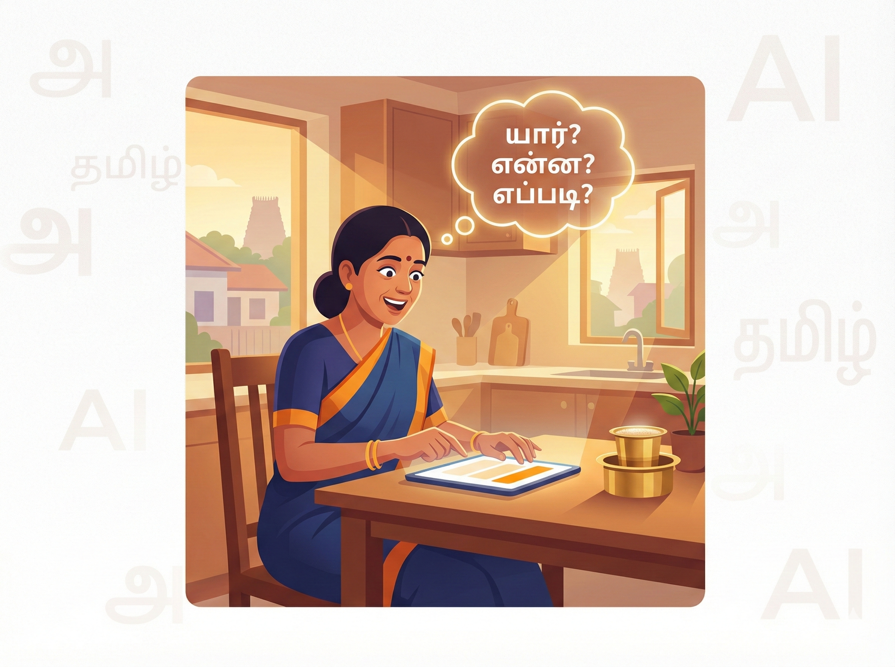

# முதன்முறை பயனர்களுக்கான வழிகாட்டி

செய்யறிவு (AI) என்பது ஏதோ ஒரு மாயாஜாலம் அல்ல; அது ஒரு திறமையான உதவியாளர். அவரிடம் எப்படி வேலை வாங்குவது என்பதை ஒரு எளிய கதை மூலம் முதலில் பார்ப்போம்.

## 👨‍🏫 ஒரு சின்ன கதை: அந்த மாயக் கண்ணாடி

விழுப்புரத்தில் வசிக்கும் சரவணன், ஒரு நாள் தன் 7-ம் வகுப்பு மகனின் கணிதப் பாடத்தைப் பார்த்துத் திகைத்துப் போனார். "பின்னங்கள்" (Fractions) அவருக்கும் புரியவில்லை, மகனுக்கும் புரியவில்லை. அப்போதுதான் அவர் தன் கைபேசியில் இருந்த செய்யறிவுத் தோழனிடம் (AI) உதவி கேட்டார்.

அவர் கேட்ட விதம் இதுதான்: **"நான் ஒரு தந்தை. என் மகனுக்குப் பின்னங்கள் புரியவில்லை. பிட்சா (Pizza) துண்டுகளை உதாரணங்களாக வைத்து எளிய தமிழில் விளக்கவும்."**

அடுத்த நிமிடம், செய்யறிவு ஒரு அற்புதமான ஆசிரியராக மாறி, பிட்சா துண்டுகளைக் கொண்டு அழகாக விளக்கியது. சரவணனின் மகன் அன்று சிரித்துக்கொண்டே கணக்குப் பாடம் படித்தான். அந்த ஒரு கேள்வி, மகனின் மதிப்பெண்ணை 45-லிருந்து 78-க்கு உயர்த்தியது.

## ⚡ Prompt Lite: யார் · என்ன · எப்படி

பெரிய தொழில்நுட்பக் கட்டமைப்புகளைக் கற்பதற்கு முன், இந்த எளிய 3-படி முறையை அறிந்துகொள்ளுங்கள்:

> **🎯 கற்றல் நோக்கங்கள்**
> * 3-படி Prompt Lite முறையைப் புரிந்துகொள்ளுதல்.
> * வெவ்வேறு சூழல்களுக்குக் கட்டளைகளை உருவாக்கக் கற்றுக்கொள்ளுதல்.
> * தவறான கட்டளைகளைச் சரியானதாக மாற்றும் திறனை வளர்த்தல்.
> 
> 

### 1. யார்? (WHO)

நீங்கள் யார் அல்லது என்ன நிலையில் இருக்கிறீர்கள் என்று செய்யறிவிடம் சொல்லுங்கள்.

* "நான் ஒரு 7-ம் வகுப்பு மாணவன்".
* "நான் ஒரு சிறு விவசாயி".
* "நான் ஒரு 68 வயது முதியவர்".

### 2. என்ன? (WHAT)

உங்கள் கோரிக்கையைத் தெளிவாகவும் குறிப்பிட்டதாகவும் சொல்லுங்கள்.

* "நீரின் மூலக்கூறு (H₂O) புரிய வேண்டும்".
* "என் நெல் வயலில் இந்த நோய் என்னவென்று தெரிய வேண்டும்".

### 3. எப்படி? (HOW)

பதில் எந்த வடிவில், எந்த நடையில் இருக்க வேண்டும்?

* "எளிய தமிழில்".
* "உதாரணங்களுடன்".
* "படிப்படியாக, 5 வரிகளில்".

## 🚀 இப்போதே முயற்சிக்கலாம்!

கீழே உள்ள கட்டளைகளில் காலியாக உள்ள இடங்களை உங்கள் தேவைக்கேற்ப நிரப்பி, ChatGPT அல்லது Gemini-யிடம் கேட்டுப் பாருங்கள்:

> [!PROMPT]
> நான் ஒரு ____________________. எனக்கு ____________________ பற்றித் தெரிய வேண்டும். ____________________ எளிய தமிழில் விளக்கவும்.

### சில நேரடி உதாரணங்கள்:

* **விவசாயிக்கு:** "நான் திருவாரூரில் 3 ஏக்கர் நெல் சாகுபடி செய்யும் விவசாயி. என் நெல் இலைகளில் மஞ்சள் கோடுகள் தோன்றுகின்றன — இது என்ன நோய்? தமிழில் விளக்கவும்".
* **முதியவருக்கு:** "நான் 68 வயது முதியவன். என் மருத்துவர் 'Blood Pressure' என்று சொன்னார். மிக எளிய வார்த்தைகளில், சிறு குழந்தைக்குச் சொல்வது போல் விளக்கவும்".
* **வீட்டம்மாவுக்கு:** "நான் ஒரு வீட்டம்மா. என் 10 வயது மகனுக்குப் பின்னங்கள் கற்றுக்கொடுக்க வேண்டும். விளையாட்டு உதாரணங்களுடன் 5 படிகளில் சொல்லுங்கள்".

## 🔄 தவறான முறை vs சரியான முறை

| ❌ இப்படி கேட்காதீர்கள் | ✅ இப்படி கேட்கவும் | மாற்றம் என்ன? |
| --- | --- | --- |
| "சர்க்கரை நோய் பத்தி சொல்லு" | "நான் 50 வயது, சர்க்கரை நோய் பற்றி எளிய தமிழில் 5 முக்கிய விஷயங்கள் சொல்லுங்கள்" | யார், எப்படி சேர்க்கப்பட்டது |
| "ரெசிப்பி சொல்லு" | "நான் ஒரு ஆரம்ப நிலை சமையற்காரன். பருப்பு சாம்பார் செய்யப் படிப்படியாகச் சொல்லுங்கள்" | திறன் நிலை சொல்லப்பட்டது |

## 🔍 அறிவு சோதனை

**கேள்வி:** "எனக்கு ஒரு ரெசிப்பி சொல்லு" என்ற கட்டளையில் உள்ள குறைபாடு என்ன?

விடை பார்க்க

யார் கேட்கிறார் என்று சொல்லப்படவில்லை, என்ன வகை உணவு என்று தெளிவில்லை, எப்படிச் சொல்ல வேண்டும் என்ற விவரம் இல்லை.

**சரியான கட்டளை:** "நான் இப்போது தான் சமையல் செய்யக் கற்றுக்கொள்கிறேன். பருப்பு சாம்பார் செய்யப் படிப்படியாக தமிழில் சொல்லுங்கள்".

### 📋 அத்தியாயச் சுருக்கம்: நாம் கற்ற பாடங்கள்

சரவணனின் மகன் 45 மதிப்பெண்ணிலிருந்து 78-க்கு உயர்ந்தது ஒரு மந்திரத்தால் அல்ல — மூன்று சிறிய கேள்விகளால். இந்த அத்தியாயத்தில் நாம் கற்றவை:

* **Prompt Lite முறை:** செய்யறிவிடம் பேச 'யார் · என்ன · எப்படி' என்ற மூன்று படிகள் தெரிந்தால் போதும்.
* **யார் (WHO):** நீங்கள் யார் அல்லது என்ன நிலையில் இருக்கிறீர்கள் என்று சொல்லும்போது செய்யறிவு உங்களுக்கு ஏற்றவாறு பதிலளிக்கும்.
* **என்ன (WHAT):** உங்கள் கோரிக்கையை எவ்வளவு சுருக்கமாகவும் தெளிவாகவும் சொல்கிறீர்களோ, அவ்வளவு துல்லியமான பதில் கிடைக்கும்.
* **எப்படி (HOW):** பதில் எந்த வடிவில் (அட்டவணை, பட்டியல், எளிய தமிழ்) வேண்டும் என்பதைக் குறிப்பிடுவது அவசியம்.
* **முக்கிய எச்சரிக்கை:** செய்யறிவு ஒரு தொடக்கப் புள்ளி மட்டுமே; மருத்துவம், சட்டம் போன்ற முக்கியமான முடிவுகளுக்கு எப்போதும் நிபுணரை அணுகுவதே சிறந்தது.

> [!WARNING]
> செய்யறிவு சில நேரங்களில் மிகவும் நம்பகமாகப் பொய்களைச் சொல்லக்கூடும். இதைத்தான் நாம் 'மதிமயக்கம்' என்கிறோம். இதைப்பற்றி அடுத்த அத்தியாயத்தில் விரிவாகப் பார்ப்போம்.
