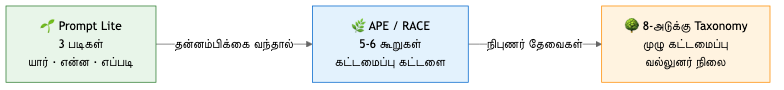

# 🌱 முதன்முறை பயனர்களுக்கான வழிகாட்டி

> [!NOTE]
> **வகை (Type):** Beginner Guide — Prompt Lite Framework
> **பயனர்கள் (Audience):** முதன்முறை AI பயனர்கள் — தொழில்நுட்ப அறிவு தேவையில்லை

AI-யிடம் கேள்வி கேட்க படிக்கத் தெரிந்தால் போதும். இந்தப் பகுதி உங்களுக்கானது.

---

## AI என்பது உங்கள் உதவியாளர்

கற்பனை செய்யுங்கள்: உங்கள் ஊரில் மிகவும் படித்த, எல்லாத் துறையிலும் அறிவுள்ள ஒருவர் உங்களுக்கு உதவ எப்போதும் தயாராக இருக்கிறார். அவரிடம் நீங்கள் எப்படி கேட்கிறீர்கள் என்பதைப் பொறுத்தே, அவரின் பதில் பயனுள்ளதாக இருக்கும்.

AI-யும் அப்படித்தான். நீங்கள் சரியாகக் கேட்டால் — சரியான பதில் கிடைக்கும்.


> **🎯 கற்றல் நோக்கங்கள்**
>
> - 3-படி Prompt Lite முறையை (யார் · என்ன · எப்படி) புரிந்துகொள்க
> - வெவ்வேறு சூழல்களுக்கு கட்டளைகளை உருவாக்கக் கற்றுக்கொள்க
> - தவறான கட்டளைகளை சரியானதாக மாற்றும் திறனை வளர்க்க
> - அடுத்த கட்டமைப்புகளுக்கு (APE, RACE, 8-அடுக்கு) தயாராகும் பாதையை அறிக

---

## 3 படி Prompt Lite முறை

பெரிய கட்டமைப்புகள் (Frameworks) கற்றுக்கொள்வதற்கு முன், இந்த எளிய 3 படி முறையை அறிந்துகொள்ளுங்கள்:



### படி 1 — யார் கேட்கிறார்? (WHO)

நீங்கள் யார், என்ன நிலையில் இருக்கிறீர்கள் என்று AI-யிடம் சொல்லுங்கள்.

> "நான் ஒரு 7ம் வகுப்பு மாணவன்"
> "நான் ஒரு சிறு விவசாயி"
> "நான் ஒரு வீட்டம்மா, என் மகனுக்கு உதவ வேண்டும்"
> "நான் ஒரு முதியவர், computer முதன்முறை பயன்படுத்துகிறேன்"

### படி 2 — என்ன வேண்டும்? (WHAT)

உங்கள் கோரிக்கையை தெளிவாகச் சொல்லுங்கள்.

> "நீரின் மூலக்கூறு (H₂O) புரிய வேண்டும்"
> "என் நெல் வயலில் இந்த நோய் என்னவென்று தெரிய வேண்டும்"
> "இந்த கடிதம் எழுத உதவி வேண்டும்"
> "இந்த மாத்திரை எதற்கானது என்று தெரிய வேண்டும்"

### படி 3 — எப்படி சொல்ல வேண்டும்? (HOW)

AI எப்படி பதில் சொல்ல வேண்டும் என்று குறிப்பிடுங்கள்.

> "எளிய தமிழில்"
> "உதாரணங்களுடன்"
> "படிப்படியாக"
> "குறுகியதாக, 5 வரிகளில்"
> "சிறு குழந்தைக்கு சொல்வது போல்"

---

## உதாரணங்கள்

### 🎓 மாணவனுக்கு

**3 படிகளை இணைத்த கட்டளை:**

```prompt
நான் ஒரு 7ம் வகுப்பு மாணவன். [யார்]
நீரின் மூலக்கூறு (H₂O) என்றால் என்ன என்று [என்ன]
எளிய தமிழில், வீட்டில் உள்ள ஒரு பொருளை உதாரணமாக கொண்டு விளக்கவும். [எப்படி]
```

**AI பதில் இப்படி வரும்:**
நீர் என்பது 2 ஹைட்ரஜன் (H) + 1 ஆக்சிஜன் (O) சேர்ந்தது. உங்கள் வீட்டில் உள்ள குளிர்பானம் போல், தனியாக குடிக்க முடியாத பொருட்களை சேர்த்தால் ஒரு புதிய, குடிக்கக்கூடிய பொருள் உருவாகும்.

---

### 🌾 விவசாயிக்கு

```prompt
நான் திருவாரூரில் 3 ஏக்கர் நெல் சாகுபடி செய்யும் விவசாயி. [யார்]
என் நெல் இலைகளில் மஞ்சள் கோடுகள் தோன்றுகின்றன — இது என்ன நோய்? [என்ன]
தமிழில் விளக்கவும், என்ன செய்ய வேண்டும் என்பதையும் சொல்லுங்கள். [எப்படி]
```

---

### 👴 முதியவருக்கு

```prompt
நான் 68 வயது முதியவன், படிப்பு குறைவு. [யார்]
என் மருத்துவர் "Blood Pressure" என்று சொன்னார் — இது என்னவென்று புரியவில்லை. [என்ன]
மிகவும் எளிய வார்த்தைகளில், சிறு குழந்தைக்கு சொல்வது போல் விளக்கவும். [எப்படி]
```

---

### 🏠 வீட்டம்மாவுக்கு

```prompt
நான் ஒரு வீட்டம்மா, என் 10 வயது மகன் தேர்வில் கணக்கு தோல்வியுற்றான். [யார்]
அவனுக்கு பின்னங்கள் (Fractions) கற்றுக்கொடுக்க வேண்டும். [என்ன]
விளையாட்டு உதாரணங்களுடன், தமிழில் 5 படிகளில் சொல்லுங்கள். [எப்படி]
```

---

## இப்போதே முயற்சிக்கவும்!

கீழே உள்ள இடங்களை நிரப்பி, ChatGPT அல்லது Claude-ல் அனுப்புங்கள்:

```
நான் ஒரு __________________________________.
எனக்கு ____________________________________ பற்றி தெரிய வேண்டும்.
___________________________________ தமிழில் விளக்கவும்.
```

---

## தவறான முறை vs சரியான முறை

| ❌ இப்படி கேட்காதீர்கள் | ✅ இப்படி கேட்கவும் | என்ன மாற்றம்? |
|---|---|---|
| "சர்க்கரை நோய் பத்தி சொல்லு" | "நான் 50 வயது, சர்க்கரை நோய் பற்றி எளிய தமிழில் 5 முக்கிய விஷயங்கள் சொல்லுங்கள்" | யார், எப்படி சேர்க்கப்பட்டது |
| "English-ல translate பண்ணு" | "இந்த தமிழ் கடிதத்தை அலுவல் ஆங்கிலத்தில் மொழிபெயர்க்கவும்" | நோக்கம் தெளிவாக உள்ளது |
| "recipe சொல்லு" | "நான் ஒரு தொடக்கநிலை சமையல்காரன். பருப்பு சாம்பார் செய்ய படிப்படியாக சொல்லுங்கள்" | திறன் நிலை சொல்லப்பட்டது |
| "என் கோபம் போக help பண்ணு" | "நான் மிகவும் கோபமாக இருக்கிறேன். கோபத்தை கட்டுப்படுத்த 3 எளிய முறைகள் சொல்லுங்கள்" | குறிப்பிட்டதாக கேட்கப்பட்டது |

---

## அடுத்தது என்ன? — வளர்ச்சிப் பாதை

3-படி Prompt Lite-ஐ சுலபமாக பயன்படுத்தும்போது, அடுத்த நிலைக்கு நகர்வீர்கள்:

**APE** (செயல் · நோக்கம் · எதிர்பார்ப்பு) → **RACE** → **8-அடுக்கு Taxonomy**

> [!TIP]
> இந்தப் புத்தகத்தின் "கட்டளை வடிவமைப்பு" பகுதியில் இந்த கட்டமைப்புகள் விரிவாக விளக்கப்பட்டுள்ளன.

---

## 📋 அத்தியாய சுருக்கம்

| கருத்து | முக்கிய விஷயம் |
|---------|---------------|
| **Prompt Lite** | யார் · என்ன · எப்படி — 3 படிகள் மட்டுமே |
| **யார் (WHO)** | நீங்கள் யார், என்ன நிலையில் இருக்கிறீர்கள் என்று சொல்லுங்கள் |
| **என்ன (WHAT)** | உங்கள் கோரிக்கையை குறிப்பிட்டதாக சொல்லுங்கள் |
| **எப்படி (HOW)** | AI எந்த வடிவத்தில், எந்த மொழியில் பதில் சொல்ல வேண்டும் என்று குறிப்பிடுங்கள் |
| **வளர்ச்சிப் பாதை** | Prompt Lite → APE → RACE → 8-அடுக்கு Taxonomy |

**பொதுவான தவறுகள்:**
- குறுகியதாக கேட்பது: "சர்க்கரை நோய் சொல்லு" — யாருக்கு? எப்படி?
- சூழல் இல்லாமல் கேட்பது — AI எந்த நிலையில் விளக்க வேண்டும் என்று தெரியாது
- AI பதிலை கண்மூடித்தனமாக நம்புவது — எப்போதும் முக்கிய விஷயங்களை சரிபார்க்கவும்

---

## 🧠 அறிவு சோதனை

**கேள்வி 1:** "recipe சொல்லு" என்ற கட்டளையில் என்ன குறைபாடு?

<details>
<summary>விடை பார்க்க</summary>

யார் கேட்கிறார் என்று சொல்லப்படவில்லை (தொடக்கநிலையா? அனுபவமிக்கவரா?), என்ன recipe என்று தெளிவில்லை, எப்படி சொல்ல வேண்டும் என்று குறிப்பிடவில்லை.

**சரியான கட்டளை:** "நான் ஒரு தொடக்கநிலை சமையல்காரன். பருப்பு சாம்பார் செய்ய படிப்படியாக, தமிழில் 8 படிகளில் சொல்லுங்கள்."

</details>

---

**கேள்வி 2:** Prompt Lite-ன் 3 படிகள் என்ன?

<details>
<summary>விடை பார்க்க</summary>

1. **யார் (WHO)** — நீங்கள் யார், என்ன நிலையில் இருக்கிறீர்கள்
2. **என்ன (WHAT)** — உங்கள் கோரிக்கை குறிப்பாக என்ன
3. **எப்படி (HOW)** — AI எந்த வடிவத்தில், எந்த மொழியில் பதில் சொல்ல வேண்டும்

</details>

---

> [!WARNING]
> AI சொல்வது எல்லாம் உண்மையல்ல. மருத்துவம், சட்டம், நிதி தொடர்பான முடிவுகளுக்கு எப்போதும் நிபுணரிடம் சரிபார்க்கவும். AI ஒரு தொடக்கப் புள்ளி மட்டுமே.
