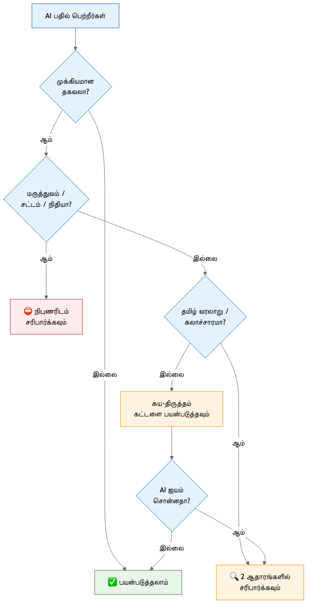

# 🔍 AI மதிமயக்கம் — தமிழில் உண்மையை சரிபார்ப்பது எப்படி?

> [!NOTE]
> **வகை (Type):** Critical Thinking Guide — AI Reliability in Tamil
> **பயனர்கள் (Audience):** அனைத்து Tamil AI பயனர்கள் — தொடக்கம் முதல் நிபுணர் வரை

AI சொல்வதை கண்ணை மூடிக்கொண்டு நம்பாதீர்கள். குறிப்பாக தமிழில் — ஏனெனில், AI மாதிரிகள் ஆங்கிலத்தை விட தமிழில் அதிகமாக தவறு செய்கின்றன.

> **🎯 இந்தப் பகுதியில் கற்றுக்கொள்வது**
>
> - AI மதிமயக்கம் என்ன, தமிழில் அது ஏன் அதிகமாக நடக்கிறது என்று புரிந்துகொள்க
> - ஆபத்தான 5 துறைகளை அறிந்து எச்சரிக்கையாக இருக்க
> - 3 சுய-திருத்தம் கட்டளைகளை பயன்படுத்தி AI-ஐ சரிபார்க்க
> - தமிழ் நம்பகமான ஆதாரங்களை கண்டறிந்து பயன்படுத்த

---

## மதிமயக்கம் என்றால் என்ன?

AI ஒரு கேள்விக்கு தவறான பதிலை, ஆனால் மிகவும் நம்பகமாகவும் தெளிவாகவும் சொல்வதே **மதிமயக்கம் (Hallucination)** எனப்படும்.

> **எடுத்துக்காட்டு:** "திருவள்ளுவர் எந்த ஊரில் பிறந்தார்?" என்று கேட்டால், AI ஒரு குறிப்பிட்ட ஊரை நம்பகமாகச் சொல்லலாம் — ஆனால் வரலாற்றில் இது உறுதிப்படுத்தப்படவில்லை.

---

## ஏன் தமிழில் அதிகமாக நடக்கிறது?

| காரணம் | விளக்கம் |
|--------|----------|
| **பயிற்சி தரவு குறைபாடு** | ஆங்கிலத்தில் பல கோடி தரவுகள், தமிழில் சில கோடி மட்டுமே |
| **மொழி நுட்பங்கள்** | தமிழின் சொல் வரிசை, இணைச்சொற்கள், பல பொருள் சொற்கள் AI-க்கு கடினம் |
| **கலாச்சார சூழல்** | தமிழ் நாட்டுப்புற மருந்துகள், பண்டிகை விவரங்கள் — AI-யிடம் குறைந்த தரவு |
| **வரலாற்று மூலங்கள்** | தமிழ் வரலாற்று ஆதாரங்கள் இணையத்தில் குறைவு |

---

## தமிழில் AI தவறு செய்யும் 5 முக்கிய துறைகள்



### 1. 🏺 தமிழ் வரலாறும் கலாச்சாரமும்

AI கற்பனையில் உருவாக்கும் தகவல்கள்:
- அரசர்களின் ஆட்சிக் காலங்கள்
- கோயில் வரலாறு, திருவிழா விவரங்கள்
- தமிழ் இலக்கிய படைப்புகளின் தேதிகள்

**சரிபார்க்க:** தமிழ் நாடு அரசு வரலாற்றுத் துறை, Tamil Nadu Archaeology Department

### 2. 🌿 நாட்டுப்புற மருத்துவம்

AI கற்பனையில் சேர்க்கும் தகவல்கள்:
- "வேப்பிலை + மஞ்சள் + X கலந்து குடிங்க" — X என்னவென்று AI கட்டுக்கதை சொல்லலாம்
- மூலிகைகளின் கலவை விகிதங்கள்
- சித்த மருத்துவ மருந்துகளின் பெயர்கள்

**சரிபார்க்க:** TNAU Herbal Garden, சித்த மருத்துவ கல்லூரி வெளியீடுகள்

### 3. 📊 புள்ளிவிவரங்கள்

AI தவறாக சொல்லும் தகவல்கள்:
- தமிழ்நாடு மக்கள்தொகை, GDP
- கல்வி கல்வி அறிவு விகிதம், வேலையின்மை
- அரசு திட்டங்களின் பயனாளிகள் எண்ணிக்கை

**சரிபார்க்க:** Census of India, MOSPI, Tamil Nadu Statistics

### 4. ⚖️ சட்டமும் அரசாங்கத் திட்டங்களும்

AI தவறாக சொல்லும் தகவல்கள்:
- "இந்த திட்டத்தில் இவ்வளவு பணம் கிடைக்கும்" — புதுப்பிக்கப்படாத தகவல்
- சட்டப் பிரிவுகளின் விவரங்கள்
- நீதிமன்றத் தீர்ப்புகளின் சாரம்

**சரிபார்க்க:** Tamil Nadu e-District, India Code website, High Court official site

### 5. 🎭 தமிழ் இலக்கியம்

AI கற்பனையில் உருவாக்கும் தகவல்கள்:
- "கம்பன் இந்த வரியை எழுதினார்" — உண்மையில் இல்லாத பாடல்
- கவிஞர்களின் வாழ்க்கை வரலாற்று விவரங்கள்
- சங்க இலக்கியப் பாடல்களின் மூலம்

**சரிபார்க்க:** Tamil Virtual Academy (tamilvu.org), Project Madurai (projectmadurai.org)

---

## 3 சுய-திருத்தம் கட்டளைகள்

இந்த கட்டளைகளை AI-யிடம் அனுப்பினால், AI தன் சொந்த பதிலை மதிப்பிட்டு, நம்பகமற்ற தகவல்களை வெளிப்படுத்தும்.

### கட்டளை 1 — உண்மை சரிபார்ப்பு

```prompt
நீ இப்போது சொன்ன தகவல் பற்றி சுயமாக மதிப்பிடு:

1. இது உறுதிப்படுத்தப்பட்ட உண்மையா அல்லது உன் அனுமானமா?
2. இந்த தகவலில் நீ நம்பகமற்றதாக உணர்கிறாயா?
3. தமிழ் வரலாறு / கலாச்சாரம் / மருத்துவம் சார்ந்தது என்றால் குறிப்பாக கவனமாக இரு.

நம்பகமற்ற தகவல்களை "இது நிச்சயமில்லை:" என்று தனியாக பட்டியலிடு.
```

### கட்டளை 2 — இரட்டை சரிபார்ப்பு

```prompt
{தலைப்பு} பற்றி சொல். பிறகு, இரண்டு பட்டியல் கொடு:

✅ நான் நம்பகமாக சொல்ல முடியும்:
- ...

⚠️ நான் நிச்சயமில்லாமல் சொன்னது:
- ...

தமிழ் கலாச்சாரம், வரலாறு, மருத்துவம் தொடர்பான தகவல்களில் மிகவும் கவனமாக இரு.
```

### கட்டளை 3 — ஆதார கோரிக்கை

```prompt
நீ சொன்ன இந்த தகவலை நான் எந்த நம்பகமான தமிழ் ஆதாரத்தில்
சரிபார்க்கலாம்? (இணையதளம், நூல், அரசு வெளியீடு)

இல்லையெனில் "இதை சரிபார்க்க ஆதாரம் தெரியவில்லை" என்று சொல்.
```

---

## தமிழ் AI பதில்களை சரிபார்க்க நம்பகமான ஆதாரங்கள்

| துறை | ஆதாரம் |
|------|--------|
| **வரலாறு / இலக்கியம்** | tamilvu.org, projectmadurai.org |
| **அரசு திட்டங்கள்** | tn.gov.in, edistrict.tn.gov.in |
| **மருத்துவம்** | AIIMS, cmchvellore.edu (நிபுணர் கலந்தாய்வு அவசியம்) |
| **சட்டம்** | indiankanoon.org, hcmadras.tn.gov.in |
| **புள்ளிவிவரம்** | censusindia.gov.in, mospi.gov.in |
| **செய்திகள்** | dinamalar.com, thehindu.com/tamil |

---

## எப்போது கவலைப்பட வேண்டாம்?

AI பதில்கள் பொதுவாக நம்பகமானவை:
- ✅ கணிதக் கணக்குகள்
- ✅ நிரல் எழுதுதல் (Programming)
- ✅ மொழிபெயர்ப்பு (சரியாக சரிபார்க்கவும்)
- ✅ கட்டுரை எழுதுதல் / சுருக்கம்
- ✅ யோசனைகள் பட்டியலிடுதல்

கவலைப்படுங்கள்:
- ⚠️ குறிப்பிட்ட எண்கள், தேதிகள், பெயர்கள்
- ⚠️ மருத்துவ / சட்ட / நிதி ஆலோசனைகள்
- ⚠️ தமிழ் வரலாறு, இலக்கியம், கலாச்சாரம்
- ⚠️ உள்ளூர் / நாட்டுப்புற தகவல்கள்

---

## நினைவில் கொள்ளவும்

> AI ஒரு மிகவும் தெரிந்தவனைப் போல் தோன்றும், ஆனால் அவன் எப்போதும் சரியாக இருப்பதில்லை.
> உங்கள் அனுபவம், சுற்றியிருப்போரின் அறிவு, மற்றும் நம்பகமான ஆதாரங்களுடன் எப்போதும் சரிபார்க்கவும்.

---

## 📋 அத்தியாய சுருக்கம்

| கருத்து | முக்கிய விஷயம் |
|---------|---------------|
| **மதிமயக்கம்** | AI தவறான தகவலை நம்பகமாக சொல்வது |
| **தமிழில் அதிக ஆபத்து** | குறைந்த பயிற்சி தரவு, கலாச்சார சூழல் தரவு இல்லாமை |
| **5 ஆபத்தான துறைகள்** | வரலாறு, நாட்டுப்புற மருத்துவம், புள்ளிவிவரம், சட்டம், இலக்கியம் |
| **3 சுய-திருத்தம் கட்டளைகள்** | உண்மை சரிபார்ப்பு, இரட்டை சரிபார்ப்பு, ஆதார கோரிக்கை |
| **நம்பகமான ஆதாரங்கள்** | tamilvu.org, tn.gov.in, indiankanoon.org, censusindia.gov.in |

**நினைவில் கொள்ளவும்:**
- AI நம்பகமாக சொல்வது = உண்மை என்று அர்த்தமில்லை
- தமிழ் தகவல்களை எப்போதும் தமிழ் ஆதாரங்களில் சரிபார்க்கவும்
- மருத்துவம், சட்டம், நிதி — இந்த மூன்றிலும் எப்போதும் நிபுணர் ஆலோசனை அவசியம்

---

> [!WARNING]
> மருத்துவம், சட்டம், நிதி தொடர்பான AI பதில்களை எப்போதும் தகுதிவாய்ந்த நிபுணரிடம் சரிபார்க்கவும். AI ஒரு தொடக்கப் புள்ளி மட்டுமே — இறுதி முடிவல்ல.
