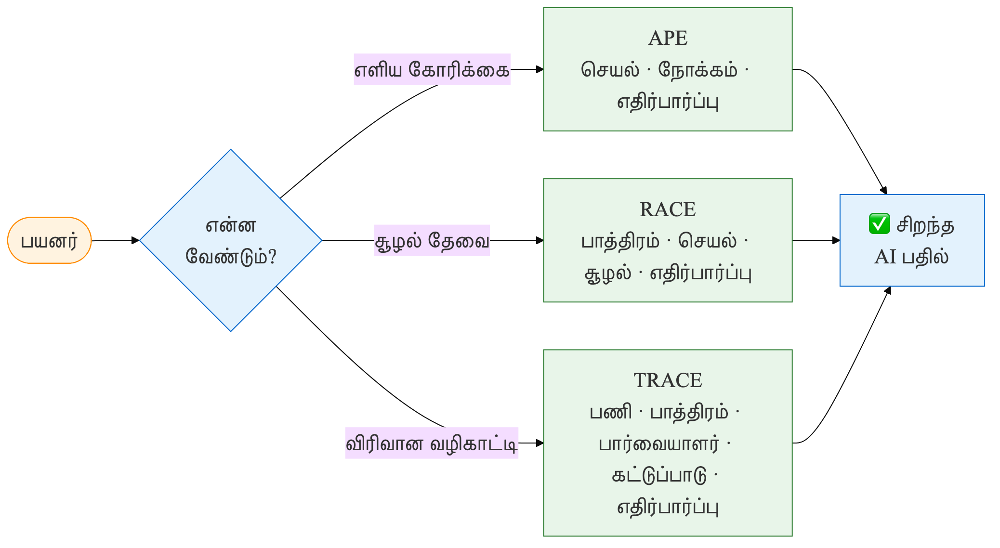
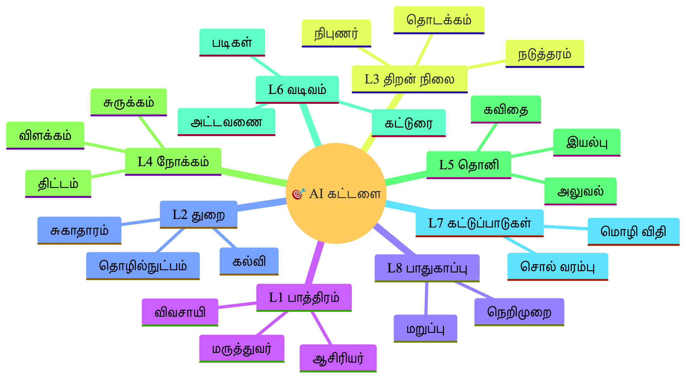

# 8-அடுக்குக் கட்டமைப்பு — செய்யறிவைச் செதுக்கும் கலை

போன அத்தியாயத்தில் 'Prompt Lite' மூலம் செய்யறிவிடம் (AI) எப்படி எளிமையாகப் பேசுவது என்று பார்த்தோம். ஆனால், பெரிய பெரிய வேலைகள் செய்யும்போதோ அல்லது ஆழமான ஒரு கட்டுரையை எழுதச் சொல்லும்போதோ இந்த மூன்று படிகள் மட்டும் போதாது. அதற்கென நமக்கு ஒரு முறையான கட்டமைப்பு (Framework) தேவைப்படுகிறது.

## 👨‍🏫 ஒரு சின்ன கதை: அந்தச் சிற்பியின் ரகசியம்

மதுரையில் ஒரு சிற்பி இருந்தார். அவரிடம் ஒருவர் வந்து, "ஐயா, எனக்கு ஒரு கல் வேணும்" என்று கேட்டார். சிற்பி ஒரு சாதாரணக் கல்லை எடுத்துத் தந்தார். இன்னொருவர் வந்து, "எனக்கு ஒரு அழகான சிலை வேணும்" என்றார். சிற்பி அங்கிருந்த சிற்பங்களில் ஓரளவு அழகாக செதுக்கி வைத்திருந்த ஒரு சிலையைக் கொடுத்தார்.

பிறகு மூன்றாவதாக ஒரு கலை ரசிகர் வந்தார். "ஐயா, எனக்கு 6 அடி உயரத்தில், கருங்கல்லால் ஆன, புன்னகைக்கும் முகம் கொண்ட ஒரு நடராஜர் சிலை வேண்டும். அது பீடத்தில் மிக உறுதியாக நிற்க வேண்டும்" என்று மிகத் தெளிவாகக் கேட்டார். இப்போது அந்தச் சிற்பி தன்னுடைய முழுத் திறமையையும் காட்டி ஓர் அற்புதம் படைத்தார்.

செய்யறிவும் அந்தச் சிற்பியைப் போலத்தான். நீங்கள் எவ்வளவு துல்லியமாகக் கேட்கிறீர்களோ, அந்த அளவுக்கு நேர்த்தியான படைப்பு உங்களுக்குக் கிடைக்கும். அந்தத் துல்லியத்தை நமக்குக் கொடுப்பதுதான் இந்த **8-அடுக்குக் கட்டமைப்பு (8-Layer Framework).**

## 🏗️ 8-அடுக்குக் கட்டமைப்பு (The 8-Layer Framework)

இந்த எட்டு அடுக்குகளைச் சரியாகப் பயன்படுத்தினால், நீங்கள் கொடுக்கும் கட்டளை (Prompt) நல்ல வடிவத்தைப் பெறும்:

1. **L1 — பாத்திரம் (Role):** செய்யறிவு யார் மாதிரி உங்களிடம் பேச வேண்டும்? (உதாரணமாக:  மருத்துவர் போலவா, அல்லது ஆசிரியர் போலவா?)
2. **L2 — துறை (Domain):** நீங்கள் கேட்கும் கேள்வி எந்தத் துறையைச் சேர்ந்தது? (உதாரணமாக: சுகாதாரமா, விவசாயமா?)
3. **L3 — திறன் நிலை (Skill Level):** இந்தப் பதில் யாருக்காகப் பயன்படப் போகிறது? (உதாரணமாக: புதிதாகக் கற்றுக்கொள்பவருக்கா அல்லது அந்தத் துறையில் நிபுணராக இருப்பவருக்கா?)
4. **L4 — நோக்கம் (Intent):** செய்யறிவை நீங்கள் என்ன செய்யச் சொல்கிறீர்கள்? (உதாரணமாக: ஒரு விஷயத்தை விளக்க வேண்டுமா, சுருக்கமாகச் சொல்ல வேண்டுமா, அல்லது நிரல் (Code) எழுத வேண்டுமா?)
5. **L5 — தொனி (Tone):** பதில் எப்படிப்பட்ட நடை அல்லது குரலில் இருக்க வேண்டும்? (உதாரணமாக: மரியாதையாகவா, கவிதை நடையிலா அல்லது அலுவலக நடையிலா?)
6. **L6 — வடிவம் (Format):** உங்களுக்குத் தேவையான பதில் எந்த வடிவத்தில் வர வேண்டும்? (உதாரணமாக: அட்டவணையாகவா, கட்டுரையாகவா அல்லது பட்டியலாகவா?)
7. **L7 — கட்டுப்பாடுகள் (Constraints):** செய்யறிவு எதெல்லாம் செய்யக் கூடாது அல்லது அதன் எல்லைகள் என்னென்ன? (உதாரணமாக: 100 வார்த்தைகளுக்குள் இருக்க வேண்டும், ஆங்கிலம் கொஞ்சம் கூடக் கலக்காமல் இருக்க வேண்டும்.)
8. **L8 — பாதுகாப்பு (Safety):** மறுப்பு அறிக்கைகள் அல்லது இந்தக் குறிப்பானது அனைவருக்கும் பொதுவான குறிப்பு என்பது போன்ற பாதுகாப்புக் குறிப்புகளைச் சேர்ப்பது.

## 🛠️ ஒரு முழுமையான உதாரணம் (The Master Template)

இந்த எட்டு அடுக்குகளையும் ஒன்று சேர்த்து ஒரு தொழில்முறையான (Professional) கட்டளையை எப்படி எழுதுவது என்று பார்ப்போம் வாங்க:

> [!PROMPT]
> **பாத்திரம்:** நீ ஒரு அனுபவமிக்க வேளாண்மை நிபுணர்.
> **துறை:** விவசாயம்.
> **திறன் நிலை:** ஒரு சிறு விவசாயிக்கான ஆலோசனை.
> **நோக்கம்:** இயற்கை முறையில் பூச்சிக்கொல்லி தயாரிப்பது எப்படி என்று விளக்கவும்.
> **தொனி:** எளிய தமிழ் நடை.
> **வடிவம்:** படிப்படியான (Step-by-step) பட்டியல்.
> **கட்டுப்பாடுகள்:** வீட்டில் கிடைக்கும் பொருட்களை மட்டுமே பயன்படுத்திச் செய்யக் கூடியதாக இருக்க வேண்டும்.
> **பாதுகாப்பு:** "இவை பொதுவான ஆலோசனைகள் மட்டுமே" என்ற குறிப்பையும் கீழே சேர்க்கவும்.

## 🔄 ஏன் இந்த 8 அடுக்குகள் அத்தனை முக்கியம்?

| அடுக்கு | இது இல்லாவிட்டால் என்ன ஆகும்? |
| --- | --- |
| **L1 — பாத்திரம்** | கிடைக்கும் பதில் மிகச் சாதாரணமானதாக, எந்த ஒரு ஆழமும் இல்லாமல் போகும். |
| **L5 — தொனி** | ஒரு பெரியவரிடம் சிறு பையன் பேசுவது போல, தேவையற்ற நடையில் பதில் கிடைக்க வாய்ப்புள்ளது. |
| **L7 — கட்டுப்பாடுகள்** | பதில் மிகவும் நீளமாக வந்து உங்களைச் சலிப்படையச் செய்யலாம் அல்லது தேவையற்ற ஆங்கிலச் சொற்கள் கலந்து வரலாம். |

## 📋 அத்தியாயச் சுருக்கம்: நாம் கற்றுக் கொண்டவை

மதுரைச் சிற்பி நமக்கு ஒன்றைத் தெளிவாகக் கற்பித்து விட்டார். நீங்கள் எந்த அளவிற்கு தெளிவாக உங்கள் விருப்பங்களைக் கேட்கிறீர்களோ, அந்த அளவிற்குதான் சாதாரண கல்லையும் அற்புதமான சிலையாக கேட்டு வாங்க முடியும் என்று. 

இந்த அத்தியாயத்தில் நாம் முக்கியமாகப் புரிந்து கொண்ட விஷயங்கள் இவைதான்:

* **சிற்பியின் கலை:** செய்யறிவிடம் (AI) நமக்குத் தேவையானதைத் துல்லியமாகக் கேட்பதும் ஒரு மாபெரும் கலைதான்; அதற்கு இந்த 8-அடுக்குக் கட்டமைப்புப் பெரிதும் உதவும்.
* **8 அடுக்குகள்:** பாத்திரம் தொடங்கிப் பாதுகாப்பு வரை இந்த 8 அடுக்குகளையும் சேர்த்துக் கேட்கும்போது, செய்யறிவின் பதில் ஒரு நிபுணரின் பதிலைப்போலவே மாறிவிடும்.
* **தரநிலை:** இந்த 8-அடுக்கு முறையைத் தொடர்ந்து பின்பற்றினாலே, நீங்கள் ஒரு சிறந்த 'கட்டளை வடிவமைப்பாளர்' (Prompt Engineer) ஆக மாறிவிடுவீர்கள்.
* **தேர்வு:** எல்லா நேரத்திலும் இந்த எட்டு அடுக்குகளும் தேவைப்படாது என்றாலும், மிக முக்கியமான வேலைகளைச் செய்யும்போது இதுதான் சரியான வழி.

> [!TIP]
> இனிமேல் நீங்கள் உங்கள் கட்டளையை எழுதும்போது, மனதிற்குள் இந்த 8 அடுக்குகளையும் ஒரு சரிபார்ப்புப் பட்டியலாக (Checklist) வைத்துக் கொள்ளுங்கள். உங்கள் செய்யறிவுத் தோழன் கொடுக்கும் பதிலைப் பார்த்து நீங்களே வியந்து போவீர்கள்!

> [!NOTE]
> இந்த 8-அடுக்குக் கட்டமைப்பின் முழுமையான விளக்கத்தையும் கூடுதல் உதாரணங்களையும் பார்க்க, **[இணைப்பு B: வகைப்பாடு கட்டமைப்பு](../appendix/appendix-taxonomy-framework.md)**-ஐக் காண்க.
