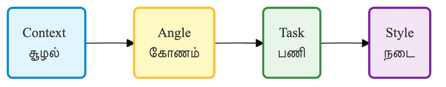

# 🌾 விவசாயம் — மண்ணின் மணம் பேசும் செய்யறிவு

நம்ம ஊர்களில் விவசாயிகள் மண்ணோடு பேசுவது போலவே, இன்று கையில் இருக்கும் அலைபேசியிலேயே ஒரு வேளாண் விஞ்ஞானியை வயலுக்கு அழைத்து வர முடியும். அவன்தான் **செய்யறிவு**. நம்ம தமிழில் கேட்டால், நம்ம மண்ணுக்கு ஏற்ற ஆலோசனையை சொல்லிவிடுவான்.

## ஒரு சின்ன கதை — சுப்பிரமணியின் மஞ்சள் இலைகள்

திருவாரூரில் 3 ஏக்கர் நெல் வயல் வைத்திருந்த சுப்பிரமணி, காலையில் எழுந்து வயலுக்கு சென்றபோது அதிர்ந்து போனார். இலைகளில் அங்காங்கே மஞ்சள் கோடுகள் தெரிந்தன. மனம் பதறியது. வேளாண் அலுவலகம் 50 கிலோமீட்டர் தொலைவில் இருந்தது. என்ன செய்வதென்று தெரியாமல் நின்றார்.

அப்போது அவருடைய மகன் சொன்னான், “அப்பா, போனில் ChatGPT-யிடம் கேட்டுப் பாருங்கள்.” சுப்பிரமணி உடனே கேட்டார்:

“நான் நெல் விவசாயி. இலைகளில் மஞ்சள் கோடுகள் தெரிகின்றன. நான் எடுத்த புகைப்படத்தை இணைத்துள்ளேன். இது என்ன பிரச்சினை?”

மூன்று நிமிடங்களில் பதில் வந்தது: “அது நோய் இல்லை. இரும்புச் சத்து குறைபாடு. இப்படி உரம் போடுங்கள்…” அவர் சொன்னபடி செய்தார். அந்த ஆண்டு மகசூல் நன்றாக வந்தது. ஒரு சின்ன கேள்வி, முழு வயலையும் காப்பாற்றிவிட்டது.

### நம்ம கேள்வி இப்படி இருந்தால் நல்ல பதில் வரும் — C.A.T.S முறை

விவசாயம் போன்ற துறைகளில் துல்லியமான, உபயோகமான பதில் கிடைக்க ஒரு எளிய ஆனால் வலுவான வழி உண்டு. அதை நாம் **C.A.T.S** முறை என்று சொல்லலாம்.

ஏன் C.A.T.S என்று பெயர்? ஏனென்றால் இதில் நான்கு முக்கிய அம்சங்கள் வரிசையாக இருக்கின்றன:

- **C — Context (சூழல்)**
  உங்கள் நிலம், ஊர், மண் வகை, தண்ணீர் வசதி ஆகியவற்றை சொல்லுங்கள்.
  உதாரணம்: “தஞ்சாவூர் மாவட்டம், களிமண் நிலம், போர்வெல் மூலம் தண்ணீர் எடுக்கிறேன்.”

- **A — Angle (கோணம்)**
  எந்தக் கோணத்தில் அல்லது என்ன முறையில் விவசாயம் செய்ய விரும்புகிறீர்கள் என்று சொல்லுங்கள்.
  உதாரணம்: “இயற்கை விவசாயக் கோணத்தில் (Organic Farming angle) நிலத்தை தயார் செய்யணும்.”

- **T — Task (பணி)**
  என்ன செய்ய வேண்டும் என்று தெளிவாகச் சொல்லுங்கள்.
  உதாரணம்: “என்ன பயிர் போடலாம், என்ன இயற்கை உரம் ஆக்கலாம் என 3 பரிந்துரை செய்.”

- **S — Style (நடை)**
  பதில் எப்படிப்பட்ட நடையில் வர வேண்டும் என்பதை கடைசியில் சொல்லுங்கள்.
  உதாரணம்: “ஒரு எளிய விவசாயிக்குத் தகுந்த கிராமத்து தமிழ் நடையில் சொல்லு.”

இந்த நான்கு அம்சங்களையும் சேர்த்தால் C.A.T.S ஆகிறது. இப்படிக் கேட்டால், செய்யறிவு நம்ம ஊர் மண்ணுக்கு ஏற்ற மாதிரி பதில் சொல்ல ஆரம்பிக்கும்.

### இப்போதே முயற்சி செய்து பாருங்கள்!

> [!PROMPT]
> என் நிலத்துக்குத் தகுந்த விவசாய ஆலோசனை சொல்லு.
>
> **சூழல் (Context):**
>
> • மாவட்டம் — {உங்கள் மாவட்டம்}
> • மண் வகை — {களிமண் / மணல் / வண்டல்}
> • தண்ணீர் வசதி — {வருடம் முழுவதும் / மழை மட்டும்}
>
> **கோணம் (Angle):**
>
> {இயற்கை விவசாயம் / பாரம்பரிய விதைகள்}
>
> **பணி (Task):**
>
> அடுத்த 3 மாதங்களில் என்ன பயிர் போடலாம், நிலத்தை எப்படித் தயார் செய்வது என்று 3 பரிந்துரைகளை வழங்கு. செலவு எப்படி இருக்கும் என்றும் சொல்லு.
>
> **நடை (Style):**
>
> உரையாடல் வடிவில் எளிய கிராமத்து தமிழ் நடையில் எழுது.

> [!TIP]
> **பல்லூடகம் (Multimodal) வசதி:** புதிய ChatGPT அல்லது Gemini செயலிகளில், நீங்கள் நோய்த் தாக்கிய பயிரின் புகைப்படத்தை நேரடியாக அதில் பதிவேற்றி, *"இந்தப் புகைப்படத்தில் உள்ள பயிரைத் தாக்கியுள்ள நோய் என்ன? இதற்கு இயற்கை முறையில் என்ன தீர்வு?"* என்று தமிழிலேயே கேட்கலாம்.

#### நாம் இங்கே என்ன கற்றுக்கொண்டோம்?

சுப்பிரமணியின் கதை நமக்கு ஒரு நம்பிக்கையைத் தருகிறது. தெரியாதவர்களுக்கும் செய்யறிவு ஒரு நல்ல தோழனாக மாற முடியும். இந்த அத்தியாயத்தில் நாம் புரிந்துகொண்டவை:

- செய்யறிவு ஒரு நடமாடும் வேளாண் அலுவலகம் போல வேலை செய்யும்.
- C.A.T.S முறையில் கேட்டால் பதில் மிகத் துல்லியமாக வரும்.
- இயற்கை விவசாயத்துக்கு மாற வேண்டுமென்றால், ரசாயன உரங்களைக் குறைக்க வேண்டுமென்றால் — அதற்கும் வழி சொல்லும்.
- ஆனால் ஒன்று மறந்துவிடாதீர்கள் — செய்யறிவு சொல்வதை ஊரில் உள்ள வேளாண் அதிகாரியிடமோ அல்லது உங்கள் விவசாய நண்பர்களிடமோ ஒருமுறை சரிபார்த்துக்கொள்ளுங்கள்.

> [!WARNING]
> **முக்கிய கவனம்:**
>
> இவை பொதுவான ஆலோசனைகள் மட்டுமே. பூச்சிக்கொல்லி, உரம், புதிய விதை போடுவதற்கு முன்பு உங்கள் ஊரில் உள்ள வேளாண் நிபுணரிடமோ, அரசு அலுவலகத்திலோ கேட்டு உறுதி செய்துகொள்ளுங்கள். உங்கள் பயிரும் மண்ணும் சரியான வழிகாட்டியைத் தேர்ந்தெடுப்பது உங்கள் பொறுப்பு.
