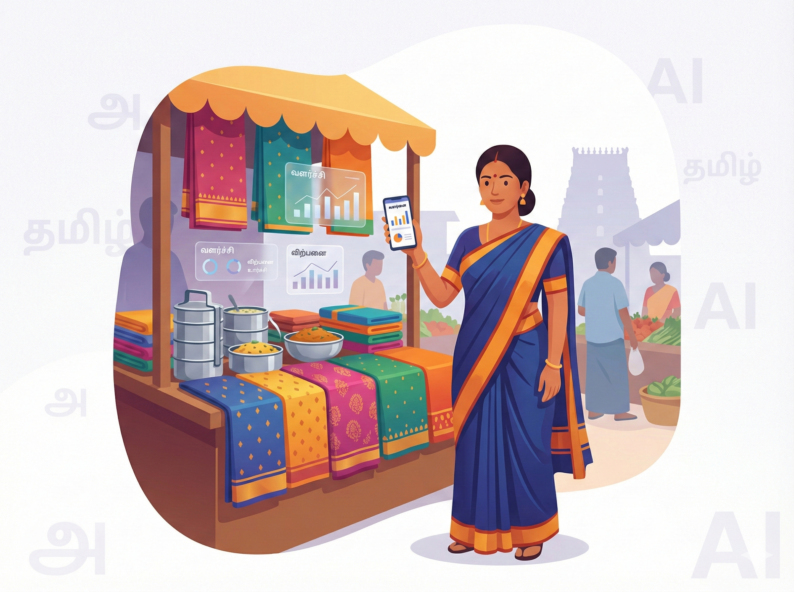

# 💼 வணிகம் — பெட்டிக்கடை முதல் பெரிய நிறுவனம் வரை

வணிகம் என்றால் என்ன தெரியுமா? அது வெறும் பணம் சம்பாதிப்பது மட்டுமல்ல; மக்களின் தேவையைப் புரிந்து, அதை நிறைவேற்றி, சமூகத்தோடு ஒரு நல்லுறவை வளர்த்துக்கொண்டு செல்வது. ஒரு சிறிய பெட்டிக்கடையை நடத்துபவராக இருந்தாலும் சரி, பல கோடிகள் புரளும் பெரிய நிறுவனத்தை நடத்துபவராக இருந்தாலும் சரி, எல்லோருக்கும் ஒரே மாதிரியான சவால்கள்தான் இருக்கின்றன — வாடிக்கையாளரை ஈர்ப்பது எப்படி, சந்தைப் போட்டியைச் சமாளிப்பது எப்படி, செலவுகளைக் கட்டுப்படுத்துவது எப்படி, அடுத்தகட்ட வளர்ச்சியைத் திட்டமிடுவது எப்படி என்று. இன்று நம் கையில் இருக்கும் அலைபேசியிலேயே பல வருட அனுபவமுள்ள ஒரு சிறந்த வணிக ஆலோசகரை (Business Consultant) நம்மால் அழைத்து வர முடியும். அவன்தான் **செய்யறிவு**. நம்ம தமிழில் கேட்டால், நம்ம தொழிலுக்கு ஏற்ற ஆலோசனையை மிகத் தெளிவாகச் சொல்லிவிடுவான்.

## ஒரு சின்ன கதை — செல்வியின் டிபன் கடை

திருச்சியில் ஒரு சிறிய டிபன் கடையை நடத்தி வந்த செல்வி, தன் கடையில் எதிர்பார்த்த அளவுக்கு விற்பனை நடக்கவில்லை என்று மிகவும் வருத்தப்பட்டார். இன்றைய காலகட்டத்திற்கு ஏற்ப WhatsApp-இலேயே ஆர்டர் வாங்க ஆரம்பித்தாலும், வாடிக்கையாளர்களைத் தன் பக்கம் ஈர்க்கும் வகையில் சுவாரஸ்யமான செய்திகளை எப்படி எழுதி அனுப்புவது என்று அவருக்குத் தெரியவில்லை. ஒரு நாள் தன் மகளிடம், “இதுக்கு ஏதாவது வழி இருக்காமா?” என்று கேட்டார். அதற்கு அவர் மகள், “அம்மா, ChatGPT-கிட்ட கேட்டுப் பாருங்களேன்” என்று யோசனை சொன்னாள்.

செல்வி உடனே தன் அலைபேசியில் இப்படி எழுதிக் கேட்டார்:

“நான் ஒரு சிறிய டிபன் கடை நடத்துகிறேன். WhatsApp மூலமா நான் விற்கிற சாப்பாட்டு வகைகளோட விலைப்பட்டியலை அழகாகவும், தொழில்முறையாகவும் (Professional) வாடிக்கையாளர்களுக்கு அனுப்பணும். அதுக்கு ஏத்த மாதிரி ஒரு செய்தியைத் தமிழிலும் ஆங்கிலத்திலும் தயார் செஞ்சு தா.”

வெறும் மூன்றாவது நிமிடம், மிகவும் நேர்த்தியான, ஈர்க்கக்கூடிய ஒரு செய்தி அவருக்குப் பதிலாக வந்தது. அதைத் தன் வாடிக்கையாளர்களுக்குப் பயன்படுத்தத் தொடங்கிய சில வாரங்களிலேயே அவருடைய கடையில் வாடிக்கையாளர்களின் எண்ணிக்கை 30 சதவீதம் அதிகரித்தது. ஒரே ஒரு சின்ன கேள்வி, அவருடைய கடையின் திசையையே ஒட்டுமொத்தமாக மாற்றிவிட்டது.

## நம்ம கேள்வி இப்படி இருந்தால் நல்ல பதில் வரும் — C.L.E.A.R முறை

வணிகம் சார்ந்த நம்முடைய கேள்விகளுக்குத் தெளிவான, உடனடியாகப் பயன்தரும் பதிலைச் செய்யறிவிடம் இருந்து பெற ஒரு எளிய ஆனால் மிக வலுவான வழி உண்டு. அதை நாம் **C.L.E.A.R** முறை என்று சொல்லலாம்.

இதற்கு ஏன் C.L.E.A.R என்று பெயர் வந்தது? ஏனென்றால், இதில் ஐந்து முக்கியமான அம்சங்கள் வரிசையாக இருக்கின்றன:

- **C — Concise (சுருக்கமாக)**  
  தேவையில்லாத கதைகளை உள்ளே விடாமல், சுருக்கமாகவும் தெளிவாகவும் கேளுங்கள்.  
  உதாரணம்: மிகவும் நீண்ட விளக்கங்கள் கொடுக்காமல், என்ன வேண்டும் என்பதை நேரடியாகக் கேட்டுப் பழகுங்கள்.

- **L — Logical (தர்க்கரீதியாக)**  
  தகவல்களை ஒன்றன்பின் ஒன்றாக, ஒரு வரிசைக்கிரமமாக அடுக்குங்கள்.  
  உதாரணம்: “முதலில் இது வேண்டும், பிறகு இதைச் சேர், இறுதியாக இப்படி முடி” என்று ஒழுங்காகக் கேளுங்கள்.

- **E — Explicit (வெளிப்படையாக)**  
  வட்டமடிக்காமல் உங்கள் எதிர்பார்ப்பை நேரடியாகவும் வெளிப்படையாகவும் சொல்லுங்கள்.  
  உதாரணம்: “இந்தச் செய்தி WhatsApp-க்கு ஏற்ற மாதிரி ரொம்பச் சுருக்கமா இருக்கணும்” என்று குறிப்பிட்டுச் சொல்லுங்கள்.

- **A — Adaptive (தகவமைத்துக்கொள்ளுதல்)**  
  வந்த முதல் பதில் உங்களுக்கு முழுமையாகத் திருப்தி தரவில்லை என்றால், கேள்வியை லேசாக மாற்றி மீண்டும் கேளுங்கள்.  
  உதாரணம்: “இந்தச் செய்தி இன்னும் கொஞ்சம் வாடிக்கையாளர்களை ஈர்க்கிற மாதிரி கவர்ச்சிகரமா மாத்திக் கொடு” என்று கேட்கலாம்.

- **R — Reflective (சிந்தனை)**  
  வந்த பதிலைப் படித்துப் பார்த்து, அது நிஜமாகவே உங்களுடைய தேவைக்குப் பொருந்துகிறதா என்று சிந்தித்து முடிவெடுங்கள்.  
  உதாரணம்: “இதை அப்படியே என் கடைக்குப் பயன்படுத்தலாமா? இல்லை ஏதேனும் மாற்ற வேண்டுமா?” என்று உங்களுக்கே நீங்கள் கேள்வி கேட்டு மதிப்பீடு செய்யுங்கள்.

இந்த ஐந்து அம்சங்களையும் சேர்த்தால் C.L.E.A.R ஆகிறது. இப்படிக் கேட்டால், செய்யறிவு அச்சு அசலாக உங்களுடைய தொழிலுக்கு ஏற்ற மாதிரியே பதில் சொல்லும்.

## இப்போதே முயற்சி செய்து பாருங்கள்!

> [!PROMPT]  
> நீ ஒரு பல வருட அனுபவமுள்ள வணிக ஆலோசகர் மாதிரி என்கிட்ட பேசு. என் சிறிய கடைக்கு (உதாரணமாக: டிபன் கடை / மளிகைக் கடை) ஒரு விரிவான வணிகத் திட்டத்தை (Business Plan) உருவாக்கு.  
> 
> **விவரங்கள்:**
>
> • கடையின் வகை — {உங்கள் கடையின் வகை}  
> • ஊர் / பகுதி — {உங்கள் ஊர் அல்லது கடை இருக்கும் பகுதி}  
> • இலக்கு வாடிக்கையாளர்கள் — {உதாரணமாக: குடும்பங்கள், கல்லூரி மாணவர்கள், அலுவலக ஊழியர்கள்}  
> 
> எல்லாவற்றையும் எனக்குப் புரியும்படி எளிய தமிழில் சொல்லு. கீழ்க்கண்டவாறு பிரித்துக்கொடு: 
> 1. நிர்வாகச் சுருக்கம் (200 சொற்களுக்குள்)  
> 2. சந்தைப் பகுப்பாய்வு (என் ஊரில் உள்ள மற்ற போட்டியாளர்களைப் பற்றியது)  
> 3. SWOT பகுப்பாய்வு (என் தொழிலின் வலிமை, பலவீனம், வாய்ப்பு, அச்சுறுத்தல்)  
> 4. அடுத்த 3 ஆண்டுகளுக்கான உத்தேச வருமானம்  

## நாம் இங்கே என்ன கற்றுக் கொண்டோம்?

திருச்சி செல்வியின் கதை நமக்கு ஒரு பெரும் நம்பிக்கையைத் தருகிறது. மிகச் சிறிய தொழிலை நடத்துபவர்களுக்குக் கூடச் செய்யறிவு ஒரு சிறந்த உற்ற தோழனாக, வழிகாட்டியாக மாற முடியும். இந்த அத்தியாயத்தில் நாம் முக்கியமாகப் புரிந்துகொண்ட விஷயங்கள் இவைதான்:

- செய்யறிவு என்பது நம்முடைய தேவைக்கேற்ற ஒரு தொழில்முறை வணிக ஆலோசகர் போலவே வேலை செய்யும் திறன் கொண்டது.
- C.L.E.A.R முறையில் விஷயங்களைக் கேட்கும்போது, கிடைக்கக்கூடிய பதில் மிகத் தெளிவாகவும் நமக்கு நேரடியாகப் பயன்படும் வகையிலும் அமையும்.
- விளம்பரம் எழுதுவதிலிருந்து, வாடிக்கையாளர்களிடம் எப்படிப் பேசுவது, ஒட்டுமொத்த வணிகத் திட்டத்தை எப்படி உருவாக்குவது என்பது வரை அனைத்திற்கும் இது கைகொடுக்கும்.
- ஆனால், எப்பொழுதும் ஒன்றை மட்டும் மறந்துவிடாதீர்கள் — செய்யறிவு சொல்வதெல்லாம் பொதுவான ஆலோசனைகள் மட்டுமே. பெரிய அளவிலான முதலீடு செய்வது, வங்கிக்கடன் வாங்குவது, சட்ட ரீதியான சிக்கல்கள் போன்ற முக்கிய முடிவுகளுக்கு அதற்குரிய தகுதியான நிபுணர்களை நேரில் அணுகுவதே சிறந்தது.

> [!WARNING]  
> **முக்கிய கவனம்:**  
> இங்குப் பெறப்படும் பதில்கள் அனைத்தும் பொதுவான வழிகாட்டுதல்கள் மட்டுமே. நிதி தொடர்பான முடிவுகள், முதலீடுகள், சட்டச் சிக்கல்கள் ஆகியவற்றுக்குச் செய்யறிவை மட்டும் முழுவதும் நம்புவது சரியாக இருக்காது. தகுதியான ஒரு வணிக ஆலோசகர், வழக்கறிஞர் அல்லது நிதி நிபுணரிடம் கலந்தாலோசித்து இறுதி முடிவெடுங்கள். உங்களுடைய தொழிலின் பாதுகாப்பு உங்கள் கைகளில்தான் இருக்கிறது.
