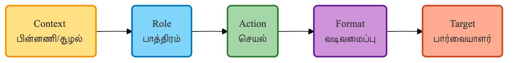

# 📚 கல்வி — வீட்டுப் பாடமும் ஒரு விளையாட்டு

கல்வி என்பது வகுப்பறையில் ஆசிரியர் சொல்வதை மனப்பாடம் செய்வது மட்டுமல்ல; அது ஒரு விஷயத்தை ஆழமாகப் புரிந்துகொள்வது. பல நேரங்களில் வகுப்பில் நடத்தப்படும் பாடங்கள் மாணவர்களுக்கு முழுமையாகப் புரியாமல் போகலாம். அதுபோன்ற நேரங்களில், செய்யறிவு ஒரு 'வீட்டுப் பாடம் சொல்லித்தரும் அன்பான அண்ணனாகவோ அல்லது அக்காவாகவோ' மாறி நம் குழந்தைகளுக்கு உதவி செய்யும்.

## ஒரு சின்ன கதை — சரவணனின் 'பீட்சா' கணக்கு

விழுப்புரத்தில் வசிக்கும் சரவணனின் 7-ஆம் வகுப்புப் படிக்கும் மகன், கணக்குப் பாடத்தில் வரும் 'பின்னங்கள்' (Fractions) புரியாமல் மிகவும் திணறினான். சரவணனுக்கும் அதை எப்படி எளிமையாக மகனுக்குப் புரிய வைப்பது என்று தெரியவில்லை. அப்போது அவர் செய்யறிவிடம் ஒரு சுவாரஸ்யமான உதவி கேட்டார்:

“நீ ஒரு கணக்கு ஆசிரியர். என் மகனுக்குப் பின்னங்கள் புரியவில்லை. அவனுக்குப் பிடித்த பீட்சா (Pizza) துண்டுகளை உதாரணமாக வெச்சு, எளிய தமிழில் இதை விளக்கிக் கூறு.”

உடனே செய்யறிவு, “ஒரு முழு பீட்சாவை நாலு துண்டுகளாகப் பிரித்தால், அதில் ஒரு துண்டு என்பது 1/4...” என்று அருமையான கதையாக விளக்கியது. அன்றைக்குத்தான் அந்த மாணவன் முதல்முறையாகக் கணக்கைப் பார்த்துச் சிரித்தான். அடுத்த தேர்வில் அவனது மதிப்பெண் கணிசமாக உயர்ந்தது.

## நம்ம கேள்வி இப்படி இருந்தால் நல்ல பதில் வரும் — C.R.A.F.T முறை

கல்வி சம்பந்தமான கேள்விகளுக்கு மிகத் தெளிவான பதிலைப் பெற **C.R.A.F.T** என்ற எளிய முறையைப் பயன்படுத்தலாம்:

- **C — Context (சூழல்):** நீங்கள் யாருக்காகக் கேட்கிறீர்கள் என்பதைச் சொல்லுங்கள்.  
  உதாரணம்: “7-ஆம் வகுப்புப் படிக்கும் தமிழ் வழி மாணவன்”.

- **R — Role (பாத்திரம்):** செய்யறிவு எப்படிப் பேச வேண்டும் என்று குறிப்பிடுங்கள்.  
  உதாரணம்: “நீ ஒரு அன்பான தமிழ் ஆசிரியர் போலப் பேசு”.

- **A — Action (செயல்):** எந்தப் பாடத்தை விளக்க வேண்டும் என்று கேளுங்கள்.  
  உதாரணம்: “பின்னங்கள் (Fractions) பற்றி விளக்கு”.

- **F — Format (வடிவம்):** பதில் எப்படி வர வேண்டும் என்று சொல்லுங்கள்.  
  உதாரணம்: “ஒரு அறிமுகம், 3 எளிய உதாரணங்கள், கடைசியில் ஒரு சிறு பயிற்சி”.

- **T — Target Audience (இலக்கு):** இது யாருக்குப் போய் சேரப் போகிறது என்று குறிப்பிடுங்கள்.  
  உதாரணம்: “12 வயது சிறுவனின் மனநிலைக்கு ஏற்பச் சொல்லு”.

இந்த ஐந்து விஷயங்களையும் சேர்த்துக் கேட்டால், சிறந்த ஆசிரியரைப் போலவே செய்யறிவு உங்கள் குழந்தைக்குப் பாடம் நடத்தும்.

## இப்போதே முயற்சி செய்து பாருங்கள்!

> [!PROMPT]  
> நீ ஒரு அனுபவமிக்க ஆசிரியர். '{பாடம் / தலைப்பு}' என்ற தலைப்பை ஒரு {வகுப்பு எண்} வகுப்புப் படிக்கும் மாணவனுக்குப் புரியும் படி எளிய உதாரணங்களுடன் விளக்கு.  
> 
> **வடிவம்:**  
> 1. எளிமையான அறிமுகம்  
> 2. அன்றாட வாழ்க்கை உதாரணம்  
> 3. மாணவன் தன்னைத்தானே சோதித்துப் பார்க்க 2 சிறு கேள்விகள்  

## நாம் இங்கே என்ன கற்றுக் கொண்டோம்?

சரவணனின் மகன் பீட்சா கணக்கைக் கற்றது, வெறும் கணக்கு மட்டுமல்ல — அது கற்றலை எப்படி ஒரு விளையாட்டாக மாற்றலாம் என்பதைக் காட்டுகிறது. இந்த அத்தியாயத்தில் நாம் முக்கியமாகப் புரிந்துகொண்ட விஷயங்கள்:

- செய்யறிவு என்பது ஒவ்வொரு மாணவனின் கற்கும் வேகத்திற்கும் ஏற்பப் பாடம் நடத்தும் ஒரு தனிப்பட்ட ஆசிரியர்.
- C.R.A.F.T முறையைப் பயன்படுத்தினால் மிகச் சிறந்த, துல்லியமான விளக்கங்கள் கிடைக்கும்.
- மாணவர்களுக்கு மட்டுமல்ல, ஆசிரியர்கள் தங்களுடைய பாடத்திட்டத்தைத் (Lesson Plan) தயாரிக்கவும் இது பெரிதும் உதவும்.
- ஆனால், செய்யறிவு ஒரு கற்றல் கருவி மட்டுமே. சொந்தமாகச் சிந்திப்பதும், ஆசிரியர்களின் வழிகாட்டுதலும் எப்போதும் அவசியம்.

> [!WARNING]  
> **முக்கிய கவனம்:**  
> செய்யறிவு தரும் விடைகளை அப்படியே நகலெடுத்துக் வீட்டுப் பாடங்களை (Homework) எழுதுவது மாணவர்களின் சிந்திக்கும் திறனைக் குறைக்கும். கடினமான கருத்துகளைப் புரிந்துகொள்ள மட்டுமே இதைப் பயன்படுத்துங்கள். தேர்வுகளில் ஏமாற்றுவதற்கு இது ஒரு கருவியல்ல.
