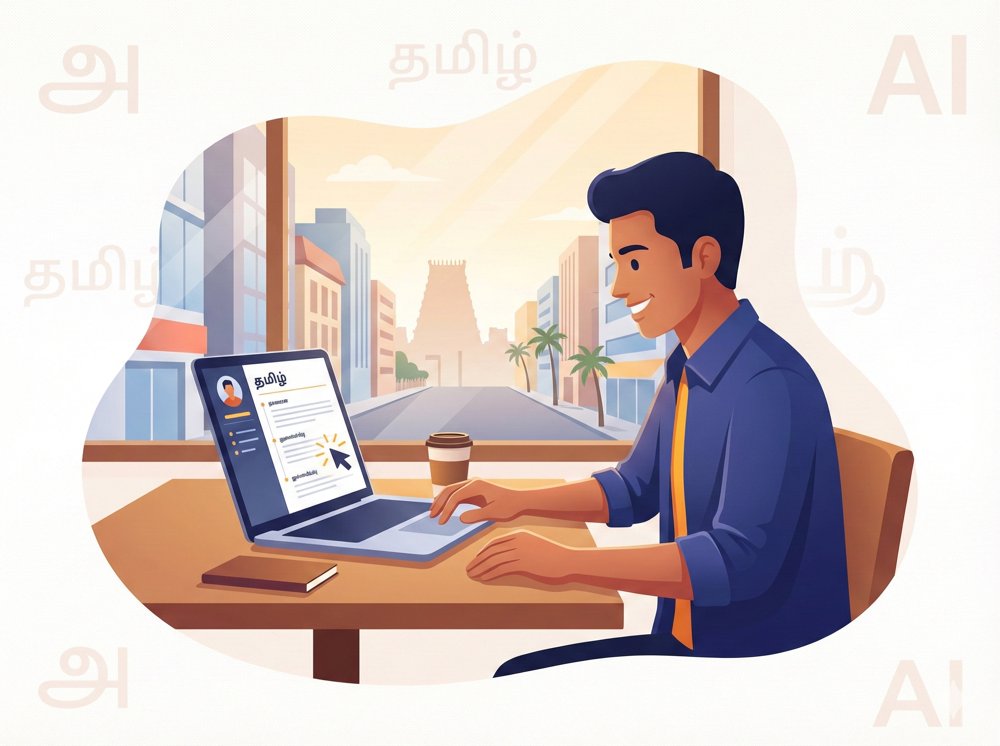

# 💼 வேலைவாய்ப்பு — உங்கள் கனவுப் பணியை வெல்லும் கலை

வேலை தேடுவது என்பது ஒரு கலை. திறமை மட்டும் இருந்தால் போதாது; அந்தத் திறமையைச் சரியான முறையில் உலகிற்குத் தெரியப்படுத்த வேண்டும். ஒரு தொழில்முறை ரெசுமே (Resume) உருவாக்குவது முதல் நேர்காணலை (Interview) எதிர்கொள்வது வரை, செய்யறிவு (AI) உங்கள் பக்கபலமாக இருக்கும்.

## 👨‍🏫 ஒரு சின்ன கதை: பிரியாவின் புதிய தன்னம்பிக்கை

மதுரையில் வசிக்கும் பிரியா, வணிகவியல் (B.Com) படிப்பை முடித்துவிட்டு ஆறு மாதங்களாக வேலை தேடிக்கொண்டிருந்தார். அவரது மதிப்பெண்கள் நன்றாக இருந்தும், நேர்காணலுக்கு அழைப்பு வரவில்லை. காரணம், அவரது ரெசுமே (Resume) சரியாக வடிவமைக்கப்படவில்லை.

செய்யறிவிடம் அவர் ஒரு உதவி கேட்டார்: **"நான் ஒரு பட்டதாரி. ஒரு கணக்கியல் நிறுவனத்தில் (Accounting Firm) வேலைக்கு விண்ணப்பிக்கப் போகிறேன். எனக்கான ஒரு தொழில்முறை ரெசுமே மற்றும் விண்ணப்பக் கடிதத்தை (Cover Letter) உருவாக்கித் தா"**. செய்யறிவு துல்லியமான ஒரு ரெசுமேவை வழங்கியது. அதை அனுப்பிய மூன்றே வாரங்களில் பிரியாவுக்கு முதல் நேர்காணல் அழைப்பு வந்தது.

## 🏗️ இங்கே நாம் பயன்படுத்தும் வித்தை: R.A.C.E.S கட்டமைப்பு

வேலைவாய்ப்புத் துறையில் ஒரு தீர்வை அடைய **ROSES** அல்லது **RACE** போன்ற கட்டமைப்புகளைப் பயன்படுத்தலாம். இங்கே நாம் **RACE** உடன் கூடுதல் தகவல்களை இணைக்கிறோம்:

* **R — பாத்திரம் (Role):** "நீ ஒரு மூத்த மனிதவள மேம்பாட்டு (HR) நிபுணர்".
* **A — செயல் (Action):** "என்னுடைய திறமைகளை விளக்கி ஒரு ரெசுமேவை உருவாக்கு".
* **C — சூழல் (Context):** "நான் ஒரு புதிய பட்டதாரி, பைதான் (Python) மற்றும் எக்செல் (Excel) தெரியும்".
* **E — எதிர்பார்ப்பு (Expectation):** "ஒரு பக்கத்தில், தொழில்முறை நடையில் (Professional Tone) வழங்குக".

## 🚀 இப்போதே முயற்சிக்கலாம்!

> [!PROMPT]
> நீ ஒரு மூத்த HR நிபுணர். {நிறுவனம்} நிறுவனத்தில் {வேலை பட்டம்} பதவிக்கான நேர்காணலுக்கு என்னை தயார் செய்.
> **என்னுடைய விவரம்:**
> * பதவி விண்ணப்பம்: {Job Title}
> * என் அனுபவம்: {ஆண்டுகள் / Fresher}
> * வலிமை: {3 முக்கிய திறன்கள்}
> 
> 
> **எதிர்பார்ப்பு:** > 1. நேர்காணலில் கேட்கப்பட வாய்ப்புள்ள 5 முக்கிய கேள்விகள்.
> 2. அதற்கான சிறந்த பதில்கள்.
> 3. நான் கேட்க வேண்டிய 2 ஆழமான கேள்விகள்.

## 🔍 அறிவு சோதனை

**கேள்வி:** நேர்காணலுக்குத் தயாராகும்போது "Interview கேள்விகள் கொடு" என்று மட்டும் கேட்பது போதுமா?

விடை பார்க்க

போதாது. நீங்கள் எந்தப் பதவிக்கு விண்ணப்பிக்கிறீர்கள், அந்த நிறுவனத்தின் பெயர் என்ன, உங்கள் அனுபவம் என்ன போன்ற விவரங்களைச் சேர்த்தால் மட்டுமே அந்த வேலைக்கு ஏற்ற பிரத்யேகக் கேள்விகளைச் செய்யறிவு வழங்கும்.

## 📋 அத்தியாயச் சுருக்கம்: நாம் கற்ற பாடங்கள்

பிரியாவின் தன்னம்பிக்கையில் செய்யறிவு பதித்த முத்திரை சிறியது — ஆனால் அந்த ஒரு ரெசுமே அவரது வாழ்க்கையை மாற்றியது. இந்த அத்தியாயத்தில் நாம் கற்றவை:

* **ரெசுமே வடிவமைப்பு:** செய்யறிவு மூலம் தொழில்முறை ரெசுமே மற்றும் விண்ணப்பக் கடிதங்களை எளிதாக உருவாக்கலாம்.
* **நேர்காணல் பயிற்சி:** ஒரு HR நிபுணர் போலச் செய்யறிவை மாற்றி, நீங்கள் நேர்காணல் பயிற்சியைப் பெறலாம்.
* **STAR முறை:** உங்கள் சாதனைகளை விவரிக்கும்போது 'சூழல், பணி, செயல், முடிவு' (STAR) முறையைப் பயன்படுத்தச் செய்யறிவிடம் கேட்கலாம்.
* **தன்னம்பிக்கை:** சரியான தயாரிப்பு உங்களின் தன்னம்பிக்கையைத் தரும்; அதற்குச் செய்யறிவு ஒரு சிறந்த கருவி.

> [!WARNING]
> **வேலைவாய்ப்பு பாதுகாப்பு அறிவிப்பு:** செய்யறிவு தரும் தகவல்கள் ஒரு வழிகாட்டுதல் மட்டுமே. இது வேலைக்கான உத்தரவாதம் அல்ல. உங்கள் ரெசுமேவில் உள்ள தகவல்கள் உண்மையானவை என்பதை நீங்களே உறுதிப்படுத்திக் கொள்ள வேண்டும்.
