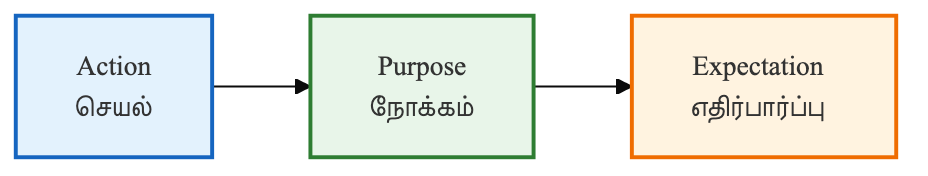

# ⚖️ சட்டம் — சாமானியனின் சட்ட ஆலோசகர்

சட்டமும் நிர்வாகமும் பெரும்பாலும் கடினமான சொற்களால் (Jargons) நிரம்பியவை. சாதாரண மக்களுக்குத் தங்களின் உரிமைகள் என்ன என்பதையும், ஒரு புகாரை எவ்வாறு முறையாக அளிப்பது என்பதையும் புரிந்துகொள்வது மிகப்பெரிய சவாலாகத் தோன்றலாம். அத்தகைய சூழலில், செய்யறிவானது ஒரு நேர்மையான வழக்கறிஞரைப் போலவோ அல்லது நிர்வாக ஆலோசகரைப் போலவோ செயல்பட்டு நமக்குத் தெளிவான வழிகாட்டுதலை வழங்கும்.

## 👨‍🏫 ஒரு சின்ன கதை: ராஜனின் வாடகை ஒப்பந்தம்

மதுரையில் வாடகை வீட்டில் வசிக்கும் ராஜன், ஒரு நாள் பெரும் அதிர்ச்சிக்குள்ளானார். வீட்டு உரிமையாளர் திடீரென 50% வாடகையை உயர்த்தியதோடு, ஒரு மாதத்தில் வீட்டைக் காலி செய்யுமாறும் வற்புறுத்தினார். ராஜனுக்குத் தன்னுடைய சட்டபூர்வமான உரிமைகள் என்னென்ன என்று தெரியவில்லை. அந்த நெருக்கடியான நேரத்தில் அவர் செய்யறிவிடம் பின்வருமாறு வினவினார்:

"நான் ஒரு வாடகைதாரர். எனக்கும் உரிமையாளருக்கும் இடையே இன்னும் 2 ஆண்டு கால ஒப்பந்தம் உள்ளது. இந்நிலையில் திடீரென என்னை வீட்டில் இருந்து வெளியேற்ற முடியுமா? என் உரிமைகள் என்ன?"

செய்யறிவு உடனே 'தமிழ்நாடு வாடகை ஒழுங்குமுறைச் சட்டத்தின்' (Rent Control Act) அடிப்படையில் அவருக்குள்ள உரிமைகளை எளிய தமிழில் தெளிவாக எடுத்துரைத்தது. அந்த விவரங்களைக் கொண்டு அவர் ஒரு வழக்கறிஞரை அணுகி, தன்னுடைய தங்குமிட உரிமையைப் பாதுகாத்துக் கொண்டார்.

## 🏗️ இங்கே நாம் பயன்படுத்தும் வித்தை: A.P.E கட்டமைப்பு

சட்டம் மற்றும் நிர்வாகம் சார்ந்த பணிகளுக்குச் செய்யறிவிடம் தெளிவான கோரிக்கையை முன்வைக்க, **APE** முறையைப் பயன்படுத்துவது சிறந்த பலனைத் தரும்:

* **A — செயல் (Action):** நீங்கள் செய்ய வேண்டிய குறிப்பிட்ட பணி. (எ.கா: "வாடகை ஒப்பந்தத்தில் இடம்பெற வேண்டிய முக்கியக் கூறுகளை விளக்கு").
* **P — நோக்கம் (Purpose):** இந்தத் தகவல் எதற்காகத் தேவைப்படுகிறது? (எ.கா: "நான் ஒரு புதிய வீட்டிற்கு வாடகைக்குச் செல்லப் போகிறேன்").
* **E — எதிர்பார்ப்பு (Expectation):** பதில் எந்த வடிவில் கிடைக்க வேண்டும்? (எ.கா: "இவற்றை ஒரு சரிபார்ப்புப் பட்டியலாக (Checklist) எளிய தமிழில் வழங்குக").

## 🚀 இப்போதே முயற்சிக்கலாம்!

சட்ட ரீதியான சந்தேகங்களை எளிதாகத் தெளிவுபடுத்திக்கொள்ள, இதோ ஒரு தயார்நிலை கட்டளை:

> [!PROMPT]
> நீ ஒரு அனுபவமிக்க சிவில் வழக்கறிஞர். '{குறிப்பிட்ட சட்டப் பிரச்சினை}' பற்றி எனக்கு எளிய தமிழில் விளக்கவும்.
>
>
> **விவரங்கள்:**
>
> * என் நிலை: {பாதிக்கப்பட்டவர் / விண்ணப்பதாரர்}
> * பிரச்சினை: {எ.கா: நுகர்வோர் புகார் / சொத்துச் சிக்கல்}
>
> **எதிர்பார்ப்பு:**
>
> 1. இதற்கான அடிப்படைச் சட்டப் பிரிவுகள் என்ன?
> 2. நான் எடுக்க வேண்டிய முதல் 3 நடவடிக்கைகள் என்ன?
> 3. இது தொடர்பாகத் தேவையான ஆவணங்கள் என்ன?
>
> **மொழி:**
> கடினமான சட்டச் சொற்களை அடைப்புக்குறிக்குள் மட்டும் வழங்கி, ஒட்டுமொத்த விளக்கத்தையும் எளிய தமிழில் தரவும்.

## 📋 அத்தியாயச் சுருக்கம்: நாம் கற்ற பாடங்கள்

ராஜனின் கதை நமக்கு ஒரு முக்கியமான செய்தியை உணர்த்துகிறது — தன்னுடைய உரிமைகள் என்னவென்று முழுமையாகத் தெரிந்த ஒருவரை அவ்வளவு எளிதில் ஏமாற்றிவிட முடியாது. இந்த அத்தியாயத்தின் மூலம் நாம் அறிந்துகொண்டவை:

* **சட்ட உதவி:** புரிந்துகொள்ளக் கடினமான சட்டச் சொற்களைச் செய்யறிவு சாமானியர்களுக்கும் எளிதாகப் புரியும் வகையில் மாற்றும்.
* **APE முறை:** செயல், நோக்கம், எதிர்பார்ப்பு ஆகிய மூன்றையும் தெளிவாகக் குறிப்பிடும்போது நிர்வாகப் பணிகள் எளிமை அடைகின்றன.
* **நிர்வாக ஆவணங்கள்:** தகவல் அறியும் உரிமைச் சட்டம் (RTI) சார்ந்த விண்ணப்பங்கள் அல்லது புகார் கடிதங்களைச் சரியான முறையில் வடிவமைக்கச் செய்யறிவு துணைபுரியும்.
* **பாதுகாப்பு:** செய்யறிவு மாற்றுச் சட்ட ஆலோசகர் அல்ல. முக்கியமான ஆவணங்களில் கையொப்பமிடும் முன்பாக, தகுதிவாய்ந்த வழக்கறிஞரை அணுகி ஆலோசனை பெறுவதே பாதுகாப்பானது.

> [!WARNING]
> **சட்டப் பாதுகாப்பு அறிவிப்பு:** இங்குக் குறிப்பிடப்பட்டுள்ள தகவல்கள் கல்வி மற்றும் விழிப்புணர்வு நோக்கத்திற்காக மட்டுமே வழங்கப்படுகின்றன. சூழ்நிலைகள் மற்றும் காலத்திற்கு ஏற்பச் சட்டங்கள் மாறுபடலாம். எனவே, நீதிமன்ற நடவடிக்கைகள் மற்றும் சட்ட ரீதியான முடிவுகள் எடுப்பதற்கு முன்னதாக ஒரு வழக்கறிஞரின் ஆலோசனையைப் பெறுவது கட்டாயமாகும்.
