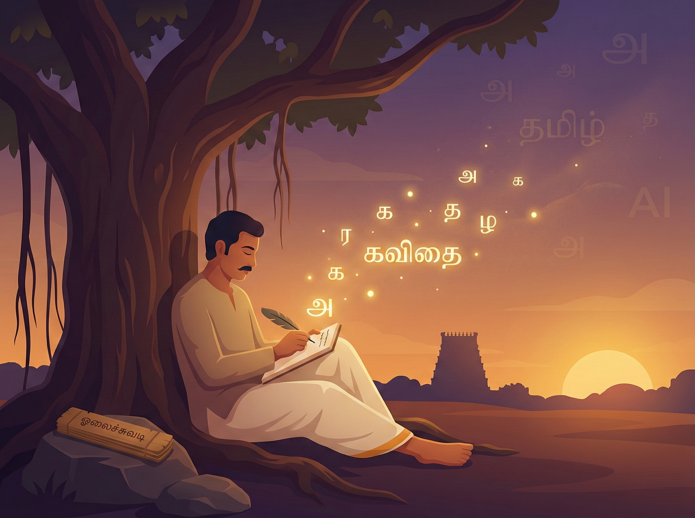

# 📝 இலக்கியம் — செய்யறிவின் கவிமனம்

இலக்கியம் என்பது வெறும் சொற்களின் சேர்க்கை மட்டுமல்ல; அது ஆழமான உணர்வுகளின் அழகிய வெளிப்பாடு. நீங்கள் ஒரு கவிஞராகவோ, எழுத்தாளராகவோ அல்லது மொழியியல் ஆர்வலராகவோ இருந்தால், புதிய சொற்களைக் கண்டறியவும் எல்லையற்ற கற்பனையை விரிக்கவும் செய்யறிவு உங்களுக்கு இணையற்ற 'கவித்துவத் தோழனாக' (Creative Partner) விளங்கும்.

## 👨‍🏫 ஒரு சின்ன கதை: குமார் ஆசிரியரின் திருக்குறள் வகுப்பு

கும்பகோணத்தில் தமிழ் ஆசிரியராகப் பணியாற்றி வரும் குமார், தன்னுடைய மாணவர்களுக்குத் திருக்குறளை சுவாரஸ்யமாகக் கற்பிக்க ஒரு புதுமையான வழியைத் தேடிக்கொண்டிருந்தார். பழங்கால உரைகள் மாணவர்களுக்குச் சற்று சலிப்பைத் தருவதை அவர் கவனித்தார். அதனால், அவர் செய்யறிவிடம் பின்வருமாறு வினவினார்:

"நீ ஒரு செம்மொழித் தமிழ் அறிஞர். 'அகர முதல எழுத்தெல்லாம்...' என்ற திருக்குறளை, இன்றைய காலத்துச் சமூக ஊடக (Social Media) உதாரணங்களைக் கொண்டு 15 வயது மாணவனுக்குப் புரியும் வகையில் விளக்குக."

செய்யறிவு உடனே, "ஒரு மொபைல் போன் இயங்குவதற்கு மின்சாரம் (Power) எவ்வளவு முதன்மையானதோ, அதுபோல இந்த ஒட்டுமொத்த உலகும் இயங்குவதற்கு இறைவன் அடிப்படையானவன்..." எனத் தொடங்கி மிக அழகாக எடுத்துரைத்தது. அந்த விளக்கத்தைக் கேட்ட மாணவர்கள், திருக்குறளைத் தங்களின் அன்றாட வாழ்வோடு எளிதாகப் பொருத்திப் புரிந்துகொண்டனர்.

## 🏗️ இங்கே நாம் பயன்படுத்தும் வித்தை: C.R.E.A.T.E கட்டமைப்பு

படைப்பாற்றல் சார்ந்த பணிகளில் விரிவான மற்றும் ஆழமான பதில்களைச் செய்யறிவிடமிருந்து பெற, **CREATE** முறையைப் பின்பற்றுவது சிறந்தது:

* **C — பாத்திரம் (Character):** "நீ ஒரு நவீன காலத்துக் கவிஞர்".
* **R — கோரிக்கை (Request):** "மழையைக் குறித்து ஒரு கவிதை எழுது".
* **E — உதாரணங்கள் (Examples):** "பாரதியாரின் கவிதை நடையைப் பின்பற்று".
* **A — மாற்றங்கள் (Adjustments):** "கடினமான சொற்களைத் தவிர்த்து, இயல்பான பேச்சுத் தமிழில் எழுதுக".
* **T — வகை (Type):** "இதனை ஒரு ஹைக்கூ (Haiku) வடிவமாகவோ அல்லது 4 வரி கவிதையாகவோ தருக".
* **E — கூடுதல் (Extras):** "கவிதைக்குப் பொருத்தமான அழகான தலைப்பு ஒன்றையும் சூட்டுக".

## 🚀 இப்போதே முயற்சிக்கலாம்!

புதிய கவிதைகள் அல்லது கதைகளை உருவாக்க, இதோ உங்களுக்கான ஒரு தயார்நிலை கட்டளை:

> [!PROMPT]
> நீ ஒரு அனுபவமிக்க தமிழ் எழுத்தாளர். '{தலைப்பு}' என்ற கருப்பொருளை மையமாகக் கொண்டு ஒரு சிறு கதையை உருவாக்கு.
> 
> **கதையின் கூறுகள்:**
>
> * தொடக்கம்: {எ.கா: ஒரு கிராமத்து காலைப் பொழுது}
> * சிக்கல்: {எ.கா: காணாமல் போன ஒரு ஆடு}
> * முடிவு: {எ.கா: நெகிழ்ச்சியான ஒரு திருப்பம்}
>
> **வடிவம்:**
>
> கதை 300 சொற்களுக்குள் சுருக்கமாகவும், உரையாடல்கள் நிறைந்த நேரடித் தமிழ் நடையிலும் அமைய வேண்டும்.

## 🔍 அறிவு சோதனை

**கேள்வி:** செய்யறிவிடம் "ஒரு கவிதை எழுது" என்று மட்டும் பொதுவாகக் கேட்டால், அது ஒரு சிறந்த கவிதையைப் படைத்துத் தருமா?

விடை பார்க்க

நிச்சயமாகத் தராது. அது மிகவும் சாதாரணமான ஒரு கவிதையை மட்டுமே வழங்கும். மாறாக, **தலைப்பு**, **எந்த நடை** (உதாரணமாக பாரதியார் அல்லது வைரமுத்து நடை), மற்றும் **என்ன உணர்வு** (மகிழ்ச்சி அல்லது சோகம்) ஆகியவற்றைத் தெளிவாகக் குறிப்பிட்டுக் கேட்டால் மட்டுமே அதனால் ஒரு காவியத்தைப் படைக்க முடியும்.

## 📋 அத்தியாயச் சுருக்கம்: நாம் கற்ற பாடங்கள்

குமார் ஆசிரியரின் வகுப்பறையில் அன்று ஒரு முக்கியமான உண்மை நிரூபிக்கப்பட்டது — திருக்குறள் என்பது 2000 ஆண்டுகள் பழமையான ஒரு நூல் மட்டுமல்ல; அது இன்றும் நம்மோடு பேசிக்கொண்டிருக்கும் ஓர் உயிரோட்டமான மொழி. இந்த அத்தியாயத்தின் மூலம் நாம் கற்றறிந்தவை:

* **படைப்புத் துணை:** செய்யறிவு உங்கள் படைப்புத் திறனுக்குச் சிறகுகளை வழங்கி, புதிய கதைக்கருக்களை உருவாக்கப் பெரிதும் துணைபுரியும்.
* **CREATE முறை:** எந்தப் பாத்திரம் என்பதைச் சொல்வதில் தொடங்கி கூடுதல் விவரங்கள் வரை, 6 படிகளைச் சரியாகப் பின்பற்றினால் தனித்துவமான இலக்கியப் படைப்புகளைப் பெறலாம்.
* **யாப்பு இலக்கணம்:** வெண்பா, குறள் போன்ற மரபுக் கவிதைகளின் இலக்கணத்தைச் சரிபார்க்கவும், அவற்றைப் பிழையின்றி கற்றுக்கொள்ளவும் செய்யறிவைப் பயன்படுத்தலாம்.
* **கலாச்சாரம்:** தமிழ் பண்பாடு மற்றும் அறநெறிகளின் சாரம் சிதையாமல் படைப்புகளை உருவாக்குமாறு நாம் செய்யறிவிடம் வலியுறுத்த வேண்டும்.

> [!TIP]
> செய்யறிவு ஒரு கவிதையை எழுதிய பிறகு, "இதை இன்னும் சிறிது பாரதியார் பாணியில் வீரமாக மாற்றி எழுது" என்று கேட்டுப் பாருங்கள். அது தரும் மாற்றங்கள் உங்களை நிச்சயம் வியப்பில் ஆழ்த்தும்!
