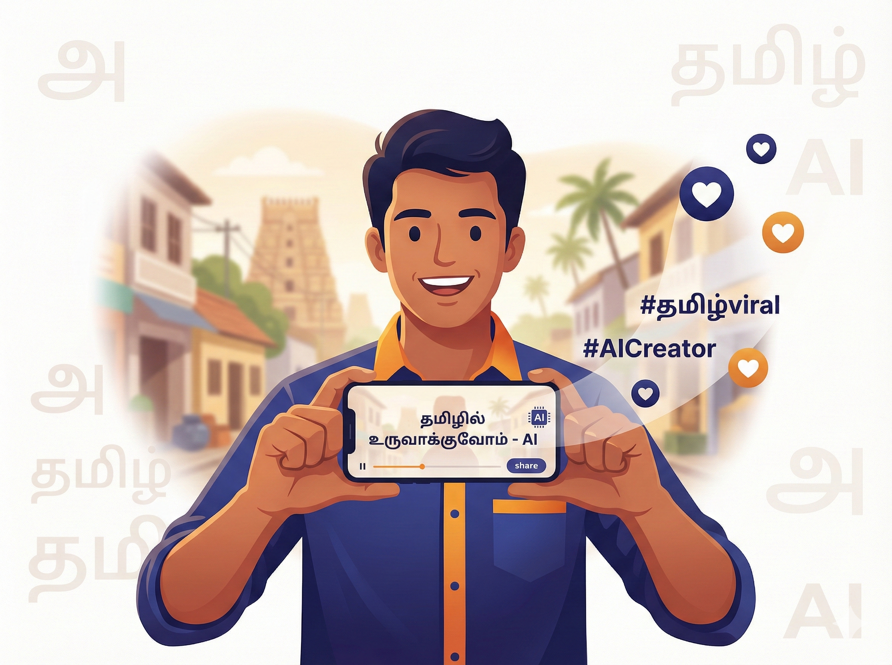

# 📱 சமூக ஊடகம் — டிஜிட்டல் உலகில் ஒரு தமிழ் குரல்

சமூக ஊடகங்களில் நாம் பதிவிடும் ஒரு சிறு கருத்தோ அல்லது வெளியிடும் சிறிய காணொளியோ ஆயிரக்கணக்கான மக்களைச் சென்றடையும் அபார வல்லமை கொண்டது. ஆனால், கூட்டத்தில் ஒருவராக இல்லாமல் தனித்துத் தெரிவதற்குச் சரியான சொற்களும், மக்களை ஈர்க்கக்கூடிய தலைப்புகளும் மிகவும் அவசியம். ஒரு உள்ளடக்க உருவாக்குநருக்கு (Content Creator) செய்யறிவு மிகச்சிறந்த 'துணை ஆசிரியராக' (Co-editor) செயல்பட்டுத் துணைபுரியும்.

## 👨‍🏫 ஒரு சின்ன கதை: தீபாவின் சமையல் பயணம்

கோயம்புத்தூரில் வசிக்கும் தீபா, தன் கைமணத்தில் உருவான சாம்பார் மற்றும் ரசம் தயாரிக்கும் முறையைக் காணொளியாக எடுத்து இன்ஸ்டாகிராமில் (Instagram Reels) தொடர்ந்து பதிவிட்டு வந்தார். ஆனால், பல மாதங்களாகப் போதுமான பார்வையாளர்கள் (Views) இல்லாமல் மிகவும் ஏமாற்றமடைந்தார். அப்போது அவர் செய்யறிவிடம் பின்வருமாறு உதவி கோரினார்:

"நான் ஒரு சமையல் கலைஞர். நான் பதிவிடும் சாம்பார் ரெசிபி காணொளிக்குப் பார்வையாளர்களைக் கவரும் வகையில் ஒரு தமிழ் தலைப்பையும் (Caption), அதற்குத் தகுந்த 3 முக்கிய சுட்டுச்சொற்களையும் (Hashtags) உருவாக்கித் தா."

செய்யறிவு உடனே, "அம்மா கைமணத்தில் மணக்கும் தஞ்சாவூர் சாம்பார்! இரகசியக் குறிப்பு உள்ளே..." என மிகவும் ஈர்க்கக்கூடிய ஒரு தலைப்பை உடனடியாக வழங்கியது. புதிய தலைப்போடு பதிவிட்ட அந்தக் காணொளி வெறும் 24 மணிநேரத்தில் 15,000 பார்வையாளர்களைக் கடந்ததோடு, தீபாவின் சமையல் கலை இன்று பல்லாயிரம் பேரைச் சென்றடையவும் வழிவகுத்தது.

## 🏗️ இங்கே நாம் பயன்படுத்தும் வித்தை: T.A.G. கட்டமைப்பு

சமூக ஊடகங்களுக்கான பதிவுகளைத் திட்டமிட **TAG** முறையைப் பயன்படுத்துவது சிறந்த அணுகுமுறையாகும்:

* **T — பணி (Task):** நீங்கள் செய்ய வேண்டிய குறிப்பிட்ட வேலை. (எ.கா: "யூடியூப் காணொளிக்கு ஏற்ற 5 தலைப்புகளை உருவாக்கு").
* **A — செயல் (Action):** அதனை எப்படிச் செயல்படுத்த வேண்டும்? (எ.கா: "மக்கள் அதிகம் தேடும் சொற்களைப் (SEO) பயன்படுத்தி, அவர்களின் ஆர்வத்தைத் தூண்டும் வகையில் எழுது").
* **G — இலக்கு (Goal):** உங்களின் இறுதி நோக்கம் என்ன? (எ.கா: "அதிகப்படியான மக்கள் இந்தக் காணொளியைக் கிளிக் செய்ய வேண்டும்").

## 🚀 இப்போதே முயற்சிக்கலாம்!

உங்கள் சமூக ஊடகப் பதிவுகளை மேம்படுத்துவதற்கு, இதோ ஒரு தயார்நிலை கட்டளை:

> [!PROMPT]
> நீ ஒரு அனுபவமிக்க சமூக ஊடக நிபுணர். கீழ்க்கண்ட விவரங்களைக் கொண்டு ஈர்க்கக்கூடிய பதிவு (Post) ஒன்றை உருவாக்கு.
> 
> **விவரங்கள்:**
> * தளம்: {WhatsApp / Instagram / Facebook}
> * தலைப்பு: {உங்கள் கருத்து - எ.கா: தீபாவளி வாழ்த்து / புதிய பொருள் அறிமுகம்}
> * இலக்கு வாசகர்: {நண்பர்கள் / வாடிக்கையாளர்கள்}
> 
> **எதிர்பார்ப்பு:**
> 1. உடனடியாகக் கவனத்தை ஈர்க்கும் முதல் வரி (Hook).
> 2. 3-4 வரிகளில் கச்சிதமான விளக்கம்.
> 3. தலைப்புக்குப் பொருத்தமான 3 சுட்டுச்சொற்கள் (#Hashtags).
> 4. சரியான இடங்களில் பொருத்தமான எமோஜிகளைப் (Emojis) பயன்படுத்தவும்.

## 🔍 அறிவு சோதனை

**கேள்வி:** வாட்ஸ்அப் (WhatsApp) குழுக்களில் ஒரு தகவலைப் பகிரும்போது, வெறும் எழுத்து வடிவிலான செய்தியை மட்டுமே அனுப்புவது நல்லதா?

விடை பார்க்க

நிச்சயமாக இல்லை. வாக்கியத்தின் முக்கியமான சொற்களை **தடிமனாகவும்** (*Bold*), பொருத்தமான இடங்களில் தகுந்த எமோஜிகளையும் பயன்படுத்தி அனுப்பினால் மக்கள் அதை இன்னும் விரும்பிப் படிப்பார்கள். செய்யறிவிடம் "WhatsApp formatting-க்கு ஏற்றவாறு செய்தியை மாற்றித் தா" என்று கேட்டால், அது அழகாக வடிவமைத்துத் தரும்.

## 📋 அத்தியாயச் சுருக்கம்: நாம் கற்ற பாடங்கள்

தீபாவின் சாம்பார் காணொளி 24 மணிநேரத்தில் 15,000 பார்வைகளைக் கடந்தது — 'சரியான சொற்கள், சரியான நேரம்' என்ற சமூக ஊடகங்களின் முக்கிய ரகசியத்தைச் செய்யறிவு எளிதாகக் கற்றுத்தரும் என்பதற்கு இதுவே சான்று. இந்த அத்தியாயத்தின் மூலம் நாம் கற்றறிந்தவை:

* **உள்ளடக்கத் தோழன்:** நீங்கள் குறிப்பிடும் சாதாரணக் கருத்துக்களைச் செய்யறிவு மிக நேர்த்தியான, கவர்ச்சிகரமான சமூக ஊடகப் பதிவுகளாக உருமாற்றும்.
* **TAG முறை:** பணி, செயல் மற்றும் இலக்கு ஆகியவற்றைத் தெளிவாகக் குறிப்பிடும்போது, தேடுபொறிக்கு (SEO) உகந்த தலைப்புகளை எளிதாகப் பெற முடியும்.
* **ஈர்ப்பு விசை:** பதிவின் முதல் வரி (Hook) எவ்வளவு சிறப்பாக முடிகிறதோ, அந்த அளவிற்குக் கூடுதல் பார்வையாளர்கள் உங்களின் பதிவைத் தேடிப் படிப்பார்கள்.
* **தனித்தன்மை:** பதிவுகளில் கடினமான அகராதித் தமிழைத் தவிர்த்துவிட்டுப் பொதுமக்கள் இயல்பாகப் பேசும் பேச்சுத் தமிழைப் பயன்படுத்துமாறு செய்யறிவிடம் கேட்டுப் பெறலாம்.

> [!TIP]
> உங்கள் சமூக ஊடகப் பதிவுகளில் எமோஜிகளைப் (Emojis) பயன்படுத்த மறக்காதீர்கள். தொனியை உணர்த்தும் இந்தச் சிறு குறியீடுகள் உங்களின் பதிவிற்குப் புதிய உயிரோட்டத்தை வழங்கும்!
