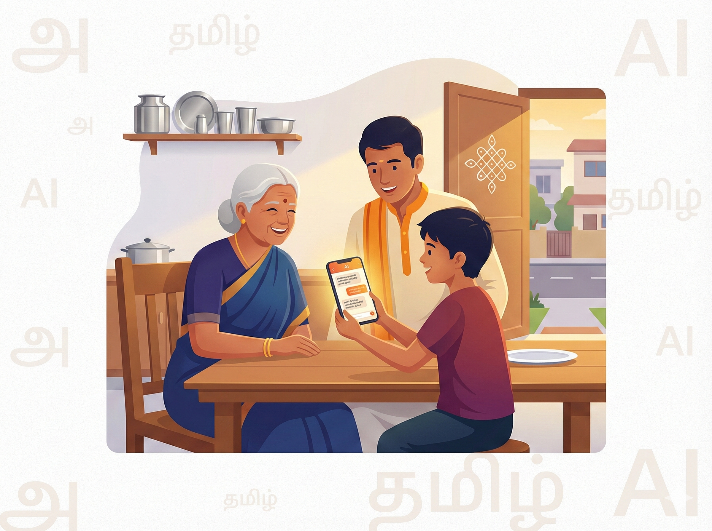

# 🏠 தினசரி வாழ்க்கை

> [!NOTE]
> **துறை (Domain):** தினசரி வாழ்க்கை (`daily`)
> **பாதுகாப்பு (Safety):** L8 அடுக்கு — நடைமுறை வழிகாட்டல் மட்டுமே

பெற்றோர்கள், மூத்தோர்கள், மற்றும் உள்ளடக்க உருவாக்குநர்களுக்கான AI கட்டளைகளின் முதல் பார்வை — இந்தத் துறையில் 60+ கட்டளைகள் உள்ளன.



---

> **💡 உண்மை கதை**
>
> சென்னையில் வசிக்கும் கமலம் (72 வயது), வெளிநாட்டில் உள்ள பேரனுடன் பேச WhatsApp video call செய்யத் தெரியவில்லை. மகள் வேலையில் இருந்தாள். "நான் ஒரு பாட்டி, smartphone முதன்முறை — WhatsApp video call எப்படி செய்வது? படிப்படியாக தமிழில்" என AI-யிடம் கேட்டாள். 5 நிமிடத்தில் பேரனுடன் பேசினாள். கண்ணீரும் சிரிப்பும் கலந்த தருணம்.

## 🚀 இன்றே முயற்சிக்கலாம்

> **🏠 தினசரி வாழ்க்கை — 5 கட்டளைகள்**
>
> 1. "நான் 65 வயதான முதியவர். WhatsApp-ல் பணம் அனுப்புவது எப்படி? படிப்படியாக தமிழில்"
> 2. "என் குழந்தை தினமும் 4 மணி நேரம் phone பார்க்கிறது — எப்படி கட்டுப்படுத்துவது?"
> 3. "இந்த மாதம் பட்ஜெட் 15000 ரூபாய் — சேமிக்கவும் செலவு செய்யவும் திட்டம் கொடுங்கள்"
> 4. "பொங்கல் கொண்டாட்டம் 20 பேருக்கு — பாரம்பரிய உணவு திட்டம் தமிழில்"
> 5. "Aadhaar கார்டு address மாற்ற என்ன செய்வது? Online முறை தமிழில் விளக்கவும்"

---

## 1. Smartphone அடிப்படைகள் — மூத்தோருக்காக

```prompt
நீ ஒரு பொறுமையான தொழில்நுட்ப ஆசிரியர். 60 வயதுக்கு மேற்பட்ட ஒருவருக்கு Smartphone பயன்படுத்துவதை எளிய தமிழில் கற்றுக்கொடு.

**அடிப்படை தலைப்புகள் (ஏதேனும் ஒன்று):**
- Mobile Switch On/Off செய்வது எப்படி?
- Phone Call செய்வது & எடுப்பது எப்படி?
- Contact save செய்வது எப்படி?
- Photos எடுப்பது எப்படி?
- WiFi connect செய்வது எப்படி?

**தலைப்பு:** {மேலே ஒன்றைத் தேர்ந்தெடுக்கவும்}

**விளக்கும் முறை:**
- மிக எளிய வார்த்தைகள்
- படிப்படியான வழிமுறைகள்
- ஒவ்வொரு படியும் எண்ணிட்டு
- Android அல்லது iPhone என்று கேட்டுக்கொண்டு விளக்கவும்
- "இப்போது என்ன தெரிகிறது?" என்று உறுதிப்படுத்தும் கேள்விகளுடன்
```

**பயன்பாடு:** 55+ வயது மூத்தோருக்கு டிஜிட்டல் தொழில்நுட்பம் கற்பிக்க.

---

## 2. வயதுக்கேற்ற திரை நேரம் வழிகாட்டல்

```prompt
நீ ஒரு குழந்தை நல ஆலோசகர். என் குழந்தைக்கு திரை நேரம்
பற்றி எப்படி வழிகாட்டுவது என்று கூறு.

**குழந்தை பற்றிய தகவல்:**
- வயது: {குழந்தை வயது}
- வகை: {தொலைக்காட்சி / Tablet / Mobile / Computer}
- தினசரி நேரம்: {தற்போது எத்தனை மணி நேரம்}
- பயன்பாடு: {கல்வி / பொழுதுபோக்கு / விளையாட்டு}

**எனக்கு தேவையானது:**
- வயதுக்கேற்ற திரை நேர வரம்பு (WHO / AAP பரிந்துரை)
- திரை நேரத்தை சுவாரசியமாக குறைக்கும் வழிகள்
- மாற்று செயல்பாடுகள் (3-4 யோசனைகள்)
- எப்போது கவலைப்பட வேண்டும்?

**மொழி:** எளிய தமிழில், நடைமுறை ஆலோசனை
```

**பயன்பாடு:** குழந்தைகளுக்கான திரை நேர வரம்பை சுவாரசியமாக நிர்வகிக்க.

---

💡 **உங்களுக்குத் தெரியுமா?** வீட்டின் சிறுசிறு வேலைகளுக்குப் Prompt Lite நுட்பம் உபயோகமாக இருப்பது போல, வேளாண் சார்ந்த ஆலோசனைகளுக்கு விவசாய அத்தியாயத்திலுள்ள **[C.A.T.S முறையைப்](agriculture-sampler.md)** படித்துப் பாருங்கள்!

---

> [!WARNING]
> **தினசரி வாழ்க்கை பாதுகாப்பு அறிவிப்பு:** இந்தத் தகவல்கள் பொது வழிகாட்டல் மற்றும் கல்வி நோக்கத்திற்காக மட்டுமே. குழந்தை மனநலம் சார்ந்த கவலைகளுக்கு குழந்தை நல நிபுணரை அணுகவும். தனிப்பட்ட சூழலுக்கேற்ப மாற்றி பயன்படுத்தவும்.


*நீங்கள் சொந்தமாகப் பயிற்சி செய்ய விரும்பினால், அன்றாடப் பயன்பாட்டுக்கான கூடுதல் தூண்டல் (Prompt) மாதிரிகளை **[எங்கள் GitHub பக்கத்தில்](https://github.com/kpassoubady/tamil-prompt-standard/blob/master/prompts/daily/README.md)** பார்வையிடலாம்.*
