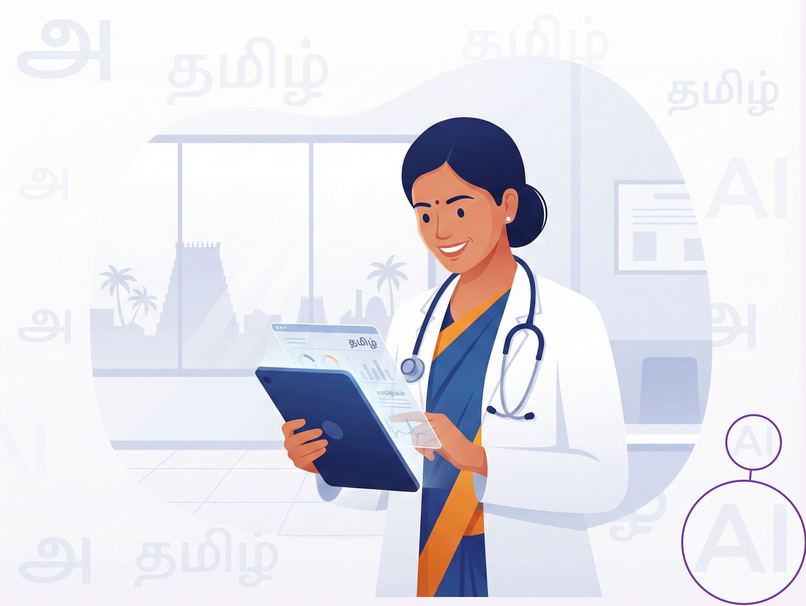

# 🏥 சுகாதாரம் & நலன்

> [!NOTE]
> **துறை (Domain):** சுகாதாரம் (`health`)
> **பாதுகாப்பு (Safety):** L8 அடுக்கு கட்டாயம் — மருத்துவ ஆலோசனை அல்ல

மருத்துவர்கள், செவிலியர்கள், ஆலோசகர்கள், மற்றும் AYUSH நிபுணர்களுக்கான AI கட்டளைகளின் முதல் பார்வை — இந்தத் துறையில் 80+ கட்டளைகள் உள்ளன.

> [!TIP]
> **முழு தொகுப்பு GitHub-ல்:** மருத்துவர்கள், செவிலியர்கள், ஆலோசகர்கள், AYUSH நிபுணர்களுக்கான அனைத்து கட்டளைகளும் இங்கே கிடைக்கின்றன:
> [health/README.md](https://github.com/kpassoubady/tamil-prompt-standard/blob/master/prompts/health/README.md)

---

> **💡 உண்மை கதை**
>
> மதுரையில் வசிக்கும் மீனா, நள்ளிரவில் தன் 8 வயது மகளுக்கு 103°F காய்ச்சல் வந்தது. அரசு மருத்துவமனை 10 கிலோமீட்டர் தொலைவு. "நான் ஒரு தாய், என் குழந்தைக்கு 103 காய்ச்சல், வாந்தி இல்லை — இப்போதே மருத்துவமனை வேண்டுமா?" என AI-யிடம் கேட்டாள். பதில் வந்தது: குளிர்ந்த துண்டு வை, 30 நிமிடம் கவனி, 104-க்கு மேல் சென்றால் உடனே செல். சரியான கேள்வி, சரியான தருணத்தில்.

## 🚀 இன்றே முயற்சிக்கலாம்

> **🏥 சுகாதாரம் — 5 கட்டளைகள்**
>
> 1. "எனக்கு சர்க்கரை நோய் — தவிர்க்க வேண்டிய உணவுகள் 10 என்ன? தமிழில் சொல்லுங்கள்"
> 2. "Blood Pressure என்றால் என்ன? எளிய தமிழில் விளக்கவும்"
> 3. "குழந்தைக்கு காய்ச்சல் — வீட்டில் என்ன செய்யலாம்? எப்போது மருத்துவமனை போக வேண்டும்?"
> 4. "ஆரோக்கியமான காலை உணவு 7 நாட்களுக்கு தமிழில் கொடுங்கள்"
> 5. "மூட்டு வலிக்கு இயற்கை தீர்வுகள் — மருத்துவரிடம் போவதற்கு முன் என்ன செய்யலாம்?"

---

## 1. நோயாளி விளக்கம் — எளிய தமிழில்

> [!PROMPT]
> நீ ஒரு அனுபவமிக்க பொது மருத்துவர்.
> '{நோய் / மருத்துவ நிலை}' பற்றி ஒரு நோயாளிக்கு எளிய தமிழில் விளக்க வேண்டும்.
>
> **நோயாளி விவரம்:**
>
> - வயது: {வயது}
> - கல்வி நிலை: {பள்ளிக் கல்வி / கல்லூரி / பாமரர்}
> - புரிதல் திறன்: {குறைவு / நடுத்தர / நல்ல}
>
> **விளக்க வேண்டியவை:**
>
> 1. **இது என்ன?:** 2-3 எளிய வாக்கியங்களில்
> 2. **ஏன் ஏற்படுகிறது?:** காரணங்கள் — தினசரி வாழ்க்கை உதாரணங்களுடன்
> 3. **அறிகுறிகள்:** எளிய தமிழில் — மருத்துவ சொற்கள் அடைப்புக்குறியில்
> 4. **என்ன செய்ய வேண்டும்?:** 3-5 நடவடிக்கைகள்
> 5. **எப்போது மீண்டும் வர வேண்டும்?:** தெளிவான வழிகாட்டுதல்
>
> **நடை:** பொறுமையான, பச்சாதாபமுள்ள, அச்சுறுத்தாத தொனி
> **மொழி:** தூய தமிழ் முன்னுரிமை — ஆங்கிலச் சொற்கள் அடைப்புக்குறியில் மட்டும்
>
> **பாதுகாப்பு:**
> 'இது பொது விளக்கம் மட்டுமே. உங்கள் குறிப்பிட்ட நிலைக்கு மருத்துவரின் ஆலோசனை அவசியம்' என்று முடிக்கவும்.

**பயன்பாடு:** நோயாளி கல்வி, கலந்தாலோசனை விளக்கம்.

---

## 2. மருத்துவ குறிப்பு — SOAP வடிவம்

> [!PROMPT]
> கீழ்க்கண்ட நோயாளி சந்திப்பு தகவல்களின் அடிப்படையில், SOAP வடிவத்தில் (Subjective, Objective, Assessment, Plan) ஒரு மருத்துவ குறிப்பை தமிழில் உருவாக்குக.
>
> **நோயாளி தகவல்:**
>
> - பெயர்: {பெயர்}, வயது: {வயது}, பாலினம்: {ஆண் / பெண் / பிற}
> - முக்கிய குறைபாடு: {நோயாளி கூறியது}
> - அறிகுறிகள்: {விவரம்}
> - உடல் பரிசோதனை: {கண்டறிந்தவை}
> - சோதனை முடிவுகள்: {கிடைத்தால்}
>
> **SOAP குறிப்பு வடிவம்:**
>
> **S — Subjective (அகநிலை):**
> - நோயாளி கூறும் குறைபாடுகள்
> - அறிகுறிகள் தொடங்கிய நேரம்
> - தீவிரத்தன்மை
>
> **O — Objective (புறநிலை):**
> - முக்கிய உயிர்க்குறியீடுகள் — BP, Pulse, Temp, RR
> - உடல் பரிசோதனை கண்டறிதல்கள்
> - சோதனை முடிவுகள்
>
> **A — Assessment (மதிப்பீடு):**
> - முதன்மை நோயறிதல் — ICD குறியீட்டுடன்
> - வேறுபாடு நோயறிதல்
>
> **P — Plan (திட்டம்):**
> - சிகிச்சை முறை
> - மருந்துகள்
> - பரிசோதனைகள்
> - மீள்பார்வை
>
> **மொழி:** மருத்துவத் தொழில்முறை தமிழ் — சர்வதேச மருத்துவ சொற்களை தமிழாக்கம் + அடைப்புக்குறியில் ஆங்கிலம்.

**பயன்பாடு:** மருத்துவ பதிவேடு, இலத்திரனியல் மருத்துவ பதிவுகள் (EMR).

---

> [!WARNING]
> **மருத்துவ பாதுகாப்பு அறிவிப்பு:** இந்தத் தகவல்கள் கல்வி மற்றும் பொது விழிப்புணர்வு நோக்கத்திற்காக மட்டுமே. இது மருத்துவ ஆலோசனை, நோய் கண்டறிதல், அல்லது சிகிச்சை பரிந்துரை அல்ல. உங்கள் உடல்நலம் சார்ந்த சந்தேகங்களுக்கு தகுதிவாய்ந்த மருத்துவரை நேரில் அணுகவும்.
