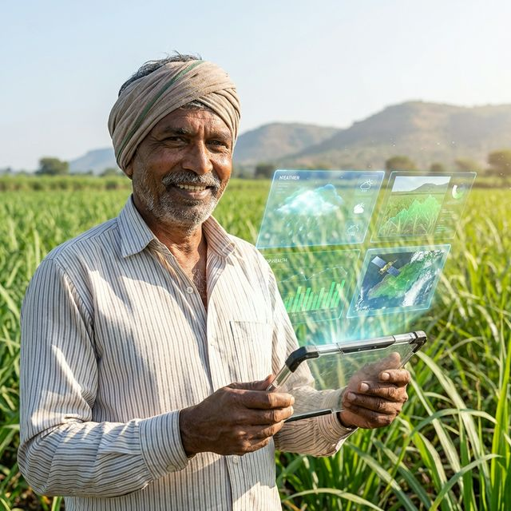
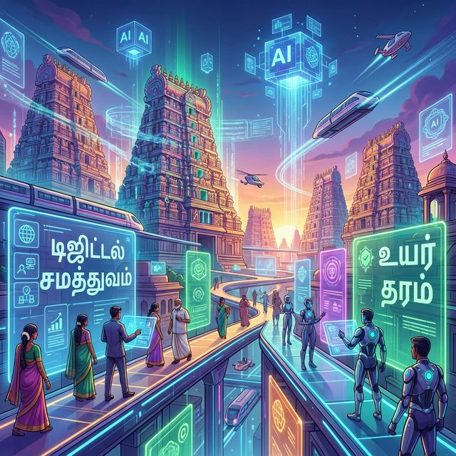

# தமிழ் தூண்டுவினா வடிவமைப்புத் திட்டம்

**Tamil Prompt Standard**  
**ஆராய்ந்து கட்டமைக்கப்பட்ட திறந்த மூல திட்டம்**

**வழங்குபவர்:** காங்கேயன் பசுபதி  
**நேரம்:** 20 நிமிடங்கள்

---

# அறிமுகம்

- இன்றைய காலகட்டத்தில் செயற்கை நுண்ணறிவு (AI) எல்லா துறைகளிலும் பெரும் தாக்கத்தை ஏற்படுத்துகிறது.
- நமது தாய் மொழியான **தமிழில்** செய்யறிவை அதன் முழுத் திறனுடன் பயன்படுத்த முடிகிறதா?
- **தமிழ் AI கட்டளை வடிவமைப்புத் திட்டம்** இந்த இடைவெளியை நிரப்ப உருவாக்கப்பட்டுள்ளது.

---

# சவால்

- **மொழித் தடை:** பெரும்பாலான அதிநவீன AI மாதிரிகள் ஆங்கிலத்தில் மட்டுமே அதிகத் தரத்துடன் செயல்படுகிறது.
- **பொருள் நுணுக்கம்:** தமிழில் சரியான இலக்கணம், மரபு மற்றும் சூழலுக்கு ஏற்ப AI-யை வழி நடத்துவது கடினமான அறைகூவலாக உள்ளது.
- **தேவை:** AI-யிடம் துல்லியமான பதில்களைத் தமிழில் பெறுவதற்கான **தரநிலைப்படுத்தப்பட்ட கட்டளை வழிகாட்டி** (Standardized Prompt Guide) இன்று எல்லாருக்கும் தேவைப்படுகிறது.

---

# திட்டம்: Tamil Prompt Standard

- **நோக்கம்:** தமிழர்களுக்கும் AI-க்கும் இடையேயான மொழிப் பாலமாக இத்திட்டம் செயல் படுகிறது.
- **பிரம்மாண்டம்:**
  - **700+** தயாரான தூண்டுவினா மாதிரிகள் (Prompt Templates)
  - **10** வெவ்வேறு தொழில் மற்றும் வாழ்வியல் துறைகள்
  - **30+** பயனர் பாத்திரங்கள் சார்ந்த அணுகுமுறைகள்
- **திறந்த மூலம்:** உலகத் தமிழர்களின் சமூகப் பங்களிப்புடன் தொடர்ந்து வளரும் ஒரு கூட்டு முயற்சி.

---

# திட்டத்தின் வீச்சு

திட்டம் பின்வரும் **10 முக்கியத் துறைகளை** முழுமையாக உள்ளடக்கியது

| துறைகள் | Domains |
| :--- | :--- |
| 🌾 விவசாயம் (Agriculture) | 💼 வணிகம் (Business) |
| 🏠 தினசரி வாழ்க்கை (Daily Life) | 📚 கல்வி (Education) |
| 💼 வேலைவாய்ப்பு (Employment) | 🏥 சுகாதாரம் (Health) |
| ⚖️ சட்டம் (Law) | 📝 இலக்கியம் (Literature) |
| 💻 தொழில்நுட்பம் (Technology) | 📱 சமூக ஊடகம் (Social Media) |

---

# கட்டளைக் கட்டமைப்புகள்

வெறுமனே கேள்வி கேட்பதைத் தாண்டி, சிறந்த விடைகளை பெற **கட்டமைக்கப்பட்ட கட்டளைகள் (Frameworks)** அவசியம்.

- **CLEAR** - எளிய அன்றாடப் பயன்பாட்டிற்கு
- **CRAFT** - படைப்புச் சார்ந்த மொழிப் பணிகளுக்கு
- **CREATE** - விரிவான விளக்கங்களுக்கு
- **AUTOMAT** - தொழில்முறை மற்றும் வேலைவாய்ப்புத் தேவைகளுக்கு
- **CATS** - துல்லியமான, குறிப்பான பதில்களைப் பெறுவதற்கு

*இவை ஒவ்வொன்றும் தமிழ் மொழியியல் மரபுகளுக்கு ஏற்ப துல்லியமாக வடிவமைக்கப்பட்டு உள்ளன.*

---

# தினசரி பயன்பாடுகள் - விவசாயம்

**பயனாளிகள்:** விவசாயிகள், விவசாயத் தொழிலாளர்கள் மற்றும் தொழில்முனைவோர்.

**தூண்டுவினா:**
> "நான் ஒரு இயற்கை விவசாயி. [பயிர் பெயர்] பயிரிட திட்டமிட்டுள்ளேன். இதற்கு ஏற்ற இயற்கை உரங்கள், பூச்சி விரட்டிகள் மற்றும் தற்போது அரசு வழங்கும் மானியங்கள் பற்றிய தகவல்களைத் தரவும்."

**பலன்:** விவசாயிகளுக்கு அவர்களின் மொழியிலேயே நவீன தொழில்நுட்ப வழிகாட்டுதல்.

---

#  எட்டடுக்கு படிநிலை கட்டமைப்பு (8-Layer Taxonomy)

<!-- செய்யறிவிடம் துல்லியமான பதிலை பெற எட்டடுக்கு கட்டமைப்பைப் பயன் படுகிறது. -->

| அடுக்கு | பெயர் | விளக்கம் |
| :--- | :--- | :--- |
| **L1** | **பாத்திரம் - Role** | ஏற்கும் ஆளுமை (எ.கா: மருத்துவர், ஆசிரியர்) |
| **L2** | **துறை - Domain** | துறை (அ) பேசுபொருள் (எ.கா: tech, law, biz) |
| **L3** | **திறன் நிலை - Skill Level** | இலக்கு பார்வையாளர்களின் புரிதல் திறன் |
| **L4** | **நோக்கம் - Intent** | சுருக்குதல், விளக்குதல் போன்ற செயல் |
| **L5** | **தொனி - Tone** | மொழி நடை (Formal, Academic) |
| **L6** | **வடிவம் - Format** | வெளியீட்டு அமைப்பு (Table, Essay, Code) |
| **L7** | **கட்டுப்பாடுகள் - Constraints** | வரம்புகள் மற்றும் மொழி சார்ந்த விதிகள் |
| **L8** | **பாதுகாப்பு - Safety** | பொறுப்புத்துறப்பு மற்றும் சார்பு சரிபார்ப்பு |

---

# எதிர்கால நோக்கம்

- **டிஜிட்டல் சமத்துவம்:** ஆங்கிலம் அறிந்தவர்களுக்கு மட்டுமே அதிநவீன தொழில்நுட்பம் என்ற தடையை உடைப்பது.
- எந்தவொரு தமிழரும், தன் தாய்மொழியில், AI-யிடம் தயக்கமின்றி உரையாடி அதன் பயன்களை முழுமையாக பெறச் செய்வது.
- ஆழமான ஆராய்ச்சியின் அடிப்படையில் தமிழின் இலக்கண மற்றும் மரபுத் தன்மைகளை AI சிறப்பாகப் புரிந்து கொள்ளச் செய்வது.

---

# உங்கள் பங்களிப்பு... & Q/A!

Tamil Prompt Standard திட்டம் திறந்த மூல (Open Source) கூட்டு முயற்சியால் உருவானது. நீங்களும் பங்களிக்கலாம்!

**திட்ட இணைப்பு:**
- [github.com/kpassoubady/tamil-prompt-standard](https://github.com/kpassoubady/tamil-prompt-standard)

**தொடர்புக்கு:**
- [https://www.linkedin.com/in/kpassoubady/](https://www.linkedin.com/in/kpassoubady/)

*தமிழால் இணைவோம், தொழில்நுட்பத்தால் உயர்வோம்!*
