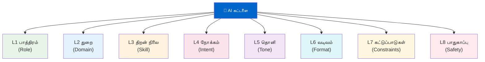
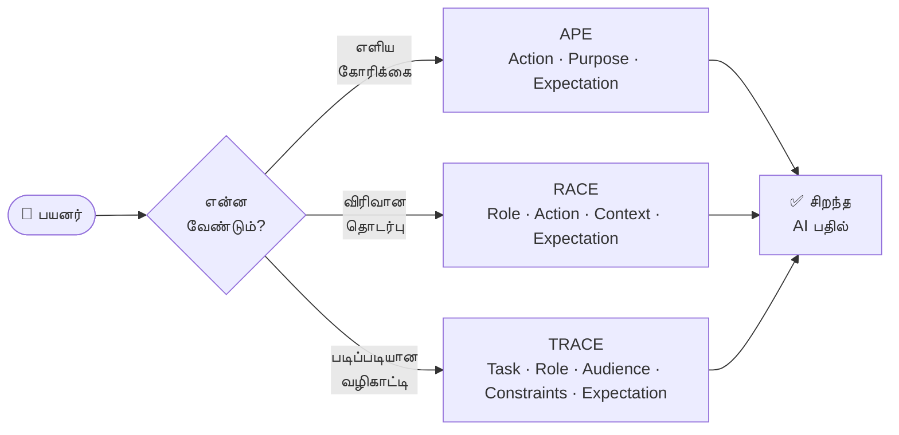
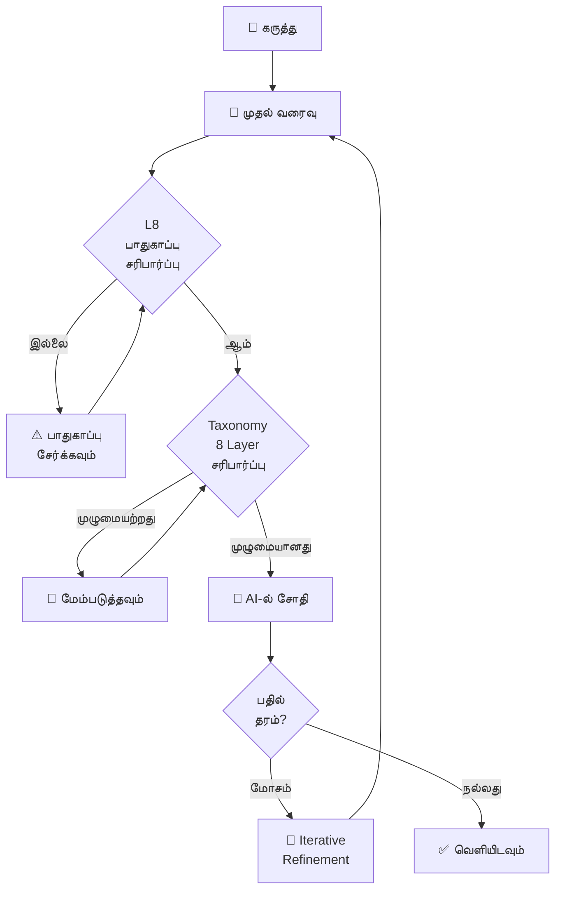
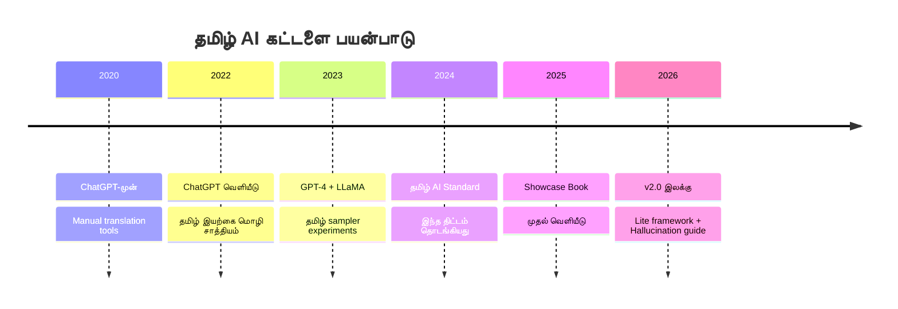
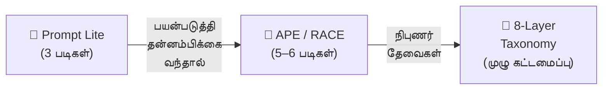
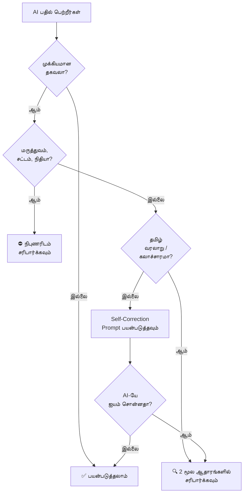

# தமிழ் AI கட்டளை தரநிலை — மேம்பாட்டு வழிமாப்பு

> **நிலை:** திட்டமிட்ட (Planned)
> **பதிப்பு:** v1.0 — 2026-02-20
> **மூலம்:** Showcase book review feedback

---

## உள்ளடக்க அட்டவணை

1. [மூன்று முக்கிய மேம்பாட்டுத் தேவைகள்](#1-மூன்று-முக்கிய-மேம்பாட்டுத்-தேவைகள்)
2. [காட்சி மற்றும் வடிவமைப்பு — Infographics & Diagrams திட்டம்](#2-காட்சி-மற்றும்-வடிவமைப்பு)
3. [எளிய பயனர்களுக்கான "Lite" கட்டமைப்பு](#3-lite-கட்டமைப்பு)
4. [தமிழில் AI மதிமயக்கம் — சிறப்பு பகுதி](#4-தமிழில்-ai-மதிமயக்கம்)
5. [Master Prompt — முதன்மைக் கட்டளை](#5-master-prompt)
6. [Mermaid வரைபடங்கள் — திட்டம்](#6-mermaid-வரைபடங்கள்)
7. [பொது மக்களை ஈர்க்கும் கருத்துக்கள்](#7-பொது-மக்களை-ஈர்க்கும்-கருத்துக்கள்)
8. [செயல் படிகள் & முன்னுரிமை](#8-செயல்-படிகள்)

---

## 1. மூன்று முக்கிய மேம்பாட்டுத் தேவைகள்

### 1.1 காட்சி அடர்த்தி (Visual Density)

**பிரச்சனை:** உள்ளடக்க அட்டவணை மற்றும் Quick Reference Cheatsheet அதிகமான உரை, மிகக் குறைந்த காட்சிகள்.

**தீர்வுகள்:**
- ஒவ்வொரு domain sampler-க்கும் ஒரு hero illustration
- 8-Layer Taxonomy → Mermaid pyramid அல்லது radial chart
- Framework comparisons (APE vs RACE vs TRACE) → side-by-side visual table with colour coding
- Cheatsheet → icon-driven one-pager (ஒவ்வொரு framework-க்கும் ஒரு icon)

### 1.2 தொடக்கநிலை பயனர்கள் (Beginner Overload)

**பிரச்சனை:** 8-Layer Taxonomy ஒரு சாதாரண பயனரை திக்குமுக்காட வைக்கும்.

**தீர்வு:** "Prompt Lite" — 3-Step model (யார்? என்ன? எப்படி?) — full spec in [Section 3](#3-lite-கட்டமைப்பு)

### 1.3 தமிழ் AI மதிமயக்கம் (Tamil Hallucinations)

**பிரச்சனை:** LLMs குறைந்த-வளம் கொண்ட மொழிகளில் (Tamil, etc.) அதிகமாக hallucinate செய்கின்றன. புத்தகத்தில் இதற்கு ஒரு வரி மட்டுமே உள்ளது.

**தீர்வு:** சிறப்பு பகுதி — full spec in [Section 4](#4-தமிழில்-ai-மதிமயக்கம்)

---

## 2. காட்சி மற்றும் வடிவமைப்பு

### 2.1 ஒவ்வொரு domain-க்கும் Hero Image

ஒவ்வொரு sampler பகுதிக்கும் ஒரு தொடக்க-பக்க illustration. கருத்துக்கள்:

| பிரிவு | Image கருத்து | உணர்வு |
|--------|--------------|---------|
| சுகாதாரம் | Doctor + phone screen showing AI assistant | நம்பகம், அன்பு |
| கல்வி | Student with glowing lamp + AI text bubbles | ஆர்வம், வளர்ச்சி |
| வேளாண்மை | Farmer looking at tablet in a field at sunrise | நம்பிக்கை, நவீனம் |
| வேலைவாய்ப்பு | Young person confidently sending CV, AI helping | தன்னம்பிக்கை |
| சட்டம் | Scales of justice + Tamil text flowing into them | நீதி, தெளிவு |
| தினசரி வாழ்க்கை | Family around table, phone in hand, smiling | அன்பு, வசதி |
| தொழில்நுட்பம் | Developer + Tamil code flowing on dark screen | வீரம், கலை |
| வணிகம் | Market stall with data charts hovering above | வளர்ச்சி, புத்திசாலித்தனம் |
| இலக்கியம் | Poet writing with quill, words becoming stars | கலை, ஈர்ப்பு |
| சமூக ஊடகம் | Phone screen with Tamil content going viral | ஆற்றல், சமூகம் |

**Image generation master prompt:** [Section 5](#5-master-prompt) காண்க.

### 2.2 8-Layer Taxonomy — Radial Diagram



**கோப்பு:** `book/images/diagrams/taxonomy-radial.md` (Mermaid source)

### 2.3 Framework Comparison Flow



**கோப்பு:** `book/images/diagrams/framework-selector-flow.md`

### 2.4 Prompt Quality Pipeline



**கோப்பு:** `book/images/diagrams/prompt-quality-pipeline.md`

### 2.5 தமிழ் AI பயன்பாட்டு வளர்ச்சி — Timeline



---

## 3. Lite கட்டமைப்பு

> **குறிக்கோள்:** ஒரு தமிழ் தாய், விவசாயி, அல்லது மாணவன் — 5 நிமிடத்தில் AI-ஐ சரியாக கேட்கக் கற்றுக்கொள்ள வேண்டும்.

### 3-Step Prompt Lite Model

```
யார் கேட்கிறார்? → என்ன வேண்டும்? → எப்படி பதில் வேண்டும்?
   (WHO)               (WHAT)              (HOW)
```

**எடுத்துக்காட்டு:**

| படி | கேள்வி | பதில் |
|-----|--------|-------|
| யார்? | நீங்கள் யார்? | "நான் ஒரு 7ம் வகுப்பு மாணவன்" |
| என்ன? | என்ன தேவை? | "நீரின் மூலக்கூறு பற்றி புரிய வேண்டும்" |
| எப்படி? | எப்படி சொல்ல வேண்டும்? | "எளிய தமிழில், உதாரணங்களுடன்" |

**முழு Lite கட்டளை:**
```
நான் ஒரு 7ம் வகுப்பு மாணவன். நீரின் மூலக்கூறு (H₂O) என்றால் என்ன என்று
எளிய தமிழில், ஒரு அன்றாட உதாரணத்துடன் விளக்கவும்.
```

### Lite → Full Upgrade Path



### புத்தகத்தில் வேண்டிய இடம்

- Part I-க்கு முன் ஒரு "Chapter 0: முதன்முறை பயனர்களுக்கு" பகுதி
- கோப்பு: `book/foundations/prompt-lite-beginners.md`
- Showcase config-ல் Part I-க்கு முன் சேர்க்கவும்

---

## 4. தமிழில் AI மதிமயக்கம்

> **ஏன் முக்கியம்:** ஆங்கிலத்தில் 100 tokens பயிற்சி பெற்ற மாதிரி, தமிழில் 1–5 tokens மட்டுமே பெற்றிருக்கலாம். இதனால் தமிழ் வினாக்களுக்கு AI தவறான, ஆனால் நம்பகமாகத் தோற்றமளிக்கும் பதில்களை கொடுக்கலாம்.

### 4.1 தமிழ்-குறிப்பிட்ட Hallucination வகைகள்

| வகை | எடுத்துக்காட்டு | அபாயம் |
|-----|----------------|---------|
| **கலாச்சார திரிபு** | "பொங்கல் தீபாவளியின் ஒரு பகுதி" என சொல்வது | குறைந்தது |
| **வரலாற்று பிழை** | போர்கள், அரசர்கள், தேதிகளில் கலைவு | நடுத்தரம் |
| **மருத்துவ/சட்ட பிழை** | தமிழ் நாட்டுப்புற மருந்துகளை AI கற்பனை செய்வது | அதிகம் |
| **இலக்கிய பெயர் குழப்பம்** | கவிஞர்களின் படைப்புகளை மாற்றி சொல்வது | நடுத்தரம் |
| **எண்கள் மற்றும் புள்ளிவிவரம்** | தமிழ்நாடு மக்கள்தொகை, GDP தவறாக சொல்வது | நடுத்தரம் |

### 4.2 Self-Correction Prompts — தமிழில்

**Prompt 1 — உண்மை சரிபார்ப்பு:**

```prompt
நீ இப்போது சொன்ன தகவல் உண்மையானதா என்று சுயமாக சரிபார்:
1. இது உறுதிப்படுத்தப்பட்ட உண்மையா அல்லது அனுமானமா?
2. நீ நம்பகமற்றவராக உணர்கிறாயா? ஆம் என்றால் சொல்.
3. மூல ஆதாரம் ஏதாவது இருந்தால் குறிப்பிடு.
```

**Prompt 2 — இரட்டை சரிபார்ப்பு:**

```prompt
முதலில் {தலைப்பு} பற்றி சொல். பிறகு, "நான் நம்பகமாக இல்லாத
தகவல்கள்:" என்று தனியாக பட்டியலிடு. தமிழ் வரலாறு மற்றும்
கலாச்சாரம் பற்றிய தகவல்களில் குறிப்பாக கவனமாக இரு.
```

**Prompt 3 — உறுதிப்படுத்தல் கோரிக்கை:**

```prompt
இந்த தகவலை எந்த நம்பகமான ஆதாரத்தில் சரிபார்க்கலாம்?
(Wikipedia, Tamil Nadu Government, Dinamalar, கல்கி போன்றவை)
```

### 4.3 Hallucination Detection Flowchart



### 4.4 புத்தகத்தில் வேண்டிய இடம்

- புதிய Appendix: `book/foundations/tamil-hallucination-guide.md`
- Showcase config-ல் Appendix C-க்கு பிறகு சேர்க்கவும்
- Full book config-லும் சேர்க்கவும்

---

## 5. Master Prompt

### 5.1 புத்தக Hero Image Master Prompt

ஒவ்வொரு domain hero image-க்கும் இந்த template பயன்படுத்தவும்:

```prompt
Create a warm, inspiring digital illustration for a Tamil AI prompt engineering book.

Style: Flat design with subtle gradients. Warm, optimistic, South Indian cultural context.
Palette: Deep blue (#0066CC) + saffron (#FF8C00) + white. Tamil script as design element.
Mood: Hopeful, modern, accessible — "AI is for everyone"

Subject: {domain-specific subject from table below}

Requirements:
- No text overlays (text will be added separately)
- Portrait orientation, 6x9 inches at 300dpi
- Tamil cultural authenticity (clothing, environment, objects)
- Soft background that works behind white text
- One clear focal point (person + technology)
- Subtle Tamil letter(s) woven into the background as artistic element
```

**Domain-specific subjects:**

| Domain | Subject கோரிக்கை |
|--------|----------------|
| சுகாதாரம் | Tamil woman doctor in saree reviewing patient data on tablet, warm clinic light |
| கல்வி | Young Tamil student with glowing book and AI thought bubbles, school setting |
| வேளாண்மை | Tamil farmer at sunrise, checking soil data on phone, green paddy field |
| வேலைவாய்ப்பு | Confident young Tamil professional sending resume on laptop, city background |
| சட்டம் | Tamil advocate with balanced scales, soft courthouse background |
| தினசரி வாழ்க்கை | Tamil family at kitchen table, grandmother and grandchild sharing phone with AI chat |
| தொழில்நுட்பம் | Tamil developer at keyboard, holographic Tamil code flowing above |
| வணிகம் | Tamil merchant at market stall, digital analytics floating above goods |
| இலக்கியம் | Tamil poet under banyan tree, quill writing words that turn to stars |
| சமூக ஊடகம் | Young Tamil creator holding phone, content radiating outward to connected hearts |

### 5.2 Mermaid Diagram Generation Prompt

```prompt
Create a Mermaid diagram for a Tamil prompt engineering educational book.

Purpose: {diagram purpose}
Audience: Tamil readers, beginner to intermediate
Style requirements:
- Use Tamil labels where possible, English only for technical terms
- Colour scheme: Blue (#0066CC primary), Saffron (#FF8C00 accent), Green (#2E7D32 success), Red (#C62828 warning)
- Keep node text under 4 words per line (use \n for line breaks in Mermaid)
- Maximum 8 nodes for flowcharts, 6 for sequence diagrams

Diagram type: {flowchart / sequence / timeline / pie / mindmap}
Content to visualise: {description}
```

---

## 6. Mermaid வரைபடங்கள்

### திட்டமிட்ட வரைபடங்கள் — முன்னுரிமை வரிசை

| # | கோப்பு | வகை | பகுதி | நிலை |
|---|--------|-----|-------|-------|
| 1 | `taxonomy-radial.md` | graph TD | Foundations | 📋 திட்டம் |
| 2 | `framework-selector-flow.md` | flowchart LR | Foundations | 📋 திட்டம் |
| 3 | `prompt-quality-pipeline.md` | flowchart TD | Foundations | 📋 திட்டம் |
| 4 | `hallucination-detection.md` | flowchart TD | Appendix | 📋 திட்டம் |
| 5 | `lite-to-full-upgrade.md` | flowchart LR | Chapter 0 | 📋 திட்டம் |
| 6 | `tamil-ai-timeline.md` | timeline | Introduction | 📋 திட்டம் |
| 7 | `iterative-refinement-loop.md` | flowchart | Techniques | 📋 திட்டம் |
| 8 | `prompt-chaining-flow.md` | sequence | Techniques | 📋 திட்டம் |

**கோப்பு இடம்:** `book/images/diagrams/` (புதிய folder)

### கோப்புகள் புத்தகத்தில் சேர்க்கும் முறை

Mermaid-ஐ PNG-ஆக மாற்ற:
```bash
# npm install -g @mermaid-js/mermaid-cli
mmdc -i book/images/diagrams/taxonomy-radial.md -o book/images/taxonomy-radial.png -w 1200 -H 900
```

---

## 7. பொது மக்களை ஈர்க்கும் கருத்துக்கள்

### 7.1 "Real Stories" — உண்மை கதைகள் பிரிவு

ஒவ்வொரு domain sampler-ல் ஒரு கற்பனை-ஆனால்-நம்பகமான சிறுகதை:

> **எடுத்துக்காட்டு (Agriculture):**
> "திருவாரூரில் உள்ள சுப்பிரமணி, 3 ஏக்கர் நெல் வயலில் பூஞ்சாண் நோய் பரவியது கண்டு கவலைப்பட்டார். தன் phone-ல் AI-ஐ கேட்டார்: 'நான் ஒரு சிறு விவசாயி. என் நெல் இப்படி இருக்கிறது [படம்]. இது என்ன நோய்? தமிழில் சொல்லுங்கள்.' 3 நிமிடத்தில் நோய் கண்டறிந்து தீர்வு பெற்றார்."

### 7.2 "முயற்சிக்கவும்" — Interactive Boxes

ஒவ்வொரு பிரிவிலும் blank-fill boxes:

```
📝 இப்போதே முயற்சிக்கவும்!

உங்கள் AI கட்டளை:
┌─────────────────────────────────────┐
│ நான் ஒரு ___________. எனக்கு       │
│ ___________ பற்றி ___________ ல்    │
│ விளக்கவும்.                         │
└─────────────────────────────────────┘
```

### 7.3 "பொதுவான தவறுகள்" — Myth-Busting

Before/After prompt comparisons:

| ❌ இப்படி கேட்காதீர்கள் | ✅ இப்படி கேட்கவும் |
|-------------------------|---------------------|
| "வலி மருந்து சொல்லுங்கள்" | "நான் ஒரு 45 வயது பெண். என் முதுகு வலிக்கு மருத்துவர் கேட்கும் முன் நான் புரிந்துகொள்ள உதவுங்கள்" |
| "சட்டம் என்ன?" | "தமிழ்நாட்டில் வாடகை ஒப்பந்தத்தில் வாடகையாளர் உரிமைகள் என்ன என்று எளிய தமிழில் விளக்கவும்" |

### 7.4 "AI-யிடம் 5 கேள்விகள்" — Quick-Start Cards

ஒவ்வொரு domain-லும் ஒரு "இன்றே கேட்கலாம்" card:

```
🏥 சுகாதாரம் — இன்றே கேட்கலாம்:
1. "சர்க்கரை நோய் தடுக்கும் உணவு முறை தமிழில் சொல்லுங்கள்"
2. "குழந்தை காய்ச்சலுக்கு வீட்டு தீர்வுகள் என்ன?"
3. "BP tablet எடுக்கும் நேரம் முக்கியமா?"
```

### 7.5 "AI vs நான்" — Comparison Exercise

ஒரு கேள்விக்கு மாணவர்/பயனர் முதல் தாங்களே எழுதி, பிறகு AI பதிலுடன் ஒப்பிட சொல்வது — கற்றல் ஆழமாக படியும்.

### 7.6 QR Code தொகுப்பு

ஒவ்வொரு domain-க்கும் ஒரு QR code → ChatGPT/Claude-ல் pre-filled Tamil prompt template. கதையின் முடிவில் "இந்த QR-ஐ scan செய்து உடனடியாக முயற்சிக்கவும்!"

---

## 8. செயல் படிகள்

### Phase 1 — உள்ளடக்கம் (Content)

| # | பணி | கோப்பு | முன்னுரிமை |
|---|-----|--------|------------|
| 1 | Prompt Lite chapter எழுது | `book/foundations/prompt-lite-beginners.md` | 🔴 அதிகம் |
| 2 | Hallucination guide எழுது | `book/foundations/tamil-hallucination-guide.md` | 🔴 அதிகம் |
| 3 | Real Stories — 5 domains | existing samplers-ல் சேர் | 🟡 நடுத்தரம் |
| 4 | "இன்றே கேட்கலாம்" cards — 10 domains | existing samplers-ல் சேர் | 🟡 நடுத்தரம் |
| 5 | Before/After myth-busting | Foundations-ல் புதிய பகுதி | 🟢 குறைந்தது |

### Phase 2 — காட்சி (Visual)

| # | பணி | கருவி | முன்னுரிமை |
|---|-----|-------|------------|
| 1 | Taxonomy radial diagram | Mermaid | 🔴 அதிகம் |
| 2 | Framework selector flow | Mermaid | 🔴 அதிகம் |
| 3 | Prompt quality pipeline | Mermaid | 🟡 நடுத்தரம் |
| 4 | Hallucination detection flow | Mermaid | 🟡 நடுத்தரம் |
| 5 | Domain hero images (10) | AI image generation (master prompt in §5) | 🟢 குறைந்தது |

### Phase 3 — கட்டமைப்பு (Config)

| # | பணி | கோப்பு |
|---|-----|--------|
| 1 | Prompt Lite chapter-ஐ show-case config-ல் சேர் | `configs/tamil-prompt-engineering-book-show-case.json` |
| 2 | Hallucination guide-ஐ full book config-ல் சேர் | `configs/tamil-prompt-engineering-book-full-book.json` |
| 3 | Diagrams folder-ஐ build pipeline-ல் சேர் | `configs/run-book-builder.sh` |

---

> [!NOTE]
> **நிலை (Status):** இந்த ஆவணம் ஒரு திட்ட வழிமாப்பு (roadmap spec). ஒவ்வொரு phase-உம் தனி feature branch-ல் செயல்படுத்தப்படும்.
> **அடுத்த படி:** Phase 1, Item 1 — `prompt-lite-beginners.md` உருவாக்கவும்.
